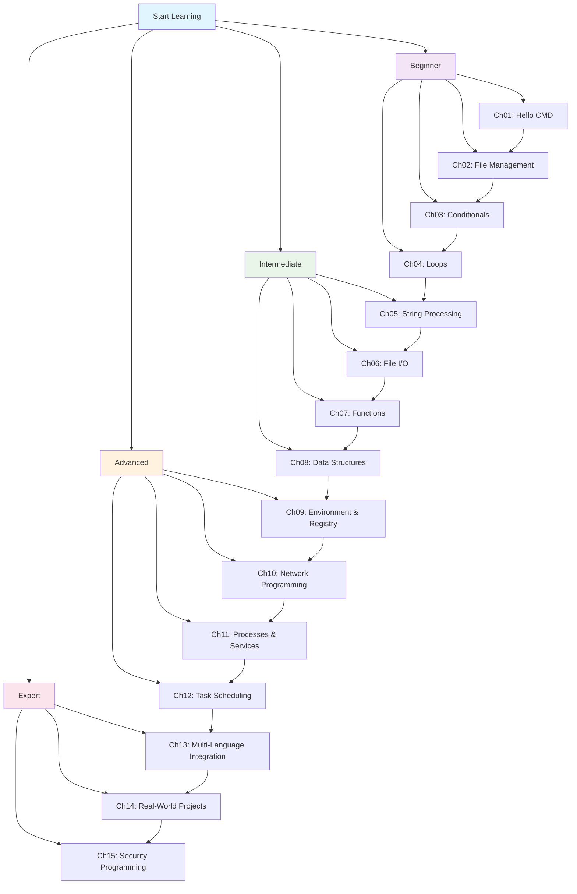

# CMD/BAT From Beginner to Expert

[English](README.md) | [简体中文](README_zh.md)

---

[](LICENSE)
[]()
[]()

> A comprehensive Windows CMD/BAT scripting tutorial covering 15 chapters from basics to advanced automation.

!!! warning "AI-Generated Content Disclaimer"
    **This entire project was generated by AI (Qwen Code) and is provided for reference only.** The content, code examples, and documentation were created through AI assistance. While efforts have been made to ensure accuracy, please verify all information and test code before using in production environments. Use at your own risk.

## Table of Contents

- [Introduction](#introduction)
- [Features](#features)
- [Who Is This For](#who-is-this-for)
- [Learning Roadmap](#learning-roadmap)
- [Prerequisites](#prerequisites)
- [Installation](#installation)
- [Usage](#usage)
- [Project Structure](#project-structure)
- [Contributing](#contributing)
- [License](#license)

## Introduction

**CMD/BAT From Beginner to Expert** is a complete Windows command-line scripting tutorial. Whether you're a system administrator, DevOps engineer, or developer interested in command-line tools, this tutorial provides a structured learning path from basic commands to advanced automation scripts.

The tutorial covers 15 chapters, starting from the basics of "Hello World" and progressing through file management, conditionals, loops, string processing, file I/O, functions, data structures, environment variables, networking, process management, task scheduling, multi-language integration, real-world projects, and security programming.

## Features

### 📚 Systematic Learning

- **15 progressive chapters** from beginner to expert
- **Example code for each chapter** combining theory with practice
- **Real-world projects** to apply knowledge immediately

### 🔄 Multi-Language Comparison

- **Python comparison** — understand scripting language similarities and differences
- **JavaScript comparison** — modern scripting paradigms
- **C language comparison** — deep dive into low-level implementation
- **Lua comparison** — lightweight scripting design patterns

### 🛠️ Practical Skills

- **System administration automation** — batch processing, scheduled tasks
- **File batch operations** — renaming, organizing, backup
- **Network tool development** — ping, port scanning, data fetching
- **Secure scripting** — input validation, permission control

## Who Is This For

!!! tip "Are you one of these?"

    **🪟 Windows System Administrators**

    Managing Windows servers and workstations daily, looking to automate repetitive tasks and improve operational efficiency.

    **🔧 DevOps Engineers**

    Need to write batch scripts for application deployment, system monitoring, and log processing.

    **💻 Developers Interested in Command Line**

    Want to understand Windows command-line capabilities and master system-level programming skills.

    **🎓 Programming Beginners**

    Looking to start with a simple scripting language — CMD/BAT syntax is straightforward and perfect for beginners.

## Learning Roadmap



## Prerequisites

!!! warning "Before You Begin"

    **Required**

    - Windows 10 or Windows 11
    - CMD.exe (built-in with Windows)
    - Text editor (Notepad, VS Code, Notepad++, etc.)

    **Optional (for multi-language comparison)**

    - Python 3.x (recommended 3.8+)
    - Node.js (recommended 16+)
    - GCC/MinGW (C language compiler)
    - LuaJIT (Lua interpreter)

## Installation

No installation required! The tutorial documentation can be accessed directly:

### Option 1: View Online (Static Site)

```bash
# Clone the repository
git clone https://github.com/hyfaust/cmd-learn.git
cd cmd-learn

# Install MkDocs and Material theme
pip install mkdocs mkdocs-material

# Build the site
mkdocs build

# Serve locally
mkdocs serve
```

Open your browser and navigate to `http://localhost:8000`

### Option 2: Use as Reference

Simply browse the `docs/` directory for Markdown files or the `examples/` directory for runnable BAT scripts.

## Usage

### Running Example Scripts

```cmd
:: Navigate to the examples directory
cd examples\ch01

:: Run a specific example
hello.bat

:: Run with parameters
shift_demo.bat arg1 arg2 arg3
```

### Building the Documentation Site

```cmd
:: Build static site
mkdocs build

:: Start development server with live reload
mkdocs serve

:: Deploy to GitHub Pages
mkdocs gh-deploy
```

## Project Structure

```
cmd_learn/
├── mkdocs.yml              # MkDocs configuration
├── LICENSE                 # GPL v3 License
├── README.md               # This file (English)
├── README_zh.md            # Chinese README
├── docs/                   # Documentation source files
│   ├── index.md            # Homepage
│   ├── getting-started.md  # Getting started guide
│   ├── ch01-hello-cmd/     # Chapter 1: Hello CMD
│   ├── ch02-file-management/ # Chapter 2: File Management
│   ├── ch03-conditionals/  # Chapter 3: Conditionals
│   ├── ch04-loops/         # Chapter 4: Loops
│   ├── ch05-string-processing/ # Chapter 5: String Processing
│   ├── ch06-file-io/       # Chapter 6: File I/O
│   ├── ch07-functions/     # Chapter 7: Functions
│   ├── ch08-data-structures/ # Chapter 8: Data Structures
│   ├── ch09-env-registry/  # Chapter 9: Environment & Registry
│   ├── ch10-network/       # Chapter 10: Network
│   ├── ch11-process-services/ # Chapter 11: Processes & Services
│   ├── ch12-task-scheduler/ # Chapter 12: Task Scheduling
│   ├── ch13-multilang/     # Chapter 13: Multi-Language
│   ├── ch14-projects/      # Chapter 14: Projects
│   ├── ch15-security/      # Chapter 15: Security
│   └── appendix/           # Appendix & Reference
├── examples/               # Runnable example scripts
│   ├── ch01/ ~ ch15/       # Examples organized by chapter
└── site/                   # Generated static site (after build)
```

## Contributing

Contributions are welcome! Here's how you can help:

1. **Report Issues** — Found a bug or error? Open an issue
2. **Fix Typos** — Submit a pull request with corrections
3. **Add Examples** — Share useful BAT script examples
4. **Improve Documentation** — Help make explanations clearer

!!! note "Contribution Guidelines"
    - All code examples must be safe to run (no destructive operations outside project directory)
    - Follow existing documentation style and formatting
    - Test all BAT scripts before submitting
    - Use English for code identifiers and Chinese for documentation

## License

This project is licensed under the **GNU General Public License v3.0** — see the [LICENSE](LICENSE) file for details.

```
This program is free software: you can redistribute it and/or modify
it under the terms of the GNU General Public License as published by
the Free Software Foundation, either version 3 of the License, or
(at your option) any later version.
```

---

!!! note "About This Tutorial"
    - **Version**: 1.0
    - **Last Updated**: June 2026
    - **Platform**: Windows 10/11
    - **License**: GNU General Public License v3.0
    - **Generated by**: AI (Qwen Code) — content provided for reference only
