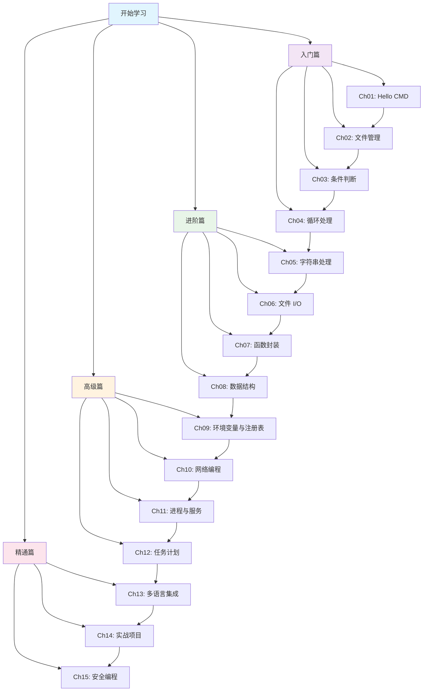

# CMD/BAT 从入门到精通

[English](README.md) | [简体中文](README_zh.md)

---

[](LICENSE)
[]()
[]()

> 一套完整的 Windows CMD/BAT 脚本编程教程，涵盖 15 个章节，从入门到精通。

!!! warning "AI 生成内容声明"
    **本项目全部内容由 AI（Qwen Code）生成，仅供参考。** 教程内容、代码示例和文档均通过 AI 辅助创建。虽然已尽力确保准确性，但请在生产环境使用前验证所有信息并测试代码。使用风险自负。

## 目录

- [教程简介](#教程简介)
- [教程特色](#教程特色)
- [适合人群](#适合人群)
- [学习路线图](#学习路线图)
- [环境要求](#环境要求)
- [安装部署](#安装部署)
- [使用方法](#使用方法)
- [项目结构](#项目结构)
- [参与贡献](#参与贡献)
- [许可证](#许可证)

## 教程简介

**CMD/BAT 从入门到精通** 是一套完整的 Windows 命令行脚本编程学习教程。无论你是系统管理员、运维工程师，还是对命令行感兴趣的开发者，都能在这里找到适合你的学习路径。

本教程涵盖 15 个章节，从最基础的 "Hello World" 开始，逐步深入到文件管理、条件判断、循环处理、字符串操作、文件 I/O、函数封装、数据结构、环境变量、网络操作、进程管理、任务调度、多语言集成、实战项目和安全编程等主题。

## 教程特色

### 📚 系统化学习

- **15 章渐进式学习**：从入门到精通，循序渐进
- **每章配套示例代码**：理论与实践相结合
- **实战项目驱动**：学以致用，解决实际问题

### 🔄 多语言对比

- **Python 对比**：理解脚本语言的异同
- **JavaScript 对比**：掌握现代脚本编程思想
- **C 语言对比**：深入理解底层实现
- **Lua 对比**：学习轻量级脚本设计

### 🛠️ 实用技能

- **系统管理自动化**：批量处理、定时任务
- **文件批处理**：重命名、整理、备份
- **网络工具开发**：Ping、端口扫描、数据抓取
- **安全脚本编写**：输入验证、权限控制

## 适合人群

!!! tip "你是否属于以下人群？"

    **🪟 Windows 系统管理员**

    日常需要管理大量 Windows 服务器和工作站，希望通过脚本自动化重复性工作，提高运维效率。

    **🔧 自动化运维工程师**

    需要编写批处理脚本来部署应用、监控系统、处理日志，实现运维工作的自动化。

    **💻 对命令行感兴趣的开发者**

    想要深入了解 Windows 命令行的强大功能，掌握系统级编程技能，提升开发效率。

    **🎓 编程初学者**

    希望从简单的脚本语言开始学习编程，CMD/BAT 语法简单，是入门编程的绝佳选择。

## 学习路线图



## 环境要求

!!! warning "开始学习前请确认"

    **必需环境**

    - Windows 10 或 Windows 11
    - CMD.exe（系统自带）
    - 文本编辑器（记事本、VS Code、Notepad++ 等）

    **可选环境（用于多语言对比）**

    - Python 3.x（推荐 3.8+）
    - Node.js（推荐 16+）
    - GCC/MinGW（C 语言编译器）
    - LuaJIT（Lua 解释器）

## 安装部署

无需安装！可以直接访问教程文档：

### 方式一：本地预览（静态站点）

```cmd
:: 克隆仓库
git clone https://github.com/hyfaust/cmd-learn.git
cd cmd-learn

:: 安装 MkDocs 和 Material 主题
pip install mkdocs mkdocs-material

:: 构建站点
mkdocs build

:: 本地预览
mkdocs serve
```

打开浏览器访问 `http://localhost:8000`

### 方式二：直接参考

直接浏览 `docs/` 目录下的 Markdown 文件，或 `examples/` 目录下可运行的 BAT 脚本。

## 使用方法

### 运行示例脚本

```cmd
:: 进入示例目录
cd examples\ch01

:: 运行特定示例
hello.bat

:: 带参数运行
shift_demo.bat arg1 arg2 arg3
```

### 构建文档站点

```cmd
:: 构建静态站点
mkdocs build

:: 启动开发服务器（支持热重载）
mkdocs serve

:: 部署到 GitHub Pages
mkdocs gh-deploy
```

## 项目结构

```
cmd_learn/
├── mkdocs.yml              # MkDocs 配置文件
├── LICENSE                 # GPL v3 许可证
├── README.md               # 英文 README
├── README_zh.md            # 中文 README（本文件）
├── docs/                   # 文档源文件
│   ├── index.md            # 首页
│   ├── getting-started.md  # 快速开始指南
│   ├── ch01-hello-cmd/     # 第1章：Hello CMD
│   ├── ch02-file-management/ # 第2章：文件管理
│   ├── ch03-conditionals/  # 第3章：条件判断
│   ├── ch04-loops/         # 第4章：循环处理
│   ├── ch05-string-processing/ # 第5章：字符串处理
│   ├── ch06-file-io/       # 第6章：文件 I/O
│   ├── ch07-functions/     # 第7章：函数封装
│   ├── ch08-data-structures/ # 第8章：数据结构
│   ├── ch09-env-registry/  # 第9章：环境变量与注册表
│   ├── ch10-network/       # 第10章：网络编程
│   ├── ch11-process-services/ # 第11章：进程与服务
│   ├── ch12-task-scheduler/ # 第12章：任务计划
│   ├── ch13-multilang/     # 第13章：多语言集成
│   ├── ch14-projects/      # 第14章：实战项目
│   ├── ch15-security/      # 第15章：安全编程
│   └── appendix/           # 附录与参考
├── examples/               # 可运行的示例脚本
│   ├── ch01/ ~ ch15/       # 按章节组织的示例
└── site/                   # 生成的静态站点（构建后）
```

## 参与贡献

欢迎参与贡献！以下是你可以帮助的方式：

1. **报告问题** — 发现错误？提交 Issue
2. **修正拼写** — 提交 Pull Request 修正
3. **添加示例** — 分享实用的 BAT 脚本示例
4. **改进文档** — 帮助让解释更清晰

!!! note "贡献指南"
    - 所有代码示例必须安全可运行（不在项目目录外执行破坏性操作）
    - 遵循现有文档风格和格式
    - 提交前测试所有 BAT 脚本
    - 代码标识符使用英文，文档使用中文

## 许可证

本项目采用 **GNU 通用公共许可证 v3.0** — 详见 [LICENSE](LICENSE) 文件。

```
本程序是自由软件：你可以再分发之和/或依照由自由软件基金会所发表的
GNU 通用公共许可证条款修改之，无论是版本 3 许可证，或（按你的决定）
任何以后版本。
```

---

!!! note "关于本教程"
    - **版本**：1.0
    - **更新日期**：2026年6月
    - **适用系统**：Windows 10/11
    - **许可证**：GNU 通用公共许可证 v3.0
    - **生成工具**：AI（Qwen Code）— 内容仅供参考
