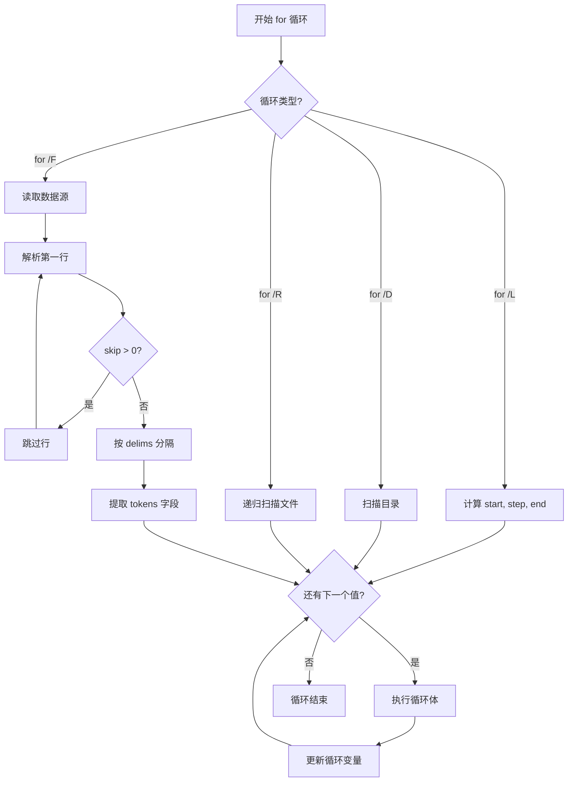
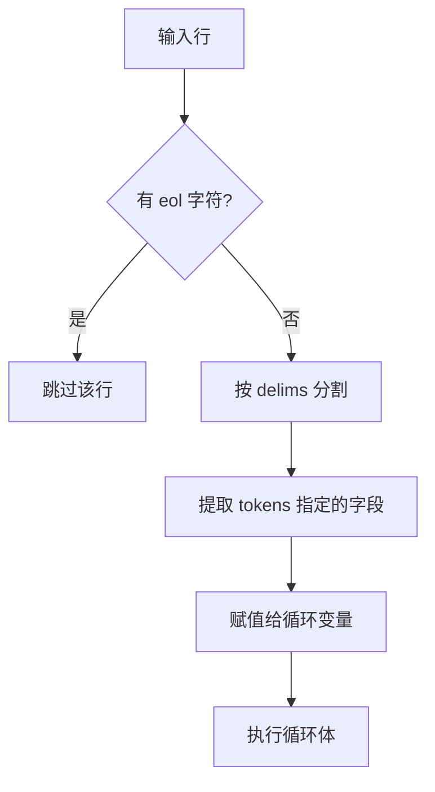

# 第04章 循环与跳转 — 重复的艺术

## 概述

循环是自动化的核心。在批处理脚本中，循环让我们能够重复执行任务，处理批量数据，遍历文件和目录。本章将深入讲解 `for` 循环的各种形式、`goto` 跳转、子程序调用等核心概念。

## 本章学习目标

完成本章后，你将能够：

- 掌握 `for` 循环的六种基本形式
- 熟练使用 `for /F` 进行字符串解析和文件读取
- 理解 `goto` 和标签的使用场景
- 运用 `call :label` 实现子程序调用
- 使用 `shift` 处理可变参数
- 避免循环中的常见陷阱

## 前置知识

- 变量定义和使用（set 命令）
- 条件判断（if 语句）
- 基本的命令行操作

## 预计学习时间

60-90 分钟

---

## 4.1 for 循环基础

### 4.1.1 基本列表遍历

最简单的 `for` 循环用于遍历一个列表：

```bat
@echo off
REM 遍历一组值
for %%i in (apple banana cherry) do (
    echo 水果: %%i
)
```

**输出：**
```
水果: apple
水果: banana
水果: cherry
```

!!! warning "循环变量的写法"
    - 在命令行中使用单 `%`：`for %i in (...) do ...`
    - 在批处理文件中使用双 `%%`：`for %%i in (...) do ...`

### 4.1.2 使用通配符

```bat
@echo off
REM 遍历当前目录下的所有 .txt 文件
for %%f in (*.txt) do (
    echo 文件: %%f
)
```

---

## 4.2 for /L — 数值范围循环

`for /L` 类似于其他语言的 `for(i=start; i<=end; i+=step)` 循环。

### 语法

```bat
for /L %%variable in (start,step,end) do command
```

### 参数说明

| 参数 | 说明 | 示例 |
|------|------|------|
| start | 起始值 | 1 |
| step | 步长（可为负数） | 1, 2, -1 |
| end | 结束值 | 10 |

### 示例：基本数值循环

```bat
@echo off
echo === 基本数值循环 ===
for /L %%i in (1,1,5) do (
    echo 第 %%i 次循环
)

echo.
echo === 自定义步长 ===
for /L %%i in (0,5,25) do (
    echo %%i
)

echo.
echo === 倒序循环 ===
for /L %%i in (10,-1,1) do (
    echo 倒计时: %%i
)
```

**输出：**
```
=== 基本数值循环 ===
第 1 次循环
第 2 次循环
第 3 次循环
第 4 次循环
第 5 次循环

=== 自定义步长 ===
0
5
10
15
20
25

=== 倒序循环 ===
倒计时: 10
倒计时: 9
...
倒计时: 1
```

!!! tip "技巧"
    使用步长 `-1` 可以实现倒序循环，这在倒计时场景中非常有用。

---

## 4.3 for /F — 文件/字符串解析循环

`for /F` 是最强大也最复杂的循环形式，用于解析文本内容。

### 4.3.1 基本语法

```bat
for /F ["options"] %%variable in (source) do command
```

### 4.3.2 解析字符串

```bat
@echo off
REM 按空格分隔（默认分隔符）
for /F "tokens=1,2,3" %%a in ("hello world cmd") do (
    echo 第1个: %%a
    echo 第2个: %%b
    echo 第3个: %%c
)
```

**输出：**
```
第1个: hello
第2个: world
第3个: cmd
```

### 4.3.3 自定义分隔符（delims）

```bat
@echo off
REM 按逗号分隔
for /F "tokens=1-3 delims=," %%a in ("apple,banana,cherry") do (
    echo 水果: %%a, %%b, %%c
)
```

**输出：**
```
水果: apple, banana, cherry
```

### 4.3.4 提取字段（tokens）

`tokens` 用于指定要提取的字段编号：

```bat
@echo off
REM 提取第1和第3个字段
for /F "tokens=1,3 delims=," %%a in ("one,two,three,four") do (
    echo 第1个: %%a
    echo 第3个: %%c
)
```

!!! info "tokens 语法说明"
    - `tokens=1,3` — 提取第1和第3个字段
    - `tokens=1-3` — 提取第1到第3个字段
    - `tokens=1,3-5` — 提取第1、3、4、5个字段
    - `tokens=*` — 提取剩余所有内容

### 4.3.5 跳过行数（skip）

```bat
@echo off
REM 跳过前2行
for /F "skip=2 tokens=*" %%a in (data.txt) do (
    echo %%a
)
```

### 4.3.6 注释字符（eol）

```bat
@echo off
REM 将 # 作为注释字符
for /F "eol=# tokens=*" %%a in (config.txt) do (
    echo %%a
)
```

### 4.3.7 读取命令输出

```bat
@echo off
REM 读取 dir 命令的输出
for /F "tokens=*" %%a in ('dir /b "%~dp0"') do (
    echo 文件: %%a
)
```

### 4.3.8 读取文件内容

```bat
@echo off
REM 使用 usebackq 读取文件
for /F "usebackq tokens=*" %%a in ("C:\path\to\file.txt") do (
    echo 读取: %%a
)
```

!!! warning "usebackq 选项"
    使用 `usebackq` 时：
    - 文件路径用双引号 `"file.txt"`
    - 字符串用单引号 `'string'`
    - 命令用反引号 `` `command` ``

---

## 4.4 for /D — 目录遍历循环

`for /D` 用于遍历目录（不包括文件）。

### 语法

```bat
for /D %%variable in (path\pattern) do command
```

### 示例

```bat
@echo off
echo === 遍历当前目录下的子目录 ===
for /D %%d in ("%~dp0*") do (
    echo 目录: %%~nxd
)
```

**输出：**
```
=== 遍历当前目录下的子目录 ===
目录: ch01
目录: ch02
目录: ch03
...
```

### 路径变量修饰符

| 修饰符 | 说明 | 示例 |
|--------|------|------|
| `%%~d` | 驱动器号 | C: |
| `%%~p` | 路径 | \Users\docs\ |
| `%%~n` | 文件名 | file |
| `%%~x` | 扩展名 | .txt |
| `%%~nx` | 文件名+扩展名 | file.txt |
| `%%~dpf` | 驱动器+路径+文件名 | C:\Users\docs\file.txt |

---

## 4.5 for /R — 递归文件遍历

`for /R` 用于递归遍历目录树中的文件。

### 语法

```bat
for /R [path] %%variable in (pattern) do command
```

### 示例

```bat
@echo off
echo === 遍历所有.bat文件 ===
for /R "%~dp0" %%f in (*.bat) do (
    echo 文件: %%~nxf (路径: %%~dpf)
)

echo.
echo === 遍历所有.txt文件 ===
for /R "%~dp0" %%f in (*.txt) do (
    echo 文件: %%~nxf
)
```

**输出：**
```
=== 遍历所有.bat文件 ===
文件: for_L.bat (路径: C:\Users\...\examples\ch04\)
文件: for_F.bat (路径: C:\Users\...\examples\ch04\)
...

=== 遍历所有.txt文件 ===
文件: temp.txt
...
```

!!! tip "性能提示"
    `for /R` 会递归遍历所有子目录，在目录结构很深时可能较慢。如果只需要遍历当前目录，使用 `for` 基本形式或 `for /D`。

---

## 4.6 for 循环的执行流程



---

## 4.7 goto 和标签

### 4.7.1 基本用法

`goto` 用于跳转到脚本中的指定标签位置。

```bat
@echo off
set /a "count=0"
:loop
set /a "count+=1"
echo 循环次数: %count%
if %count% LSS 5 goto :loop
echo 循环结束
```

**输出：**
```
循环次数: 1
循环次数: 2
循环次数: 3
循环次数: 4
循环次数: 5
循环结束
```

### 4.7.2 goto 实现菜单

```bat
@echo off
setlocal
goto :menu

:menu
echo.
echo 主菜单:
echo 1. 显示时间
echo 2. 显示日期
echo 3. 退出
choice /c 123 /n /m "请选择: "
if errorlevel 3 goto :end
if errorlevel 2 goto :showdate
if errorlevel 1 goto :showtime

:showtime
echo 当前时间: %TIME%
goto :menu

:showdate
echo 当前日期: %DATE%
goto :menu

:end
endlocal
```

!!! warning "goto 的陷阱"
    - 过度使用 `goto` 会导致"面条代码"，难以维护
    - `goto` 只能在同一文件内跳转
    - 标签名称不区分大小写

### 4.7.3 goto :eof 结束脚本

`:eof` 是一个特殊标签，表示文件结束：

```bat
@echo off
echo 开始
goto :eof
echo 这行不会执行
```

---

## 4.8 call :label — 子程序调用

### 4.8.1 基本用法

`call :label` 用于调用脚本中的子程序，执行完毕后返回调用点。

```bat
@echo off
echo 主程序开始
call :sayHello
echo 主程序继续
goto :eof

:sayHello
echo 你好，世界！
goto :eof
```

**输出：**
```
主程序开始
你好，世界！
主程序继续
```

### 4.8.2 传递参数给子程序

```bat
@echo off
call :greet "张三" 25
call :greet "李四" 30
goto :eof

:greet
echo 姓名: %~1, 年龄: %~2
goto :eof
```

**输出：**
```
姓名: 张三, 年龄: 25
姓名: 李四, 年龄: 30
```

### 4.8.3 使用 errorlevel 返回状态

```bat
@echo off
call :divide 10 2
echo 结果: %errorlevel%

call :divide 10 0
echo 结果: %errorlevel%
goto :eof

:divide
if %~2==0 (
    exit /b 1
)
set /a "result=%~1/%~2"
exit /b %result%
```

---

## 4.9 shift — 参数移位

`shift` 命令用于移动批处理参数的位置，常用于处理可变数量的参数。

### 语法

```bat
shift [/n]
```

### 示例

```bat
@echo off
echo 参数总数: %*
echo.
:loop
if "%~1"=="" goto :end
echo 当前参数: %~1
shift
goto :loop
:end
echo 所有参数处理完毕
```

**调用：**
```cmd
script.bat apple banana cherry
```

**输出：**
```
参数总数: apple banana cherry

当前参数: apple
当前参数: banana
当前参数: cherry
所有参数处理完毕
```

!!! tip "shift /n"
    使用 `shift /n` 可以从第 n 个参数开始移位，保留前面的参数。

---

## 4.10 嵌套循环与变量作用域

### 4.10.1 嵌套循环的变量冲突

```bat
@echo off
REM 错误示例：内外层使用相同变量
for /L %%i in (1,1,3) do (
    for /L %%i in (1,1,3) do (
        echo %%i
    )
)
```

!!! warning "变量冲突"
    内层循环会覆盖外层循环的变量！必须使用不同的变量名。

### 4.10.2 正确的嵌套循环

```bat
@echo off
REM 正确示例：使用不同变量
for /L %%i in (1,1,3) do (
    for /L %%j in (1,1,3) do (
        echo 外层: %%i, 内层: %%j
    )
)
```

**输出：**
```
外层: 1, 内层: 1
外层: 1, 内层: 2
外层: 1, 内层: 3
外层: 2, 内层: 1
...
```

### 4.10.3 循环变量的生命周期

循环变量只在循环体内有效，循环结束后变量值不可预测。

```bat
@echo off
for /L %%i in (1,1,5) do (
    set "last=%%i"
)
echo 最后的值: %last%
```

!!! info "延迟扩展"
    在循环体内修改变量时，需要使用延迟扩展（`setlocal EnableDelayedExpansion`）和 `!variable!` 语法：

```bat
@echo off
setlocal EnableDelayedExpansion
set "sum=0"
for /L %%i in (1,1,5) do (
    set /a "sum+=%%i"
    echo 当前总和: !sum!
)
echo 最终总和: !sum!
endlocal
```

---

## 4.11 for /F 的字符串解析算法

### 4.11.1 解析流程



### 4.11.2 分隔符处理规则

1. **连续分隔符**：被视为一个分隔符
   ```
   输入: "a,,b,,,c"
   delims=,
   结果: a, b, c
   ```

2. **行首分隔符**：被忽略
   ```
   输入: ",a,b,c"
   delims=,
   结果: a, b, c
   ```

3. **行尾分隔符**：被忽略
   ```
   输入: "a,b,c,"
   delims=,
   结果: a, b, c
   ```

### 4.11.3 tokens 与变量的对应关系

```bat
for /F "tokens=1,3,5" %%a in (...) do (
    REM %%a = 第1个字段
    REM %%b = 第2个字段（自动递增）
    REM %%c = 第3个字段
)
```

!!! warning "变量自动递增"
    即使 `tokens=1,3,5`，变量也是连续的：`%%a`, `%%b`, `%%c`，而不是 `%%a`, `%%c`, `%%e`。

---

## 4.12 与其他语言的对比

### 4.12.1 Python 对比

| 特性 | CMD for | Python for |
|------|---------|------------|
| 数值循环 | `for /L %%i in (1,1,10)` | `for i in range(1, 11)` |
| 列表遍历 | `for %%i in (a b c)` | `for i in ['a','b','c']` |
| 文件遍历 | `for %%f in (*.txt)` | `for f in glob.glob('*.txt')` |
| 字符串分割 | `for /F "tokens=1,2" %%a in (...)` | `a, b = s.split()` |

### 4.12.2 JavaScript 对比

| 特性 | CMD for | JavaScript |
|------|---------|------------|
| 数值循环 | `for /L %%i in (1,1,10)` | `for(let i=1; i<=10; i++)` |
| 数组遍历 | `for %%i in (a b c)` | `for(const i of ['a','b','c'])` |
| 文件遍历 | `for /R %%f in (*.txt)` | `fs.readdirSync().forEach()` |

### 4.12.3 C 语言对比

| 特性 | CMD for | C for |
|------|---------|-------|
| 数值循环 | `for /L %%i in (1,1,10)` | `for(int i=1; i<=10; i++)` |
| 条件控制 | 通过 if + goto | `for(; condition; )` |
| 嵌套循环 | 变量名不同 | 变量名可相同（作用域不同） |

---

## 4.13 最佳实践

### ✅ 推荐做法

1. **使用有意义的变量名**
   ```bat
   REM 好
   for /L %%row in (1,1,10) do (
       for /L %%col in (1,1,10) do (
           echo %%row, %%col
       )
   )
   
   REM 差
   for /L %%i in (1,1,10) do (
       for /L %%j in (1,1,10) do (
           echo %%i, %%j
       )
   )
   ```

2. **循环前检查数据源**
   ```bat
   if not exist "%file%" (
       echo 文件不存在: %file%
       goto :eof
   )
   for /F ... in ("%file%") do ...
   ```

3. **使用延迟扩展处理累加**
   ```bat
   setlocal EnableDelayedExpansion
   set "count=0"
   for %%f in (*.txt) do (
       set /a "count+=1"
   )
   echo 文件数量: !count!
   ```

4. **处理含空格的路径**
   ```bat
   for /F "tokens=*" %%a in ('dir /b /s "*.txt"') do (
       echo "%%a"
   )
   ```

### ❌ 常见陷阱

1. **循环体内修改变量未用延迟扩展**
   ```bat
   REM 错误
   set "sum=0"
   for /L %%i in (1,1,5) do (
       set /a "sum+=%%i"
       echo %sum%  REM 永远显示 0
   )
   
   REM 正确
   setlocal EnableDelayedExpansion
   set "sum=0"
   for /L %%i in (1,1,5) do (
       set /a "sum+=%%i"
       echo !sum!
   )
   ```

2. **嵌套循环使用相同变量**
   ```bat
   REM 错误
   for /L %%i in (1,1,3) do (
       for /L %%i in (1,1,3) do (
           echo %%i
       )
   )
   
   REM 正确
   for /L %%i in (1,1,3) do (
       for /L %%j in (1,1,3) do (
           echo %%i %%j
       )
   )
   ```

3. **for /F 未处理空行**
   ```bat
   REM 可能出错
   for /F "tokens=*" %%a in (file.txt) do (
       echo %%a
   )
   
   REM 更安全
   for /F "tokens=* delims=" %%a in (file.txt) do (
       if not "%%a"=="" echo %%a
   )
   ```

---

## 4.14 练习题

### 练习 1：九九乘法表

编写脚本输出九九乘法表：

```
1x1=1
1x2=2  2x2=4
1x3=3  2x3=6  3x3=9
...
```

??? hint "提示"
    使用嵌套的 `for /L` 循环，外层控制行，内层控制列。

### 练习 2：统计文件数量

编写脚本统计当前目录及子目录中 `.txt` 文件的数量。

??? hint "提示"
    使用 `for /R` 遍历文件，配合延迟扩展计数。

### 练习 3：CSV 解析器

编写脚本读取 CSV 文件，提取第 1 列和第 3 列，格式化输出。

??? hint "提示"
    使用 `for /F` 配合 `delims=,` 和 `tokens=1,3`。

### 练习 4：批量重命名

编写脚本将当前目录下所有 `.txt` 文件重命名为 `.bak` 文件。

??? hint "提示"
    使用 `for` 循环遍历文件，配合 `ren` 命令。

### 练习 5：简易计算器

使用 `goto` 和标签实现一个支持加减乘除的简易计算器菜单。

??? hint "提示"
    使用 `choice` 命令获取用户选择，用 `goto` 跳转到不同运算标签。

---

## 4.15 总结

本章介绍了 CMD 批处理中循环和跳转的核心概念：

| 概念 | 用途 | 关键语法 |
|------|------|----------|
| `for` 基本形式 | 列表遍历 | `for %%i in (list) do ...` |
| `for /L` | 数值循环 | `for /L %%i in (start,step,end) do ...` |
| `for /F` | 字符串/文件解析 | `for /F "options" %%i in (source) do ...` |
| `for /D` | 目录遍历 | `for /D %%i in (pattern) do ...` |
| `for /R` | 递归文件遍历 | `for /R path %%i in (pattern) do ...` |
| `goto` | 跳转到标签 | `goto :label` |
| `call :label` | 子程序调用 | `call :label args` |
| `shift` | 参数移位 | `shift [/n]` |

---

## 4.16 下一步

在下一章中，我们将学习字符串处理，包括：

- 字符串截取和替换
- 变量延迟扩展的深入应用
- 字符串查找和比较
- 特殊字符处理

---

## 附录：参考资源

- [Microsoft for 命令文档](https://learn.microsoft.com/en-us/windows-server/administration/windows-commands/for)
- [SS64 for 参考](https://ss64.com/nt/for.html)
- [Batch Scripting Guide](https://www.tutorialspoint.com/batch_script/index.htm)
