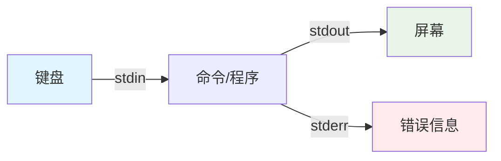
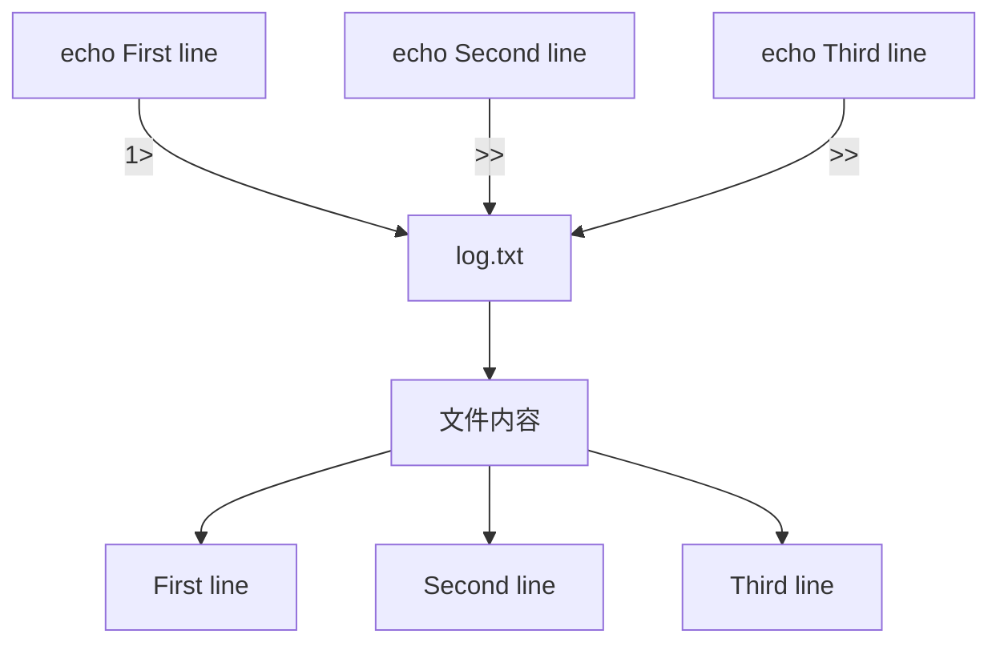
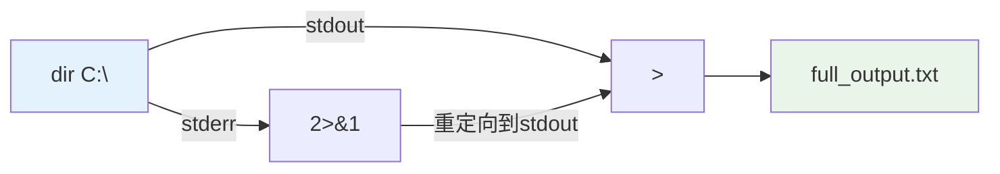
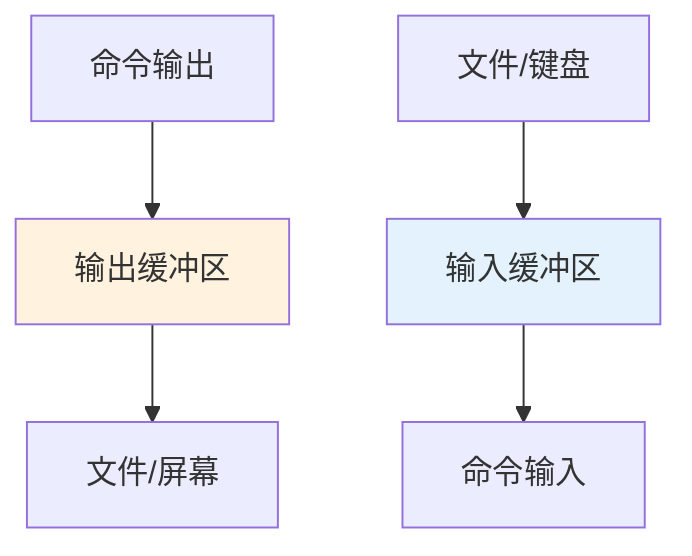

# 第06章：文件I/O与重定向 — 数据的流动

!!! note "学习目标"
    - 理解标准流（stdin、stdout、stderr）的概念
    - 掌握输出重定向、输入重定向和管道的使用
    - 学会使用CMD进行文件读写操作
    - 了解CMD脚本中数据流动的机制

**预计学习时间**：45-60分钟  
**难度等级**：⭐⭐⭐ 中级

## 6.1 I/O重定向概述

I/O重定向是CMD脚本中最强大的特性之一。它允许你控制命令的输入来源和输出去向，而不是仅限于屏幕和键盘。

### 什么是I/O重定向？

在命令行环境中，每个程序都有三个标准的数据通道：



**I/O重定向**允许你改变这些数据流的方向：
- 将输出写入文件而不是屏幕
- 从文件读取输入而不是键盘
- 将错误信息重定向到文件
- 通过管道将多个命令串联

## 6.2 标准流（Standard Streams）

### 6.2.1 三个标准流

在Windows CMD中，每个进程都有三个预定义的流：

| 流名称 | 文件描述符 | 变量 | 默认设备 | 用途 |
|--------|-----------|------|----------|------|
| **stdin** | 0 | `%input%` | 键盘 | 标准输入 |
| **stdout** | 1 | `%output%` | 屏幕 | 标准输出 |
| **stderr** | 2 | `%error%` | 屏幕 | 标准错误 |

!!! tip "文件描述符"
    文件描述符（File Descriptor）是操作系统用来标识打开文件或流的整数。在CMD中：
    - `0` 代表标准输入（stdin）
    - `1` 代表标准输出（stdout）
    - `2` 代表标准错误（stderr）

### 6.2.2 流的类型

CMD中的流分为两种类型：

**文本流（Text Stream）**
- 以行为单位处理数据
- 每行以换行符（CRLF）结束
- 自动进行字符编码转换

**字节流（Byte Stream）**
- 以字节为单位处理数据
- 不处理换行符
- 原始二进制数据

!!! warning "换行符差异"
    Windows使用CRLF（`\r\n`）作为换行符，而Unix/Linux使用LF（`\n`）。在跨平台处理文件时需要注意这个差异。

## 6.3 输出重定向

### 6.3.1 基本输出重定向 `>`

`>` 操作符将命令的输出写入文件，如果文件已存在则**覆盖**原有内容。

**基本语法**：
```bat
命令 > 文件名
```

**示例**：
```bat
echo Hello World > output.txt
dir > directory_list.txt
```

**执行流程**：


### 6.3.2 追加输出重定向 `>>`

`>>` 操作符将输出追加到文件末尾，不会覆盖原有内容。

**基本语法**：
```bat
命令 >> 文件名
```

**示例**：
```bat
echo First line > log.txt
echo Second line >> log.txt
echo Third line >> log.txt
```

**执行流程**：


### 6.3.3 错误重定向 `2>`

`2>` 操作符专门重定向标准错误输出（stderr）。

**基本语法**：
```bat
命令 2> 错误文件
```

**示例**：
```bat
dir nonexistent_directory 2> error.log
type missing_file.txt 2> error.log
```

**分离输出和错误**：
```bat
dir C:\ > output.txt 2> error.txt
```

### 6.3.4 合并错误到标准输出 `2>&1`

`2>&1` 将标准错误合并到标准输出，这样错误信息和正常输出会写入同一个地方。

**基本语法**：
```bat
命令 > 文件 2>&1
```

**示例**：
```bat
dir C:\ > full_output.txt 2>&1
```

**执行流程**：


!!! warning "重定向顺序"
    重定向的顺序非常重要！`2>&1` 必须在 `>` 之后，否则会出错：
    ```bat
    :: 正确
    dir > output.txt 2>&1
    
    :: 错误 - stderr会输出到屏幕
    dir 2>&1 > output.txt
    ```

### 6.3.5 丢弃输出 `>nul`

将输出重定向到 `nul` 设备会丢弃所有输出。

**基本语法**：
```bat
命令 >nul
命令 2>nul
命令 >nul 2>&1
```

**示例**：
```bat
:: 静默删除文件
del temp.txt 2>nul

:: 静默执行，不显示任何输出
echo Secret operation >nul 2>&1
```

!!! tip "nul的作用"
    `nul` 是Windows的空设备，类似于Unix的 `/dev/null`。写入 `nul` 的数据会被丢弃，读取 `nul` 会立即返回EOF。

## 6.4 输入重定向

### 6.4.1 基本输入重定向 `<`

`<` 操作符从文件读取输入，而不是从键盘读取。

**基本语法**：
```bat
命令 < 输入文件
```

**示例**：
```bat
sort < unsorted.txt
find "keyword" < data.txt
```

**执行流程**：


### 6.4.2 组合输入输出重定向

可以同时使用输入和输出重定向：

```bat
sort < unsorted.txt > sorted.txt
find "error" < log.txt > errors.txt
```

**执行流程**：


## 6.5 管道（Pipe）

### 6.5.1 管道基础

管道 `|` 将一个命令的输出作为另一个命令的输入。

**基本语法**：
```bat
命令1 | 命令2
```

**示例**：
```bat
dir | find ".txt"
echo hello | findstr "hello"
```

**执行流程**：
```mermaid
graph LR
    A[dir] -->|stdout| B[管道 |]
    B -->|stdin| C[find ".txt"]
    C -->|stdout| D[屏幕]
    
    style A fill:#e3f2fd
    style D fill:#e8f5e8
```

### 6.5.2 多级管道

可以将多个命令通过管道串联：

```bat
dir | find ".bat" | sort | find /c /v ""
```

**执行流程**：
```mermaid
graph LR
    A[dir] -->|stdout| B[find ".bat"]
    B -->|stdout| C[sort]
    C -->|stdout| D[find /c /v ""]
    D -->|stdout| E[屏幕]
    
    style A fill:#e3f2fd
    style E fill:#e8f5e8
```

### 6.5.3 管道中的变量扩展

!!! warning "变量扩展时机"
    在管道中，变量扩展发生在管道执行之前，这可能导致意外行为：
    
    ```bat
    set "var=hello"
    echo %var% | findstr "hello"
    :: 正确工作
    
    :: 但如果在括号代码块中...
    (
        set "var=hello"
        echo %var% | findstr "hello"
    )
    :: %var%可能为空，因为变量在括号开始时就已扩展
    ```
    
    **解决方案**：使用延迟扩展 `!var!`

## 6.6 Here Document（Here Doc）

### 6.6.1 CMD中的Here Document模拟

CMD没有真正的Here Document语法，但可以使用括号代码块模拟：

**基本模式**：
```bat
(
echo 第一行
echo 第二行
echo 第三行
) > output.txt
```

**示例：生成HTML文件**：
```bat
@echo off
(
echo ^<!DOCTYPE html^>
echo ^<html^>
echo ^<head^>
echo     ^<title^>Test Page^</title^>
echo ^</head^>
echo ^<body^>
echo     ^<h1^>Hello World^</h1^>
echo ^</body^>
echo ^</html^>
) > page.html
```

!!! warning "特殊字符转义"
    在括号代码块中，以下字符需要转义：
    - `<` → `^<`
    - `>` → `^>`
    - `|` → `^|`
    - `&` → `^&`
    - `(` → `^(`  （在某些情况下）
    - `)` → `^)`  （在某些情况下）

### 6.6.2 使用临时文件模拟Here Doc

更可靠的方法是使用临时文件：

```bat
@echo off
setlocal

:: 创建临时文件
set "TMPFILE=%TEMP%\heredoc_%RANDOM%.txt"

:: 写入内容
echo Line 1 > "%TMPFILE%"
echo Line 2 >> "%TMPFILE%"
echo Line 3 >> "%TMPFILE%"

:: 使用临时文件
type "%TMPFILE%" | findstr "Line"

:: 清理
del "%TMPFILE%" 2>nul
endlocal
```

## 6.7 文件读取

### 6.7.1 `type` 命令

`type` 命令显示文件内容。

**基本用法**：
```bat
type filename.txt
type "path with spaces\file.txt"
```

**特点**：
- 显示整个文件内容
- 支持通配符（`*.txt`）
- 不能分页显示

### 6.7.2 `more` 命令（分页显示）

`more` 命令分页显示文件内容。

**基本用法**：
```bat
more filename.txt
more < filename.txt
```

**交互命令**：
- `Space` - 显示下一页
- `Enter` - 显示下一行
- `Q` 或 `Ctrl+C` - 退出

**示例**：
```bat
:: 分页显示大文件
more large_file.txt

:: 结合管道使用
dir /s | more
```

### 6.7.3 `for /F` 逐行读取

`for /F` 是最强大的文件读取方式，可以逐行处理文件内容。

**基本语法**：
```bat
for /F "options" %%variable in (file) do command
```

**选项说明**：

| 选项 | 说明 | 示例 |
|------|------|------|
| `tokens=N` | 提取第N个标记 | `tokens=1` |
| `delims=X` | 使用X作为分隔符 | `delims=,` |
| `skip=N` | 跳过前N行 | `skip=2` |
| `usebackq` | 允许使用反引号 | 文件名有空格时使用 |

**示例1：简单逐行读取**：
```bat
for /F "tokens=*" %%a in (file.txt) do (
    echo 行内容: %%a
)
```

**示例2：提取特定列**：
```bat
:: 假设文件内容: name,age,city
for /F "tokens=1,3 delims=," %%a in (data.csv) do (
    echo 姓名: %%a, 城市: %%c
)
```

**示例3：跳过标题行**：
```bat
for /F "skip=1 tokens=*" %%a in (data.csv) do (
    echo %%a
)
```

**示例4：带行号读取**：
```bat
@echo off
setlocal EnableDelayedExpansion
set "linenum=0"

for /F "tokens=*" %%a in (file.txt) do (
    set /a "linenum+=1"
    echo !linenum!: %%a
)
```

!!! tip "usebackq选项"
    当文件路径包含空格时，使用 `usebackq` 选项并用反引号包裹路径：
    ```bat
    for /F "usebackq tokens=*" %%a in ("C:\My Files\data.txt") do (
        echo %%a
    )
    ```

## 6.8 文件写入

### 6.8.1 `echo` 重定向写入

最常见的文件写入方式。

**基本语法**：
```bat
echo 内容 > 文件名
echo 内容 >> 文件名
```

**示例**：
```bat
:: 覆盖写入
echo Hello > output.txt

:: 追加写入
echo World >> output.txt

:: 写入空行
echo. >> output.txt
```

!!! warning "echo的尾部空格"
    `echo` 命令会包含尾部的空格：
    ```bat
    echo Hello   > file.txt
    :: 文件内容: "Hello   " (包含尾部空格)
    
    :: 解决方案：确保>紧贴内容
    echo Hello> file.txt
    ```

### 6.8.2 `set /p` 写入（无换行）

`set /p` 可以写入不带换行符的内容。

**基本语法**：
```bat
<nul set /p "=内容" > 文件名
```

**示例**：
```bat
:: 写入不带换行的内容
<nul set /p "=No newline" > file.txt
echo. >> file.txt  :: 添加换行
```

### 6.8.3 `type` 追加文件

使用 `type` 命令可以将一个文件的内容追加到另一个文件。

**基本语法**：
```bat
type source.txt >> destination.txt
```

**示例**：
```bat
:: 合并多个文件
type part1.txt > combined.txt
type part2.txt >> combined.txt
type part3.txt >> combined.txt
```

### 6.8.4 `copy con` 交互式写入

`copy con` 允许从键盘交互式输入内容到文件。

**基本语法**：
```bat
copy con filename.txt
```

**使用方法**：
1. 输入命令后，光标会移到下一行
2. 逐行输入内容
3. 按 `Ctrl+Z` 然后 `Enter` 结束输入

**示例**：
```bat
copy con notes.txt
This is line 1
This is line 2
^Z
```

!!! tip "copy con的用途"
    `copy con` 适合快速创建小型文本文件，但不适合脚本自动化，因为它需要用户交互。

## 6.9 临时文件

### 6.9.1 `%TEMP%` 环境变量

Windows提供了 `%TEMP%` 环境变量指向临时目录。

**常用临时目录**：
- `%TEMP%` - 当前用户的临时目录
- `%TMP%` - 通常与 `%TEMP%` 相同
- `%USERPROFILE%\AppData\Local\Temp` - 完整路径

**示例**：
```bat
echo 临时目录: %TEMP%
echo 用户临时目录: %TMP%
```

### 6.9.2 创建唯一临时文件名

使用 `%RANDOM%` 或 `%TIME%` 创建唯一文件名：

```bat
:: 使用随机数
set "TMPFILE=%TEMP%\myapp_%RANDOM%.txt"

:: 使用时间戳
set "TMPFILE=%TEMP%\myapp_%TIME:~0,2%%TIME:~3,2%%TIME:~6,2%.txt"

:: 使用GUID（需要PowerShell）
for /f "delims=" %%i in ('powershell -command "[guid]::NewGuid().ToString()"') do set "TMPFILE=%TEMP%\%%i.txt"
```

### 6.9.3 临时文件最佳实践

!!! warning "临时文件清理"
    **必须**在脚本结束时清理临时文件：
    
    ```bat
    @echo off
    setlocal
    
    set "TMPFILE=%TEMP%\myapp_%RANDOM%.txt"
    
    :: 使用临时文件
    echo Data > "%TMPFILE%"
    
    :: 清理（确保执行）
    del "%TMPFILE%" 2>nul
    
    endlocal
    ```

## 6.10 文件锁和并发

### 6.10.1 CMD的并发限制

CMD批处理脚本**没有内置的文件锁机制**，这在并发场景下会导致问题：

**常见问题**：
- 多个脚本同时写入同一文件
- 读取正在被写入的文件
- 文件损坏或数据丢失

### 6.10.2 简单的锁机制模拟

可以使用锁文件模拟简单的并发控制：

```bat
@echo off
setlocal

set "LOCKFILE=%TEMP%\myapp.lock"

:: 检查锁是否存在
if exist "%LOCKFILE%" (
    echo 另一个实例正在运行
    exit /b 1
)

:: 创建锁
echo %PID% > "%LOCKFILE%"

:: 执行操作
echo Processing...

:: 释放锁
del "%LOCKFILE%" 2>nul

endlocal
```

!!! warning "锁机制的局限性"
    这种简单的锁机制存在竞态条件（race condition），不适用于高并发场景。对于生产环境，建议使用：
    - PowerShell的 `Mutex`
    - 第三方工具
    - 数据库

## 6.11 数据结构概念

### 6.11.1 缓冲区机制

CMD使用缓冲区来提高I/O性能：



**缓冲区类型**：
- **行缓冲**：遇到换行符时刷新
- **全缓冲**：缓冲区满时刷新
- **无缓冲**：立即写入

### 6.11.2 换行符（CRLF vs LF）

**Windows换行符**：CRLF（`\r\n`，十六进制 `0D 0A`）
**Unix/Linux换行符**：LF（`\n`，十六进制 `0A`）

**处理建议**：
```bat
:: 查看文件的换行符类型
xxd filename.txt | find "0d 0a"

:: 转换LF到CRLF（需要Unix工具）
:: dos2unix filename.txt
```

## 6.12 与其他语言的对比

### 6.12.1 Python文件I/O对比

**Python**：
```python
# 读取文件
with open('file.txt', 'r') as f:
    for line in f:
        print(line.strip())

# 写入文件
with open('file.txt', 'w') as f:
    f.write('Hello\n')
    f.write('World\n')
```

**CMD**：
```bat
:: 读取文件
for /F "tokens=*" %%a in (file.txt) do (
    echo %%a
)

:: 写入文件
echo Hello > file.txt
echo World >> file.txt
```

**主要差异**：

| 特性 | Python | CMD |
|------|--------|-----|
| 文件打开 | `open()` 函数 | 自动处理 |
| 编码控制 | `encoding` 参数 | 系统默认 |
| 异常处理 | `try/except` | `2>nul` |
| 缓冲控制 | `buffering` 参数 | 无控制 |
| 二进制模式 | `'rb'`/`'wb'` | 不支持 |

### 6.12.2 JavaScript (Node.js) 对比

**Node.js**：
```javascript
const fs = require('fs');

// 同步读取
const data = fs.readFileSync('file.txt', 'utf8');

// 异步写入
fs.writeFile('file.txt', 'Hello\n', (err) => {
    if (err) throw err;
});
```

**主要差异**：

| 特性 | Node.js | CMD |
|------|---------|-----|
| 异步支持 | 原生支持 | 不支持 |
| 流式处理 | Stream API | 管道 |
| 文件监听 | `fs.watch()` | 不支持 |
| 大文件处理 | 流式处理 | 分块读取 |

### 6.12.3 C语言对比

**C语言**：
```c
#include <stdio.h>

int main() {
    FILE *f = fopen("file.txt", "r");
    char line[256];
    while (fgets(line, sizeof(line), f)) {
        printf("%s", line);
    }
    fclose(f);
    return 0;
}
```

**主要差异**：

| 特性 | C语言 | CMD |
|------|-------|-----|
| 内存管理 | 手动 | 自动 |
| 错误处理 | 返回值检查 | `errorlevel` |
| 文件指针 | `FILE*` | 隐式 |
| 缓冲控制 | `setbuf()` | 无控制 |

## 6.13 最佳实践和常见陷阱

### 6.13.1 重定向顺序的重要性

**正确的重定向顺序**：
```bat
:: 正确：先重定向stdout，再合并stderr
command > output.txt 2>&1

:: 错误：stderr会输出到屏幕
command 2>&1 > output.txt
```

**多个重定向的顺序**：
```bat
:: 正确顺序
command 1> output.txt 2> error.txt

:: 合并到同一文件
command > all.txt 2>&1
```

### 6.13.2 编码问题（GBK vs UTF-8）

**Windows默认编码**：
- CMD默认使用GBK（代码页936）
- 记事本默认使用ANSI（通常是GBK）
- 现代编辑器默认使用UTF-8

**处理编码问题**：
```bat
:: 查看当前代码页
chcp

:: 切换到UTF-8
chcp 65001

:: 切换回GBK
chcp 936
```

!!! warning "编码不匹配"
    如果文件是UTF-8编码但CMD使用GBK，会出现乱码。解决方案：
    1. 使用 `chcp 65001` 切换到UTF-8
    2. 在文件开头添加BOM（`\xEF\xBB\xBF`）
    3. 使用支持指定编码的工具（如PowerShell）

### 6.13.3 管道中的变量扩展时机

**问题**：
```bat
@echo off
setlocal

set "var=hello"
echo %var% | findstr "hello"
:: 正常工作

:: 在括号代码块中
(
    set "var=world"
    echo %var% | findstr "world"
    :: 可能失败！%var%在括号开始时已扩展
)
```

**解决方案：延迟扩展**：
```bat
@echo off
setlocal EnableDelayedExpansion

(
    set "var=world"
    echo !var! | findstr "world"
    :: 正常工作
)
```

### 6.13.4 大文件处理的性能问题

**性能瓶颈**：
- `for /F` 会将整个文件加载到内存
- 管道会创建临时文件
- 重复的文件打开/关闭

**优化建议**：
```bat
:: 避免在循环中多次打开文件
:: 不好的做法
for /L %%i in (1,1,100) do (
    type file.txt | findstr "pattern"
)

:: 好的做法
for /F "tokens=*" %%a in (file.txt) do (
    echo %%a | findstr "pattern"
)
```

**大文件处理技巧**：
```bat
:: 使用more分页处理
more large.txt | findstr "pattern"

:: 使用PowerShell处理大文件
powershell -command "Get-Content large.txt | Where-Object { $_ -match 'pattern' }"
```

## 6.14 练习题

### 练习1：基础重定向

**题目**：创建一个批处理脚本，将当前目录的文件列表保存到 `filelist.txt`，并将错误信息保存到 `errors.txt`。

**要求**：
- 使用 `dir` 命令
- 分离标准输出和错误输出
- 显示生成的文件内容

**提示**：
```bat
dir > filelist.txt 2> errors.txt
```

### 练习2：管道组合

**题目**：创建一个脚本，统计当前目录下所有 `.bat` 文件的数量。

**要求**：
- 使用管道组合多个命令
- 只显示数量，不显示文件列表

**提示**：
```bat
dir /b | find /c ".bat"
```

### 练习3：文件处理

**题目**：创建一个脚本，读取一个文本文件，为每一行添加行号，然后保存到新文件。

**要求**：
- 使用 `for /F` 逐行读取
- 使用延迟扩展
- 输出格式：`行号: 内容`

**参考代码**：
```bat
@echo off
setlocal EnableDelayedExpansion

set "INPUT=input.txt"
set "OUTPUT=output_with_linenum.txt"
set "linenum=0"

echo. > "%OUTPUT%"
for /F "tokens=*" %%a in ("%INPUT%") do (
    set /a "linenum+=1"
    echo !linenum!: %%a >> "%OUTPUT%"
)

echo 处理完成，共 !linenum! 行
type "%OUTPUT%"
```

### 练习4：Here Document

**题目**：创建一个脚本，使用Here Document方式生成一个简单的HTML页面。

**要求**：
- 使用括号代码块模拟Here Document
- 包含基本的HTML结构
- 正确转义特殊字符

### 练习5：临时文件管理

**题目**：创建一个脚本，演示临时文件的创建、使用和清理。

**要求**：
- 使用 `%TEMP%` 环境变量
- 创建唯一文件名（使用 `%RANDOM%`）
- 确保脚本退出时清理临时文件

## 6.15 总结

本章介绍了CMD中文件I/O和重定向的核心概念：

1. **标准流**：stdin(0)、stdout(1)、stderr(2)
2. **输出重定向**：`>` 覆盖、`>>` 追加、`2>` 错误、`2>&1` 合并、`>nul` 丢弃
3. **输入重定向**：`<` 从文件读取
4. **管道**：`|` 连接命令
5. **文件读取**：`type`、`more`、`for /F`
6. **文件写入**：`echo` 重定向、`set /p`、`type` 追加
7. **临时文件**：`%TEMP%`、`%RANDOM%`
8. **最佳实践**：重定向顺序、编码问题、变量扩展时机

掌握这些概念将使你能够编写更强大的CMD脚本，处理复杂的数据流和文件操作。

## 6.16 下一步学习

- [第07章：函数与模块化 — 代码的复用](../ch07-functions/index.md)
- [第08章：数据结构 — 信息的组织](../ch08-data-structures/index.md)

## 6.17 附加资源

- [Microsoft Docs: Redirection](https://learn.microsoft.com/en-us/windows-server/administration/windows-commands/redirection-operators)
- [SS64: Redirection](https://ss64.com/nt/syntax-redirection.html)
- [Batch File Programming](https://www.tutorialspoint.com/batch_script/)