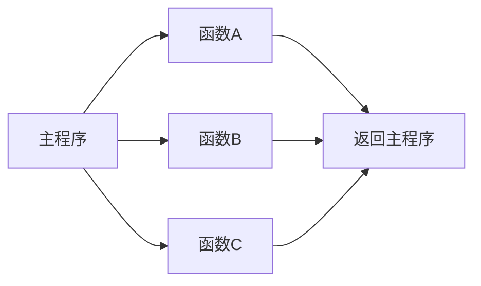
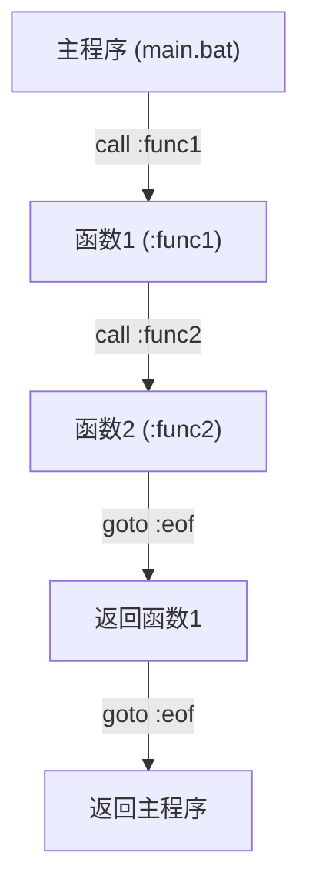

# 第07章 函数与模块化 — 代码的组织

## 本章目标

通过本章学习，你将能够：

- 理解CMD中函数的概念和实现方式
- 掌握使用 `call` 命令调用子程序
- 学会参数传递和返回值处理
- 理解延迟扩展的必要性和使用场景
- 掌握变量作用域管理
- 创建可复用的函数库文件

**预计学习时间**: 45-60分钟

**前置知识**: 第1-6章内容，特别是变量、循环和条件判断

---

## 7.1 为什么需要函数？

在编写较复杂的批处理脚本时，你经常会遇到以下问题：

1. **代码重复** - 相同的逻辑在多个地方出现
2. **难以维护** - 修改一个功能需要找到所有相关代码
3. **逻辑混乱** - 所有代码堆在一起，难以理解

函数（在CMD中称为"子程序"）正是解决这些问题的关键。



!!! tip "类比理解"
    函数就像是一个"子任务"：主程序告诉函数"请帮我完成这件事"，函数完成后返回结果，主程序继续执行。

---

## 7.2 标签和 goto：函数的基础

在CMD中，函数本质上是通过**标签（label）** 和 **goto** 来实现的。

### 7.2.1 标签定义

标签以冒号 `:` 开头，放在行首：

```bat
:label_name
:: 这里是标签下的代码
echo This is inside the label
```

!!! warning "标签命名规则"
    - 标签名不能包含空格
    - 标签名不区分大小写
    - 建议使用有意义的名称，如 `:greet`、`:calculate`

### 7.2.2 goto 命令

`goto` 命令用于跳转到指定标签：

```bat
@echo off
echo Before goto
goto :skip_middle
echo This line is skipped!
:skip_middle
echo After goto
```

**输出结果：**
```
Before goto
After goto
```

### 7.2.3 标签作为函数的基本结构

```bat
@echo off
:: 主程序
echo 主程序开始
call :my_function
echo 主程序结束
goto :eof

:my_function
echo 函数执行中...
goto :eof
```

---

## 7.3 call 命令：调用子程序

`call` 是CMD中调用函数的核心命令。

### 7.3.1 call :label - 调用当前脚本中的标签

```bat
@echo off
echo 主程序开始
call :greet "Alice"
call :greet "Bob"
echo 主程序结束
goto :eof

:greet
echo 你好, %~1!
goto :eof
```

**输出结果：**
```
主程序开始
你好, Alice!
你好, Bob!
主程序结束
```

### 7.3.2 call script.bat - 调用外部脚本

```bat
:: 主脚本 (main.bat)
@echo off
echo 主脚本开始
call helper.bat
echo 主脚本结束
```

```bat
:: 辅助脚本 (helper.bat)
@echo off
echo 辅助脚本被调用
```

### 7.3.3 call 嵌套调用的限制

!!! warning "嵌套深度限制"
    CMD的call命令有嵌套深度限制，默认约为128层。超过限制会导致错误。

```bat
@echo off
setlocal EnableDelayedExpansion

:: 计数器，用于跟踪嵌套深度
set "depth=0"

:recursive
set /a "depth+=1"
echo 嵌套深度: !depth!

:: 限制递归深度，防止无限循环
if !depth! GEQ 10 goto :eof
goto :recursive
```

**输出结果：**
```
嵌套深度: 1
嵌套深度: 2
嵌套深度: 3
嵌套深度: 4
嵌套深度: 5
嵌套深度: 6
嵌套深度: 7
嵌套深度: 8
嵌套深度: 9
嵌套深度: 10
```

---

## 7.4 参数传递

CMD中的参数传递非常灵活，但也有其特殊性。

### 7.4.1 位置参数 %0 ~ %9

- `%0` - 脚本或函数名本身
- `%1` 到 `%9` - 第1到第9个参数

```bat
@echo off
call :show_params arg1 arg2 arg3
goto :eof

:show_params
echo 函数名: %0
echo 参数1: %1
echo 参数2: %2
echo 参数3: %3
goto :eof
```

**输出结果：**
```
函数名: :show_params
参数1: arg1
参数2: arg2
参数3: arg3
```

### 7.4.2 参数扩展修饰符

使用 `~` 修饰符可以去除引号等：

| 修饰符 | 说明 | 示例 |
|--------|------|------|
| `%~1` | 去除引号 | `"hello"` → `hello` |
| `%~f1` | 完整路径 | `file.txt` → `C:\path\file.txt` |
| `%~d1` | 驱动器号 | `C:\file.txt` → `C:` |
| `%~p1` | 路径部分 | `C:\dir\file.txt` → `\dir\` |
| `%~n1` | 文件名 | `file.txt` → `file` |
| `%~x1` | 扩展名 | `file.txt` → `.txt` |
| `%~s1` | 短路径 | 长路径 → `8.3`格式 |
| `%~a1` | 文件属性 | 显示文件属性 |
| `%~t1` | 文件时间 | 显示修改时间 |
| `%~z1` | 文件大小 | 显示文件大小 |

```bat
@echo off
call :show_info "C:\My Documents\report.txt"
goto :eof

:show_info
echo 完整路径: %~f1
echo 驱动器: %~d1
echo 路径: %~p1
echo 文件名: %~n1
echo 扩展名: %~x1
goto :eof
```

### 7.4.3 %* 所有参数

`%*` 代表传递给脚本或函数的所有参数（保留原始格式）：

```bat
@echo off
call :show_all "hello world" foo bar
goto :eof

:show_all
echo 所有参数: %*
echo 参数1: %~1
echo 参数2: %~2
goto :eof
```

**输出结果：**
```
所有参数: "hello world" foo bar
参数1: hello world
参数2: foo
```

### 7.4.4 参数中的特殊字符处理

!!! warning "特殊字符问题"
    参数中的特殊字符（如 `&`, `|`, `<`, `>`）可能导致意外行为。务必使用引号包裹参数。

```bat
@echo off
:: 错误示例 - 特殊字符会导致问题
call :show_msg hello & world

:: 正确示例 - 使用引号
call :show_msg "hello & world"
goto :eof

:show_msg
echo 消息: %~1
goto :eof
```

### 7.4.5 命名参数的实现技巧

虽然CMD不原生支持命名参数，但可以通过解析实现：

```bat
@echo off
setlocal EnableDelayedExpansion

call :process_args /name:Alice /age:25 /city:"New York"
echo 姓名: !name!, 年龄: !age!, 城市: !city!
endlocal
goto :eof

:process_args
set "name="
set "age="
set "city="

:parse_loop
if "%~1"=="" goto :parse_done

if /i "%~1"=="/name" (
    set "name=%~2"
    shift
    shift
    goto :parse_loop
)

if /i "%~1"=="/age" (
    set "age=%~2"
    shift
    shift
    goto :parse_loop
)

if /i "%~1"=="/city" (
    set "city=%~2"
    shift
    shift
    goto :parse_loop
)

shift
goto :parse_loop

:parse_done
goto :eof
```

**输出结果：**
```
姓名: Alice, 年龄: 25, 城市: New York
```

### 7.4.6 参数个数统计

```bat
@echo off
call :count_params a b c d e
goto :eof

:count_params
set "count=0"
:params_loop
if "%~1"=="" goto :params_done
set /a "count+=1"
shift
goto :params_loop
:params_done
echo 参数个数: %count%
goto :eof
```

**输出结果：**
```
参数个数: 5
```

---

## 7.5 返回值

CMD中函数返回值有两种主要方式。

### 7.5.1 通过 ERRORLEVEL 返回数值

`exit /b` 命令可以设置 ERRORLEVEL：

```bat
@echo off
setlocal

:: 调用加法函数
call :add 3 5
echo 3 + 5 = %ERRORLEVEL%

:: 调用乘法函数
call :multiply 4 6
echo 4 * 6 = %ERRORLEVEL%

endlocal
goto :eof

:add
set /a "result=%~1 + %~2"
exit /b %result%

:multiply
set /a "result=%~1 * %~2"
exit /b %result%
```

**输出结果：**
```
3 + 5 = 8
4 * 6 = 24
```

!!! note "ERRORLEVEL的局限性"
    ERRORLEVEL只能返回0-255的整数（实际上更大范围也可能工作，但不推荐）。如果需要返回更复杂的数据，应该使用变量。

### 7.5.2 通过变量返回（副作用方式）

这是更灵活的方式，通过修改全局变量来返回结果：

```bat
@echo off
setlocal EnableDelayedExpansion

:: 通过变量返回结果
call :get_greeting "Alice"
echo !greeting!

call :calculate_area 5 3
echo 面积: !area!

endlocal
goto :eof

:get_greeting
set "greeting=Hello, %~1! Welcome!"
goto :eof

:calculate_area
set /a "area=%~1 * %~2"
goto :eof
```

**输出结果：**
```
Hello, Alice! Welcome!
面积: 15
```

### 7.5.3 goto :eof 结束子程序

`goto :eof` 是CMD中结束子程序的标准方式：

```bat
:my_function
:: 函数代码
echo 执行中...

:: 条件退出
if %some_condition%==true goto :eof

:: 继续执行
echo 继续...

goto :eof
```

!!! tip "为什么用 goto :eof 而不是 exit /b？"
    - `goto :eof` 只是跳转到文件末尾，不设置ERRORLEVEL
    - `exit /b` 可以同时设置ERRORLEVEL
    - 如果不需要返回值，两者都可以用

---

## 7.6 延迟扩展：CMD函数的核心机制

延迟扩展是理解CMD函数的关键概念。

### 7.6.1 为什么需要延迟扩展？

CMD在解析命令时会立即替换 `%var%`，这在循环和代码块中会导致问题：

```bat
@echo off
setlocal

set "count=0"
for /L %%i in (1,1,5) do (
    set /a "count+=1"
    echo 计数: %count%  :: 这里显示的总是0！
)

endlocal
```

**输出结果：**
```
计数: 0
计数: 0
计数: 0
计数: 0
计数: 0
```

问题在于：`%count%` 在循环开始前就被替换了，循环内永远不会更新。

### 7.6.2 启用延迟扩展

使用 `setlocal EnableDelayedExpansion` 启用延迟扩展：

```bat
@echo off
setlocal EnableDelayedExpansion

set "count=0"
for /L %%i in (1,1,5) do (
    set /a "count+=1"
    echo 计数: !count!  :: 使用感叹号，延迟扩展
)

endlocal
```

**输出结果：**
```
计数: 1
计数: 2
计数: 3
计数: 4
计数: 5
```

### 7.6.3 !var! vs %var%

| 语法 | 替换时机 | 使用场景 |
|------|----------|----------|
| `%var%` | 解析时立即替换 | 简单语句，for循环变量 |
| `!var!` | 执行时延迟替换 | 循环体、代码块内的变量 |

```bat
@echo off
setlocal EnableDelayedExpansion

set "a=hello"
set "b=world"

:: 简单语句中，两者效果相同
echo %a% %b%
echo !a! !b!

:: 代码块中，必须使用延迟扩展
if 1==1 (
    set "c=inside block"
    echo 延迟扩展: !c!
    echo 即时扩展: %c%  :: 这会显示空！
)

endlocal
```

### 7.6.4 延迟扩展在 for 循环中的应用

```bat
@echo off
setlocal EnableDelayedExpansion

:: 收集所有文件到变量
set "files="
for %%f in (*.txt) do (
    set "files=!files! %%f"
)
echo 找到的文件: !files!

:: 累加计算
set "total=0"
for /L %%i in (1,1,10) do (
    set /a "total+=%%i"
)
echo 1到10的和: !total!

endlocal
```

!!! warning "延迟扩展的性能开销"
    延迟扩展会带来轻微的性能开销。在不需要时（如简单语句中），可以使用 `%var%`。

### 7.6.5 感叹号的处理

当变量值包含感叹号时，需要特别注意：

```bat
@echo off
setlocal EnableDelayedExpansion

:: 包含感叹号的字符串
set "msg=Hello World!"
echo 不使用延迟扩展: %msg%
echo 使用延迟扩展: !msg!

:: 如果启用了延迟扩展，感叹号会被解释为变量边界
:: 这可能导致意外行为
set "test=This is a test!"
echo 测试: !test!

endlocal
```

---

## 7.7 作用域管理

CMD中的变量作用域管理对于函数的正确实现至关重要。

### 7.7.1 setlocal 和 endlocal

```bat
@echo off

:: 全局变量
set "global_var=I am global"
echo 全局变量: %global_var%

:: 进入局部作用域
setlocal
set "local_var=I am local"
echo 局部变量: %local_var%
echo 全局变量仍然可访问: %global_var%

:: 退出局部作用域
endlocal

echo 退出后全局变量: %global_var%
echo 退出后局部变量: %local_var%  :: 这会显示空！
```

**输出结果：**
```
全局变量: I am global
局部变量: I am local
全局变量仍然可访问: I am global
退出后全局变量: I am global
退出后局部变量: 
```

### 7.7.2 函数中的作用域

```bat
@echo off
set "x=100"
echo 主程序 x=%x%

call :my_function
echo 调用后 x=%x%
goto :eof

:my_function
setlocal
set "x=200"
echo 函数内 x=%x%
endlocal
goto :eof
```

**输出结果：**
```
主程序 x=100
函数内 x=200
调用后 x=100
```

### 7.7.3 跨 endlocal 传递变量的技巧

这是一个高级技巧，用于从函数返回变量：

```bat
@echo off
setlocal

call :get_info
echo 姓名: %name%
echo 年龄: %age%
goto :eof

:get_info
setlocal
set "name=Alice"
set "age=25"

:: 技巧：使用 endlocal & set 来传递变量
:: 命令在同一行执行，endlocal和set同时生效
endlocal & set "name=%name%" & set "age=%age%"
goto :eof
```

**输出结果：**
```
姓名: Alice
年龄: 25
```

!!! tip "跨endlocal传递的原理"
    CMD在解析 `endlocal & set "name=%name%"` 时：
    1. 先解析 `%name%`（此时还在setlocal内部）
    2. 然后执行 `endlocal`（销毁局部变量）
    3. 最后执行 `set "name=Alice"`（在新作用域创建变量）

---

## 7.8 函数库文件

将常用函数组织到单独的文件中，实现代码复用。

### 7.8.1 创建函数库

```bat
:: lib/string_utils.bat
@echo off
:: 字符串处理工具库

:to_upper
:: 将字符串转换为大写
set "result="
for /l %%i in (0,1,1000) do (
    if "!%~1:~%%i,1!"=="" goto :to_upper_done
    set "char=!%~1:~%%i,1!"
    if "!char!"=="a" set "char=A"
    if "!char!"=="b" set "char=B"
    :: ... 更多字符映射
    set "result=!result!!char!"
)
:to_upper_done
set "%~2=!result!"
goto :eof

:trim
:: 去除字符串首尾空格
set "str=%~1"
for /f "tokens=*" %%a in ("%str%") do set "str=%%a"
set "%~2=%str%"
goto :eof
```

### 7.8.2 使用函数库

```bat
@echo off
setlocal EnableDelayedExpansion

:: 调用库函数
call lib\string_utils.bat :to_upper "hello" upper_str
echo 大写: !upper_str!

call lib\string_utils.bat :trim "  spaces  " trimmed
echo 去除空格: [!trimmed!]

endlocal
```

### 7.8.3 库文件组织最佳实践

```
project/
├── main.bat
├── lib/
│   ├── string_utils.bat
│   ├── math_utils.bat
│   ├── file_utils.bat
│   └── logging.bat
└── config/
    └── settings.bat
```

---

## 7.9 数据结构概念

### 7.9.1 调用栈的概念

CMD维护一个调用栈来跟踪函数调用：



```bat
@echo off
echo 主程序开始
call :func1
echo 主程序结束
goto :eof

:func1
echo 函数1开始
call :func2
echo 函数1结束
goto :eof

:func2
echo 函数2开始
echo 函数2结束
goto :eof
```

**输出结果：**
```
主程序开始
函数1开始
函数2开始
函数2结束
函数1结束
主程序结束
```

### 7.9.2 变量作用域（全局 vs 局部）

| 特性 | 全局变量 | 局部变量（setlocal） |
|------|----------|----------------------|
| 定义方式 | 直接 `set` | 在 `setlocal` 内 `set` |
| 可见性 | 整个脚本 | 仅在 `setlocal` 块内 |
| 生命周期 | 脚本结束 | `endlocal` 时销毁 |
| 修改影响 | 永久修改 | 退出后恢复 |

### 7.9.3 参数传递机制（值传递）

CMD中的参数传递是**值传递**，不是引用传递：

```bat
@echo off
setlocal EnableDelayedExpansion

set "original=Hello"
echo 调用前: !original!

call :modify_var "!original!"
echo 调用后: !original!

endlocal
goto :eof

:modify_var
set "arg=%~1"
set "arg=Modified"
echo 函数内: !arg!
goto :eof
```

**输出结果：**
```
调用前: Hello
函数内: Modified
调用后: Hello
```

!!! note "为什么修改不生效？"
    函数中的 `set "arg=%~1"` 创建了一个新的局部变量，修改的是这个局部变量，而不是原始变量。

---

## 7.10 与其他语言的对比

### 7.10.1 函数定义对比

=== "CMD/BAT"

    ```bat
    @echo off
    
    :: 函数定义（使用标签）
    :add
    set /a "result=%~1 + %~2"
    goto :eof
    
    :: 函数调用
    call :add 3 5
    echo 结果: %ERRORLEVEL%
    ```

=== "Python"

    ```python
    # 函数定义
    def add(a, b):
        return a + b
    
    # 函数调用
    result = add(3, 5)
    print(f"结果: {result}")
    ```

=== "JavaScript"

    ```javascript
    // 函数定义
    function add(a, b) {
        return a + b;
    }
    
    // 函数调用
    const result = add(3, 5);
    console.log(`结果: ${result}`);
    ```

=== "C"

    ```c
    #include <stdio.h>
    
    // 函数定义
    int add(int a, int b) {
        return a + b;
    }
    
    // 函数调用
    int main() {
        int result = add(3, 5);
        printf("结果: %d\n", result);
        return 0;
    }
    ```

### 7.10.2 主要差异

| 特性 | CMD/BAT | Python/JS/C |
|------|---------|-------------|
| 函数定义 | 标签 `:name` | 关键字 `def`/`function`/返回类型 |
| 参数传递 | `%1`-`%9` | 命名参数 |
| 返回值 | ERRORLEVEL 或变量 | `return` 语句 |
| 作用域 | `setlocal`/`endlocal` | 语言自动管理 |
| 嵌套限制 | ~128层 | 通常无限制 |

---

## 7.11 最佳实践和常见陷阱

### 7.11.1 最佳实践

!!! tip "函数设计原则"
    1. **单一职责** - 每个函数只做一件事
    2. **明确的输入输出** - 清晰的参数和返回值
    3. **避免副作用** - 尽量通过参数返回结果
    4. **错误处理** - 检查参数有效性

```bat
:: 好的函数设计
:get_file_size
:: 获取文件大小
:: 参数: %1 - 文件路径
:: 返回: 设置 filesize 变量
if not exist "%~1" (
    set "filesize=-1"
    goto :eof
)
for %%A in ("%~1") do set "filesize=%%~zA"
goto :eof
```

### 7.11.2 常见陷阱

**陷阱1: goto 破坏 for 循环**

```bat
:: 错误示例
for %%i in (1 2 3) do (
    echo %%i
    if %%i==2 goto :found
)
:found
echo Found 2
```

!!! warning "为什么这是错误的？"
    `goto` 会跳出整个 `for` 循环，而不是继续执行。如果需要在循环中跳出，使用标志变量。

**正确做法：**

```bat
set "found="
for %%i in (1 2 3) do (
    echo %%i
    if %%i==2 set "found=1"
)
if defined found echo Found 2
```

**陷阱2: 延迟扩展的感叹号问题**

```bat
setlocal EnableDelayedExpansion
set "msg=Hello World!"
echo !msg!  :: 输出: Hello World  (感叹号消失了！)
```

**解决方案：**

```bat
:: 如果不需要延迟扩展，不要启用
set "msg=Hello World!"
echo %msg%

:: 或者转义感叹号
set "msg=Hello World^!"
echo !msg!
```

**陷阱3: 变量名冲突**

```bat
:: 主程序
set "name=Alice"

call :func1
echo 主程序: %name%  :: 可能被修改！
goto :eof

:func1
set "name=Bob"  :: 修改了全局变量！
goto :eof
```

**解决方案：**

```bat
:func1
setlocal
set "local_name=Bob"
:: 使用局部变量
endlocal
goto :eof
```

**陷阱4: 嵌套call的深度限制**

```bat
:: 危险：可能导致栈溢出
:recursive
call :recursive
goto :eof
```

**解决方案：**

```bat
:: 使用迭代代替递归
set "depth=0"
:loop
set /a "depth+=1"
if %depth% GEQ 100 goto :done
goto :loop
:done
```

### 7.11.3 性能考虑

!!! warning "性能提示"
    - 延迟扩展有轻微性能开销
    - 频繁的 `call` 调用比直接执行慢
    - 嵌套调用深度影响性能
    - 对于简单操作，考虑内联而不是函数调用

---

## 7.12 实战练习

### 练习1: 基础函数

创建一个函数 `:max`，接收两个参数，返回较大的那个值。

**要求：**
- 使用 ERRORLEVEL 返回结果
- 处理相等的情况

```bat
@echo off
setlocal

:: 测试你的函数
call :max 10 20
echo 最大值: %ERRORLEVEL%

call :max 30 15
echo 最大值: %ERRORLEVEL%

endlocal
goto :eof

:max
:: 在这里实现你的代码
:: ...
goto :eof
```

??? success "参考答案"
    ```bat
    :max
    if %~1 GEQ %~2 (
        exit /b %~1
    ) else (
        exit /b %~2
    )
    ```

### 练习2: 字符串处理

创建一个函数 `:reverse`，反转字符串。

**要求：**
- 使用延迟扩展
- 通过变量返回结果

```bat
@echo off
setlocal EnableDelayedExpansion

call :reverse "hello"
echo 反转: !result!

call :reverse "batch"
echo 反转: !result!

endlocal
goto :eof

:reverse
:: 在这里实现你的代码
:: ...
goto :eof
```

??? success "参考答案"
    ```bat
    :reverse
    set "str=%~1"
    set "result="
    for /l %%i in (0,1,1000) do (
        if "!str:~%%i,1!"=="" goto :reverse_done
        set "result=!str:~%%i,1!!result!"
    )
    :reverse_done
    goto :eof
    ```

### 练习3: 数组处理

创建一个函数 `:sum_array`，计算数组元素的和。

**要求：**
- 数组通过多个参数传递
- 使用 `%*` 和循环

```bat
@echo off
setlocal EnableDelayedExpansion

call :sum_array 1 2 3 4 5
echo 总和: !result!

call :sum_array 10 20 30
echo 总和: !result!

endlocal
goto :eof

:sum_array
:: 在这里实现你的代码
:: ...
goto :eof
```

??? success "参考答案"
    ```bat
    :sum_array
    set "result=0"
    :sum_loop
    if "%~1"=="" goto :sum_done
    set /a "result+=%~1"
    shift
    goto :sum_loop
    :sum_done
    goto :eof
    ```

### 练习4: 作用域管理

解释以下代码的输出，并说明为什么：

```bat
@echo off
set "x=1"
echo A: %x%

setlocal
set "x=2"
echo B: %x%

setlocal
set "x=3"
echo C: %x%
endlocal

echo D: %x%
endlocal

echo E: %x%
```

??? success "参考答案"
    ```
    A: 1    (全局变量x=1)
    B: 2    (第一层setlocal内x=2)
    C: 3    (第二层setlocal内x=3)
    D: 2    (第二层endlocal，回到第一层，x=2)
    E: 1    (第一层endlocal，回到全局，x=1)
    ```

### 练习5: 综合应用

创建一个简单的"计算器"库，支持加、减、乘、除四则运算。

**要求：**
- 创建单独的库文件 `calc.bat`
- 每个运算一个函数
- 处理除零错误
- 通过变量返回结果

---

## 7.13 本章小结

### 关键概念回顾

1. **标签和goto** - CMD函数的基础，标签定义函数入口
2. **call命令** - 调用子程序的核心，支持调用内部标签和外部脚本
3. **参数传递** - 使用 `%1`-`%9` 和 `%*`，注意特殊字符处理
4. **返回值** - ERRORLEVEL（数值）或变量（任意值）
5. **延迟扩展** - 解决代码块内变量更新问题，使用 `!var!`
6. **作用域** - `setlocal`/`endlocal` 管理局部变量
7. **函数库** - 将常用函数组织到单独文件

### 核心语法速查

```bat
:: 定义函数
:function_name
:: 函数代码
goto :eof

:: 调用函数
call :function_name arg1 arg2

:: 返回值
exit /b %value%          :: ERRORLEVEL
set "result=value"       :: 变量返回

:: 延迟扩展
setlocal EnableDelayedExpansion
echo !variable!

:: 作用域
setlocal
:: 局部代码
endlocal
```

### 下一步学习

- [第08章 数据结构](../ch08-data-structures/index.md) - 学习在CMD中模拟数组、栈等数据结构
- [第09章 环境变量与注册表](../ch09-env-registry/index.md) - 深入了解系统配置

---

## 7.14 附加资源

### 示例代码

本章所有示例代码可在 `examples/ch07/` 目录找到：

- `call_basic.bat` - call基础用法演示
- `params.bat` - 参数传递完整示例
- `return_values.bat` - 返回值处理方法
- `setlocal_demo.bat` - 作用域管理演示
- `delayed_expansion.bat` - 延迟扩展详解
- `library_demo.bat` - 函数库使用示例

### 对比语言代码

- `comparison.py` - Python函数对比
- `comparison.js` - JavaScript函数对比
- `comparison.c` - C语言函数对比
- `comparison.lua` - Lua函数对比

### 参考资料

- [Microsoft - Call命令文档](https://docs.microsoft.com/en-us/windows-server/administration/windows-commands/call)
- [SS64 - Batch Functions](https://ss64.com/nt/call.html)
- [Rob van der Woude - Batch Functions](https://www.robvanderwoude.com/battech_functions.php)

---

**下一章**: [第08章 数据结构](../ch08-data-structures/index.md)
