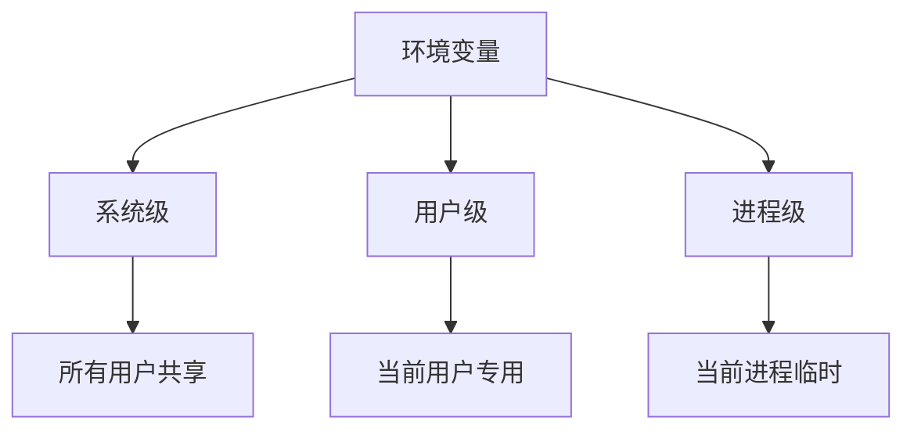
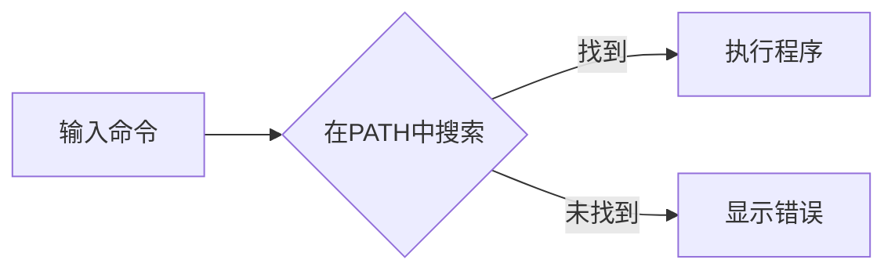
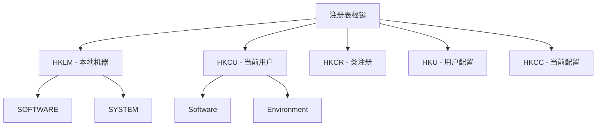
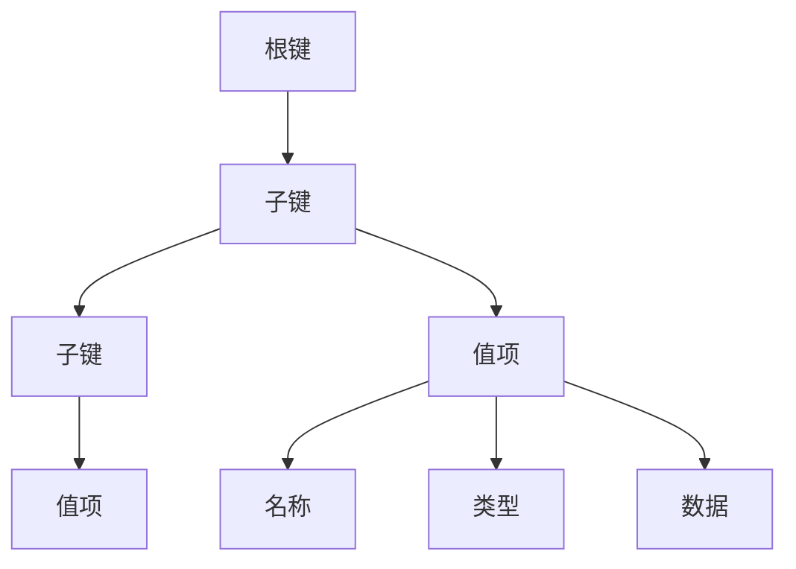
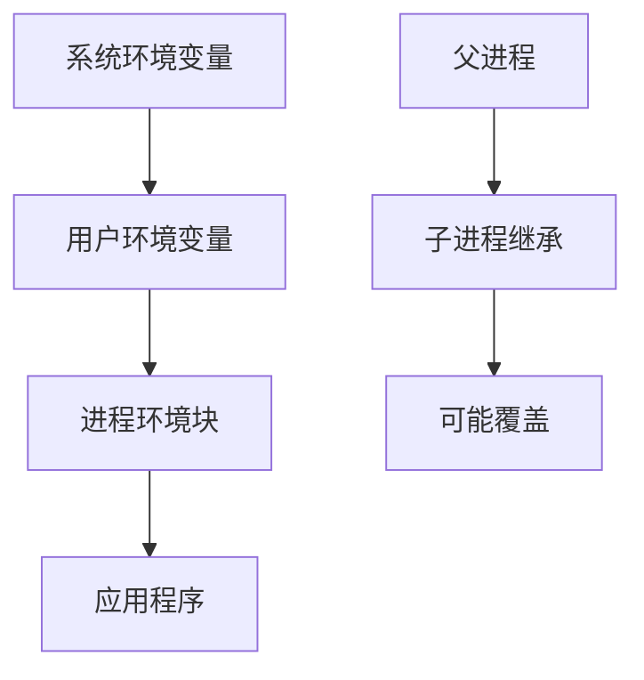

# 第09章 环境变量与注册表 — 系统配置的钥匙

## 章节概述

环境变量和注册表是Windows系统中两个核心配置机制。环境变量为应用程序提供运行时上下文信息，而注册表则是系统配置的中央数据库。本章将深入讲解如何使用CMD命令行操作这两个重要组件，帮助您理解系统配置的本质。

## 学习目标

完成本章学习后，您将能够：

1. 理解环境变量的分类和作用机制
2. 使用`set`和`setx`命令管理环境变量
3. 掌握PATH变量的管理和优化
4. 理解Windows注册表的层次结构
5. 使用`reg`命令查询、添加和删除注册表项
6. 了解环境变量和注册表操作的安全注意事项

## 前置知识

- 基本的CMD命令行操作（第01-04章）
- 文件路径和目录概念（第02章）
- 权限和用户账户基础概念

## 预计学习时间

- 理论学习：45分钟
- 动手实践：60分钟
- 总计：105分钟

---

## 9.1 环境变量基础

### 9.1.1 什么是环境变量？

环境变量是操作系统中用于存储配置信息的动态命名值。它们为运行中的程序提供系统信息，如：

- 系统路径
- 用户配置
- 临时文件位置
- 应用程序设置



### 9.1.2 系统环境变量 vs 用户环境变量

| 特性 | 系统环境变量 | 用户环境变量 |
|------|-------------|-------------|
| 作用范围 | 所有用户 | 当前用户 |
| 存储位置 | 注册表 `HKLM\SYSTEM\CurrentControlSet\Control\Session Manager\Environment` | 注册表 `HKCU\Environment` |
| 修改权限 | 需要管理员权限 | 当前用户权限 |
| 典型例子 | `SystemRoot`, `ProgramFiles` | `TEMP`, `APPDATA` |

### 9.1.3 使用`set`命令查看和设置临时变量

`set`命令用于查看、设置和删除环境变量（仅当前会话有效）：

```batch
@echo off
REM 查看所有环境变量
set

REM 查看特定变量
echo %PATH%
echo %TEMP%

REM 设置临时变量
set MY_VAR=Hello World
echo %MY_VAR%

REM 删除变量
set MY_VAR=
echo %MY_VAR%  REM 显示为空
```

**实际输出示例：**
```
C:\Users\FaustSherpad>set MY_VAR=Hello World
C:\Users\FaustSherpad>echo %MY_VAR%
Hello World
C:\Users\FaustSherpad>set MY_VAR=
C:\Users\FaustSherpad>echo %MY_VAR%
%MY_VAR%
```

> **注意**：`set`命令设置的变量仅在当前CMD会话中有效，关闭窗口后丢失。

### 9.1.4 使用`setx`永久设置环境变量

`setx`命令用于永久设置环境变量，修改会写入注册表：

```batch
@echo off
REM 永久设置用户环境变量
setx MY_PERMANENT_VAR "This is permanent"

REM 设置系统环境变量（需要管理员权限）
setx /M SYSTEM_VAR "System level variable"

REM 注意：setx设置后需要新开CMD窗口才能生效
echo 请新开CMD窗口查看MY_PERMANENT_VAR的值
```

**安全提示**：使用`setx /M`需要管理员权限，且会修改系统级注册表。

### 9.1.5 常用环境变量详解

```batch
@echo off
REM 系统路径相关
echo 系统根目录: %SystemRoot%
echo 程序文件目录: %ProgramFiles%
echo 程序文件(x86)目录: %ProgramFiles(x86)%

REM 用户相关
echo 用户配置文件: %USERPROFILE%
echo 用户文档: %USERPROFILE%\Documents
echo 桌面路径: %USERPROFILE%\Desktop
echo 开始菜单: %APPDATA%\Microsoft\Windows\Start Menu

REM 临时文件
echo 临时目录: %TEMP%
echo 临时目录(用户): %TMP%

REM 系统信息
echo 计算机名: %COMPUTERNAME%
echo 用户名: %USERNAME%
echo 处理器架构: %PROCESSOR_ARCHITECTURE%
```

---

## 9.2 PATH变量管理

### 9.2.1 PATH变量的作用

PATH环境变量告诉系统在哪里查找可执行文件。当您在命令行输入一个命令时，系统会按照PATH中列出的目录顺序搜索可执行文件。



### 9.2.2 查看和分析PATH变量

```batch
@echo off
REM 查看PATH变量（每个目录换行显示）
echo %PATH:;=&echo.%

REM 或者使用更清晰的方式
for %%i in ("%PATH:;=" "%") do (
    echo %%~i
)
```

### 9.2.3 临时添加目录到PATH

```batch
@echo off
REM 临时添加目录到PATH
set PATH=%PATH%;C:\MyCustomTools
echo 新目录已添加到PATH

REM 验证添加
echo %PATH%
```

### 9.2.4 永久修改PATH变量

```batch
@echo off
REM 获取当前PATH值
for /f "tokens=2*" %%A in ('reg query "HKCU\Environment" /v Path') do set "CURRENT_PATH=%%B"

REM 添加新路径到用户PATH
setx PATH "%CURRENT_PATH%;C:\MyNewTools"

REM 或者直接追加（推荐方式）
setx PATH "%PATH%;C:\MyNewTools"

echo PATH已更新，请新开CMD窗口生效
```

**最佳实践**：
1. 避免在PATH中添加过多目录，会影响命令查找速度
2. 优先将常用工具目录放在PATH前面
3. 定期清理不再需要的PATH条目

---

## 9.3 注册表基础

### 9.3.1 什么是注册表？

Windows注册表是一个层次结构的数据库，存储系统和应用程序的配置信息。它类似于文件系统的树形结构，但存储的是键值对数据。



### 9.3.2 注册表根键说明

| 根键 | 全称 | 说明 |
|------|------|------|
| `HKLM` | HKEY_LOCAL_MACHINE | 存储系统级配置，所有用户共享 |
| `HKCU` | HKEY_CURRENT_USER | 存储当前用户的配置 |
| `HKCR` | HKEY_CLASSES_ROOT | 存储文件类型关联和COM对象注册 |
| `HKU` | HKEY_USERS | 存储所有用户的配置文件 |
| `HKCC` | HKEY_CURRENT_CONFIG | 存储当前硬件配置信息 |

### 9.3.3 使用`reg query`查询注册表

```batch
@echo off
REM 查询当前用户的环境变量
reg query "HKCU\Environment"

REM 查询特定值
reg query "HKCU\Environment" /v Path

REM 查询系统环境变量
reg query "HKLM\SYSTEM\CurrentControlSet\Control\Session Manager\Environment" /v Path

REM 查询注册表项的所有子项
reg query "HKCU\Software\Microsoft" /s
```

**输出示例：**
```
HKEY_CURRENT_USER\Environment
    Path    REG_EXPAND_SZ    C:\Users\FaustSherpad\AppData\Local\Programs\Python\Python39\...
    TEMP    REG_EXPAND_SZ    %USERPROFILE%\AppData\Local\Temp
    TMP     REG_EXPAND_SZ    %USERPROFILE%\AppData\Local\Temp
```

### 9.3.4 使用`reg add`添加注册表项

```batch
@echo off
REM 添加新的环境变量（安全位置）
reg add "HKCU\Environment" /v "TEST_VAR" /t REG_SZ /d "Test Value" /f

REM 添加带空格的值
reg add "HKCU\Environment" /v "MY_PATH" /t REG_EXPAND_SZ /d "C:\My Folder" /f

REM 验证添加
reg query "HKCU\Environment" /v "TEST_VAR"
```

**参数说明：**
- `/v` - 值名称
- `/t` - 数据类型（REG_SZ, REG_EXPAND_SZ, REG_DWORD等）
- `/d` - 数据值
- `/f` - 强制覆盖，不提示确认

### 9.3.5 使用`reg delete`删除注册表项

```batch
@echo off
REM 删除特定值
reg delete "HKCU\Environment" /v "TEST_VAR" /f

REM 删除整个注册表项（谨慎使用）
reg delete "HKCU\Software\MyTestKey" /f

REM 确认删除
reg query "HKCU\Environment" /v "TEST_VAR" 2>nul && echo 变量存在 || echo 变量已删除
```

**安全警告**：删除注册表项可能导致系统或应用程序故障，请仅删除您明确创建的项。

### 9.3.6 使用`reg export`导出注册表

```batch
@echo off
REM 导出环境变量注册表项
reg export "HKCU\Environment" "%USERPROFILE%\env_backup.reg"

REM 导出系统环境变量
reg export "HKLM\SYSTEM\CurrentControlSet\Control\Session Manager\Environment" "%USERPROFILE%\sys_env_backup.reg"

REM 导出整个HKCU\Software分支
reg export "HKCU\Software" "%USERPROFILE%\software_backup.reg"

echo 注册表已导出到 %USERPROFILE%\env_backup.reg
```

**备份的重要性**：在修改注册表前，始终先导出备份，以便出现问题时恢复。

---

## 9.4 注册表操作的安全性

### 9.4.1 安全操作原则

1. **最小权限原则**：只修改必要的注册表项
2. **备份优先**：修改前导出备份
3. **测试环境**：先在测试环境验证
4. **文档记录**：记录所有修改内容

### 9.4.2 安全位置 vs 危险位置

| 位置 | 安全等级 | 说明 |
|------|----------|------|
| `HKCU\Environment` | 安全 | 用户环境变量，影响当前用户 |
| `HKCU\Software\MyApp` | 相对安全 | 自定义应用程序设置 |
| `HKLM\SYSTEM` | 危险 | 系统核心配置，修改可能导致系统故障 |
| `HKLM\SOFTWARE\Microsoft\Windows` | 危险 | Windows系统设置 |

### 9.4.3 权限问题处理

```batch
@echo off
REM 检查是否有管理员权限
net session >nul 2>&1
if %errorLevel% == 0 (
    echo 管理员权限已启用
) else (
    echo 需要管理员权限
    echo 请右键选择"以管理员身份运行"
    pause
    exit /b 1
)

REM 尝试修改系统环境变量
reg add "HKLM\SYSTEM\CurrentControlSet\Control\Session Manager\Environment" /v "TEST" /t REG_SZ /d "Value" /f
if %errorLevel% neq 0 (
    echo 修改失败，请检查权限
)
```

---

## 9.5 PowerShell vs CMD的注册表操作对比

### 9.5.1 PowerShell优势

PowerShell提供了更强大的注册表操作能力：

```powershell
# 查看注册表
Get-ItemProperty -Path "HKCU:\Environment" -Name "Path"

# 设置注册表值
Set-ItemProperty -Path "HKCU:\Environment" -Name "TEST_VAR" -Value "PowerShell Value"

# 删除注册表值
Remove-ItemProperty -Path "HKCU:\Environment" -Name "TEST_VAR"

# 列出所有子项
Get-ChildItem -Path "HKCU:\Software\Microsoft"
```

### 9.5.2 CMD与PowerShell对比

| 功能 | CMD (reg命令) | PowerShell |
|------|---------------|------------|
| 查询 | `reg query "HKCU\Environment"` | `Get-ItemProperty "HKCU:\Environment"` |
| 添加 | `reg add "HKCU\Environment" /v ...` | `Set-ItemProperty "HKCU:\Environment" ...` |
| 删除 | `reg delete "HKCU\Environment" /v ...` | `Remove-ItemProperty "HKCU:\Environment" ...` |
| 导出 | `reg export "HKCU\Environment" file.reg` | `RegExport` cmdlet |
| 错误处理 | 基本 | 丰富的异常处理 |
| 管道操作 | 有限 | 强大的对象管道 |

**建议**：对于复杂的注册表操作，推荐使用PowerShell；对于简单的脚本和兼容性需求，CMD仍然有效。

---

## 9.6 数据结构概念

### 9.6.1 注册表的层次结构

注册表采用树形结构，类似于文件系统：



### 9.6.2 环境变量的存储机制

环境变量在注册表中的存储：

1. **用户环境变量**：`HKCU\Environment`
2. **系统环境变量**：`HKLM\SYSTEM\CurrentControlSet\Control\Session Manager\Environment`
3. **临时变量**：仅存在于内存中

**数据类型**：
- `REG_SZ`：固定字符串
- `REG_EXPAND_SZ`：可扩展字符串（包含变量引用，如`%SystemRoot%`）
- `REG_DWORD`：32位整数
- `REG_BINARY`：二进制数据

### 9.6.3 环境变量继承机制



---

## 9.7 与其他语言的对比

### 9.7.1 Python环境变量操作

```python
import os

# 获取环境变量
path = os.environ.get('PATH', '默认值')
temp = os.environ['TEMP']

# 设置临时环境变量
os.environ['MY_VAR'] = 'Python Value'

# 永久设置（仅Windows）
import winreg
key = winreg.OpenKey(winreg.HKEY_CURRENT_USER, 'Environment', 0, winreg.KEY_SET_VALUE)
winreg.SetValueEx(key, 'MY_VAR', 0, winreg.REG_SZ, 'Permanent Value')
winreg.CloseKey(key)
```

### 9.7.2 Node.js环境变量操作

```javascript
// 获取环境变量
const path = process.env.PATH;
const temp = process.env.TEMP;

// 设置临时环境变量
process.env.MY_VAR = 'Node.js Value';

// 永久设置需要调用系统命令
const { execSync } = require('child_process');
execSync('setx MY_VAR "Permanent Value"');
```

### 9.7.3 C语言环境变量操作

```c
#include <stdlib.h>
#include <stdio.h>

int main() {
    // 获取环境变量
    char *path = getenv("PATH");
    printf("PATH: %s\n", path);
    
    // 设置临时环境变量
    setenv("MY_VAR", "C Value", 1);
    printf("MY_VAR: %s\n", getenv("MY_VAR"));
    
    // 删除环境变量
    unsetenv("MY_VAR");
    
    return 0;
}
```

### 9.7.4 Lua环境变量操作

```lua
-- 获取环境变量
local path = os.getenv("PATH")
local temp = os.getenv("TEMP")

-- 设置临时环境变量（仅当前进程）
os.setenv("MY_VAR", "Lua Value")  -- 注意：Lua标准库没有os.setenv

-- 实际上需要通过系统命令
os.execute('set MY_VAR=Lua Value')

-- 获取设置的变量
print(os.getenv("MY_VAR"))
```

---

## 9.8 最佳实践和常见陷阱

### 9.8.1 最佳实践

1. **环境变量命名**：使用大写字母和下划线，如`MY_APP_CONFIG`
2. **路径处理**：始终使用引号包裹包含空格的路径
3. **备份策略**：修改注册表前先导出备份
4. **权限管理**：避免不必要的管理员权限
5. **变量验证**：使用前检查变量是否存在

```batch
@echo off
REM 最佳实践示例
if defined MY_VAR (
    echo MY_VAR 存在: %MY_VAR%
) else (
    echo MY_VAR 不存在，设置默认值
    set MY_VAR=default
)

REM 路径处理
set "MY_PATH=C:\Program Files\My App"
echo "%MY_PATH%"
```

### 9.8.2 常见陷阱及解决方案

**陷阱1：路径包含空格**
```batch
@echo off
REM 错误方式
set MY_PATH=C:\Program Files\My App
echo %MY_PATH%  REM 会显示错误

REM 正确方式
set "MY_PATH=C:\Program Files\My App"
echo "%MY_PATH%"
```

**陷阱2：变量延迟展开**
```batch
@echo off
set VAR=initial
(
    set VAR=modified
    echo %VAR%  REM 显示initial，因为括号内变量在解析时展开
)

REM 解决方案：使用延迟展开
setlocal enabledelayedexpansion
set VAR=initial
(
    set VAR=modified
    echo !VAR!  REM 显示modified
)
```

**陷阱3：注册表权限不足**
```batch
@echo off
REM 尝试修改系统注册表
reg add "HKLM\SOFTWARE\Microsoft\Windows\CurrentVersion" /v "Test" /t REG_SZ /d "Value" /f 2>nul
if %errorLevel% neq 0 (
    echo 需要管理员权限
    echo 请右键选择"以管理员身份运行"
)
```

**陷阱4：环境变量展开顺序**
```batch
@echo off
REM 系统变量展开顺序：系统 -> 用户 -> 进程
set PATH=C:\MyTools;%PATH%
echo %PATH%

REM 注意：setx设置的变量需要新开CMD窗口才能生效
setx PATH "%PATH%;C:\NewTools"
echo 请新开CMD窗口查看效果
```

---

## 9.9 练习题

### 练习1：环境变量管理
编写一个批处理脚本，完成以下任务：
1. 显示当前用户的TEMP变量值
2. 创建一个临时变量`GREETING`，值为"Hello, CMD!"
3. 显示`GREETING`的值
4. 永久设置一个用户环境变量`MY_HOME`，值为当前目录
5. 删除临时变量`GREETING`

### 练习2：PATH优化
编写一个脚本，分析当前PATH变量：
1. 显示PATH中每个目录的路径
2. 检查每个目录是否存在
3. 列出不存在的目录
4. 提供清理建议

### 练习3：注册表备份与恢复
编写两个脚本：
1. `backup_env.bat`：备份当前用户环境变量到文件
2. `restore_env.bat`：从备份文件恢复环境变量

### 练习4：系统信息收集
编写一个脚本，收集以下系统信息并保存到文件：
1. 计算机名、用户名
2. 系统根目录、程序文件目录
3. PATH变量内容
4. 当前用户环境变量列表

### 练习5：安全注册表操作
编写一个安全的注册表操作脚本：
1. 检查管理员权限
2. 备份要修改的注册表项
3. 添加一个测试值到`HKCU\Environment`
4. 验证添加成功
5. 清理测试值

---

## 9.10 总结

### 关键概念回顾

1. **环境变量**：系统和用户配置的动态值
2. **PATH变量**：系统查找可执行文件的路径列表
3. **注册表**：Windows配置的中央数据库
4. **安全操作**：权限管理、备份策略、最小权限原则

### 下一步学习

完成本章后，建议继续学习：
- 第10章：网络配置与命令行工具
- 第11章：进程与服务管理
- 附录：常用环境变量参考表

### 参考资源

1. [Microsoft官方文档：环境变量](https://docs.microsoft.com/en-us/windows/win32/procthread/environment-variables)
2. [Windows注册表官方文档](https://docs.microsoft.com/en-us/windows/win32/sysinfo/registry)
3. [CMD命令行参考](https://docs.microsoft.com/en-us/windows-server/administration/windows-commands/cmd)

---

## 附录：常用环境变量速查表

| 变量名 | 说明 | 示例值 |
|--------|------|--------|
| `%SystemRoot%` | Windows系统目录 | `C:\WINDOWS` |
| `%ProgramFiles%` | 程序文件目录 | `C:\Program Files` |
| `%USERPROFILE%` | 用户配置文件目录 | `C:\Users\Username` |
| `%TEMP%` | 临时文件目录 | `C:\Users\Username\AppData\Local\Temp` |
| `%APPDATA%` | 应用程序数据目录 | `C:\Users\Username\AppData\Roaming` |
| `%PATH%` | 可执行文件搜索路径 | 多个目录用分号分隔 |
| `%COMPUTERNAME%` | 计算机名称 | `MY-PC` |
| `%USERNAME%` | 当前用户名 | `Username` |
| `%OS%` | 操作系统类型 | `Windows_NT` |
| `%PROCESSOR_ARCHITECTURE%` | 处理器架构 | `AMD64` |