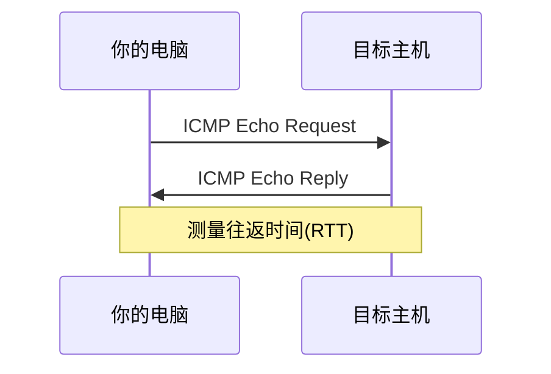
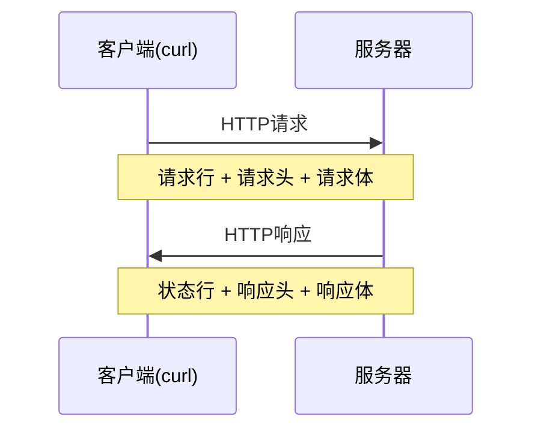
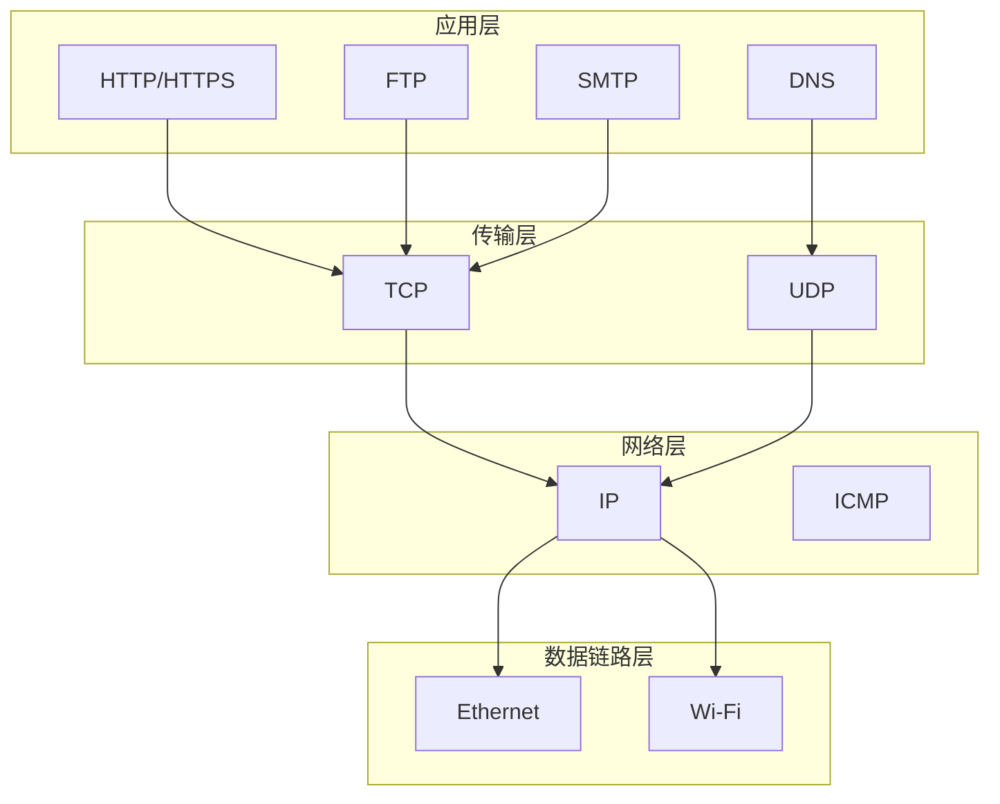

# 第10章 网络工具 — 连接世界

!!! abstract "本章概述"
    在这个互联的时代，网络工具是每个系统管理员和开发者的必备技能。本章将带你掌握Windows命令行下的网络工具，从基础的连通性测试到高级的HTTP请求处理。

## 10.1 学习目标

完成本章后，你将能够：

1. 使用 `ping`、`ipconfig`、`nslookup` 等基础命令诊断网络问题
2. 通过 `curl` 发送HTTP请求并处理响应
3. 使用 `bitsadmin` 和 `certutil` 进行文件传输
4. 检测端口状态并排查网络连接问题
5. 管理网络共享资源
6. 理解TCP/IP协议栈和HTTP请求/响应格式

## 10.2 前置要求

- 熟悉基本的CMD命令语法（第1-5章）
- 了解文件系统操作（第6章）
- 基本的网络概念（IP地址、端口、协议）

## 10.3 网络基础命令

### 10.3.1 ping — 连通性测试

`ping` 是最基础的网络诊断工具，用于测试与目标主机的连通性。



**基本用法：**

```bat
ping 目标地址
ping google.com
ping 8.8.8.8
```

**常用参数：**

| 参数 | 说明 | 示例 |
|------|------|------|
| `-n count` | 指定发送次数 | `ping -n 5 google.com` |
| `-l size` | 指定数据包大小（字节） | `ping -l 1000 google.com` |
| `-t` | 持续ping直到手动停止 | `ping -t google.com` |
| `-w timeout` | 超时时间（毫秒） | `ping -w 3000 google.com` |
| `-4` | 强制使用IPv4 | `ping -4 google.com` |
| `-6` | 强制使用IPv6 | `ping -6 google.com` |

**实际应用示例：**

```bat
:: 测试本地网络连通性
ping 127.0.0.1

:: 测试网关连通性
ping 192.168.1.1

:: 测试DNS连通性
ping 8.8.8.8

:: 测试域名解析
ping google.com

:: 持续监控网络
ping -t google.com
:: 按Ctrl+C停止
```

**结果解读：**

- `TTL=128` — Windows系统默认TTL
- `TTL=64` — Linux系统默认TTL
- `TTL=255` — 网络设备（路由器）
- `Request timed out` — 目标不可达或防火墙阻止
- `Destination host unreachable` — 路由问题

!!! tip "实用技巧"
    使用 `ping -n 1 -w 1000` 快速测试连通性，适合在脚本中使用。

### 10.3.2 ipconfig — 网络配置查看

`ipconfig` 显示当前TCP/IP网络配置值。

**常用命令：**

```bat
:: 查看基本网络配置
ipconfig

:: 查看详细配置（包括DNS、DHCP、MAC地址）
ipconfig /all

:: 释放DHCP租约
ipconfig /release

:: 续订DHCP租约
ipconfig /renew

:: 刷新DNS缓存
ipconfig /flushdns

:: 显示DNS缓存内容
ipconfig /displaydns
```

**输出字段解析：**

| 字段 | 说明 |
|------|------|
| IPv4 Address | 本机IP地址 |
| Subnet Mask | 子网掩码 |
| Default Gateway | 默认网关 |
| DNS Servers | DNS服务器地址 |
| Physical Address | MAC地址 |
| DHCP Enabled | 是否启用DHCP |

### 10.3.3 nslookup — DNS查询

`nslookup` 用于查询DNS记录，诊断DNS问题。

**基本用法：**

```bat
:: 查询域名对应的IP
nslookup google.com

:: 查询特定类型的DNS记录
nslookup -type=MX google.com
nslookup -type=NS google.com
nslookup -type=TXT google.com

:: 使用指定的DNS服务器查询
nslookup google.com 8.8.8.8
```

**DNS记录类型：**

| 类型 | 说明 | 用途 |
|------|------|------|
| A | IPv4地址记录 | 域名到IP映射 |
| AAAA | IPv6地址记录 | 域名到IPv6映射 |
| CNAME | 别名记录 | 域名别名 |
| MX | 邮件交换记录 | 邮件服务器 |
| NS | 名称服务器记录 | 域名服务器 |
| TXT | 文本记录 | SPF、DKIM等验证 |

### 10.3.4 tracert — 路由跟踪

`tracert` 显示数据包到达目标主机所经过的路径。

```bat
:: 基本路由跟踪
tracert google.com

:: 指定最大跳数
tracert -h 15 google.com

:: 不进行DNS解析（更快）
tracert -d google.com
```

**输出解读：**

```
Tracing route to google.com [142.250.185.78]
over a maximum of 30 hops:

  1    <1 ms    <1 ms    <1 ms  192.168.1.1
  2     3 ms     2 ms     2 ms  10.0.0.1
  3     *        *        *     Request timed out.
  4    15 ms    14 ms    15 ms  72.14.215.85
```

- `*` 表示该节点不响应ICMP请求
- 延迟时间突增表示网络瓶颈
- 超时表示可能有防火墙或路由问题

### 10.3.5 netstat — 网络连接状态

`netstat` 显示网络连接、路由表、接口统计等信息。

**常用参数：**

```bat
:: 显示所有连接和监听端口
netstat -a

:: 显示以太网统计信息
netstat -e

:: 显示TCP连接
netstat -p tcp

:: 显示进程ID
netstat -ano

:: 持续监控（每5秒刷新）
netstat -ano 5
```

**状态说明：**

| 状态 | 说明 |
|------|------|
| LISTENING | 监听中，等待连接 |
| ESTABLISHED | 已建立连接 |
| TIME_WAIT | 等待足够时间确保远程收到确认 |
| CLOSE_WAIT | 远程已关闭，等待本地关闭 |
| SYN_SENT | 已发送连接请求 |

## 10.4 文件传输工具

### 10.4.1 curl — HTTP请求利器

`curl` 是功能强大的命令行HTTP客户端，支持多种协议。

**基本GET请求：**

```bat
:: 获取网页内容
curl https://httpbin.org/get

:: 保存到文件
curl -o output.html https://example.com

:: 跟随重定向
curl -L https://example.com

:: 显示详细信息
curl -v https://example.com
```

**POST请求：**

```bat
:: 发送JSON数据
curl -X POST https://httpbin.org/post ^
  -H "Content-Type: application/json" ^
  -d "{\"name\":\"test\",\"value\":\"123\"}"

:: 发送表单数据
curl -X POST https://httpbin.org/post ^
  -d "name=test&value=123"

:: 上传文件
curl -X POST https://httpbin.org/post ^
  -F "file=@myfile.txt"
```

**常用参数：**

| 参数 | 说明 | 示例 |
|------|------|------|
| `-o file` | 输出到文件 | `curl -o out.txt URL` |
| `-O` | 使用远程文件名保存 | `curl -O URL` |
| `-L` | 跟随重定向 | `curl -L URL` |
| `-H "header"` | 设置请求头 | `curl -H "Accept: json" URL` |
| `-d "data"` | POST数据 | `curl -d "key=val" URL` |
| `-X method` | 指定HTTP方法 | `curl -X PUT URL` |
| `-u user:pass` | 基本认证 | `curl -u admin:pass URL` |
| `--connect-timeout` | 连接超时 | `curl --connect-timeout 10 URL` |
| `--max-time` | 最大传输时间 | `curl --max-time 30 URL` |

### 10.4.2 bitsadmin — 后台智能传输

`bitsadmin` 用于在后台传输文件，适合大文件下载。

```bat
:: 创建下载任务
bitsadmin /create download_job

:: 设置传输URL和本地文件
bitsadmin /addfile download_job https://example.com/file.zip C:\download\file.zip

:: 设置优先级
bitsadmin /setpriority download_job foreground

:: 开始传输
bitsadmin /resume download_job

:: 监控进度
bitsadmin /info download_job

:: 完成后关闭
bitsadmin /complete download_job
```

**简化用法（一行命令）：**

```bat
bitsadmin /transfer download_job /download /priority normal https://example.com/file.zip C:\download\file.zip
```

### 10.4.3 certutil — 文件下载（编码传输）

`certutil` 原本用于证书管理，但也可用于文件下载。

```bat
:: 基本下载
certutil -urlcache -split -f "https://example.com/file.txt" "C:\download\file.txt"

:: 显示缓存内容
certutil -urlcache *

:: 清除缓存
certutil -urlcache * delete
```

!!! warning "安全注意"
    `certutil` 常被恶意软件利用，在企业环境中可能被限制使用。

## 10.5 端口检测

### 10.5.1 使用telnet检测端口

```bat
:: 安装telnet客户端（如果未安装）
dism /online /Enable-Feature /FeatureName:TelnetClient

:: 测试端口
telnet google.com 80
telnet smtp.gmail.com 587
```

### 10.5.2 使用PowerShell检测端口

```bat
:: 使用PowerShell的Test-NetConnection
powershell -Command "Test-NetConnection -ComputerName google.com -Port 80"

:: 测试多个端口
powershell -Command "80,443,8080 | ForEach-Object { Test-NetConnection -ComputerName google.com -Port $_ }"
```

### 10.5.3 使用curl检测端口

```bat
:: 检测HTTP端口
curl -I http://example.com:80

:: 检测HTTPS端口
curl -I https://example.com:443

:: 使用超时快速检测
curl --connect-timeout 3 http://example.com:8080
```

## 10.6 网络共享

### 10.6.1 net use — 映射网络驱动器

```bat
:: 映射网络驱动器
net use Z: \\server\share /user:username password

:: 映射并持久化
net use Z: \\server\share /persistent:yes

:: 删除映射
net use Z: /delete

:: 查看所有映射
net use
```

### 10.6.2 net share — 共享管理

```bat
:: 创建共享
net share MyShare=C:\SharedFolder /remark:"My shared folder"

:: 删除共享
net share MyShare /delete

:: 查看共享列表
net share
```

## 10.7 HTTP请求详解

### 10.7.1 HTTP请求/响应格式



**HTTP请求结构：**

```
GET /api/data HTTP/1.1
Host: example.com
Accept: application/json
Authorization: Bearer token123

```

**HTTP响应结构：**

```
HTTP/1.1 200 OK
Content-Type: application/json
Content-Length: 25

{"status":"success"}
```

### 10.7.2 GET请求获取数据

```bat
:: 获取JSON数据
curl https://httpbin.org/get

:: 带查询参数
curl "https://httpbin.org/get?name=test&value=123"

:: 设置Accept头
curl -H "Accept: application/json" https://api.example.com/data

:: 带认证
curl -H "Authorization: Bearer your_token" https://api.example.com/protected
```

### 10.7.3 POST请求提交数据

```bat
:: 提交JSON数据
curl -X POST https://httpbin.org/post ^
  -H "Content-Type: application/json" ^
  -d "{\"username\":\"admin\",\"password\":\"secret\"}"

:: 提交表单数据
curl -X POST https://httpbin.org/post ^
  -d "username=admin&password=secret"

:: 上传文件
curl -X POST https://httpbin.org/post ^
  -F "file=@C:\path\to\file.txt" ^
  -F "description=test file"
```

### 10.7.4 处理JSON响应

```bat
:: 获取并格式化JSON（需要jq工具）
curl -s https://httpbin.org/get | jq .

:: 提取特定字段
curl -s https://httpbin.org/get | jq .origin

:: 在批处理中处理JSON
for /f "tokens=*" %%i in ('curl -s https://httpbin.org/get') do set response=%%i
echo %response%
```

### 10.7.5 设置请求头

```bat
:: 设置多个请求头
curl -H "Content-Type: application/json" ^
     -H "Accept: application/json" ^
     -H "Authorization: Bearer token123" ^
     -H "User-Agent: MyApp/1.0" ^
     https://api.example.com/data

:: 使用文件存储请求头
curl -H @headers.txt https://api.example.com/data
```

## 10.8 数据结构概念

### 10.8.1 TCP/IP协议栈



### 10.8.2 常用端口号

| 端口 | 协议 | 服务 |
|------|------|------|
| 21 | FTP | 文件传输 |
| 22 | SSH | 安全Shell |
| 23 | Telnet | 远程登录 |
| 25 | SMTP | 邮件发送 |
| 53 | DNS | 域名解析 |
| 80 | HTTP | Web服务 |
| 443 | HTTPS | 安全Web |
| 3306 | MySQL | 数据库 |
| 3389 | RDP | 远程桌面 |

## 10.9 与其他语言的对比

### 10.9.1 Python (requests库)

```python
import requests

# GET请求
response = requests.get('https://httpbin.org/get')
print(response.json())

# POST请求
data = {'username': 'admin', 'password': 'secret'}
response = requests.post('https://httpbin.org/post', json=data)
print(response.status_code)
```

### 10.9.2 JavaScript (fetch/axios)

```javascript
// GET请求
fetch('https://httpbin.org/get')
  .then(response => response.json())
  .then(data => console.log(data));

// POST请求
fetch('https://httpbin.org/post', {
  method: 'POST',
  headers: {'Content-Type': 'application/json'},
  body: JSON.stringify({username: 'admin', password: 'secret'})
});
```

### 10.9.3 C语言 (socket编程)

```c
#include <stdio.h>
#include <sys/socket.h>
#include <netinet/in.h>
#include <string.h>

int main() {
    int sock = socket(AF_INET, SOCK_STREAM, 0);
    struct sockaddr_in server;
    
    server.sin_family = AF_INET;
    server.sin_port = htons(80);
    server.sin_addr.s_addr = inet_addr("93.184.216.34");
    
    connect(sock, (struct sockaddr*)&server, sizeof(server));
    
    char *request = "GET / HTTP/1.1\r\nHost: example.com\r\n\r\n";
    send(sock, request, strlen(request), 0);
    
    char buffer[4096];
    recv(sock, buffer, sizeof(buffer), 0);
    printf("%s", buffer);
    
    close(sock);
    return 0;
}
```

### 10.9.4 Lua (socket库)

```lua
local http = require("socket.http")
local ltn12 = require("ltn12")

-- GET请求
local response_body = {}
local res, code, headers = http.request{
    url = "https://httpbin.org/get",
    sink = ltn12.sink.table(response_body)
}
print(table.concat(response_body))
```

## 10.10 最佳实践和常见陷阱

### 10.10.1 超时处理

```bat
:: 设置连接超时和最大传输时间
curl --connect-timeout 10 --max-time 30 https://example.com

:: 在脚本中检查错误
curl --connect-timeout 5 https://example.com
if errorlevel 1 (
    echo 连接失败，请检查网络
    exit /b 1
)
```

### 10.10.2 错误码检查

```bat
:: curl错误码
curl https://example.com
if %errorlevel% equ 0 (
    echo 请求成功
) else if %errorlevel% equ 6 (
    echo DNS解析失败
) else if %errorlevel% equ 7 (
    echo 连接被拒绝
) else if %errorlevel% equ 28 (
    echo 操作超时
) else (
    echo 其他错误，代码：%errorlevel%
)
```

**常见curl错误码：**

| 错误码 | 说明 | 解决方案 |
|--------|------|----------|
| 0 | 成功 | - |
| 6 | DNS解析失败 | 检查域名和DNS设置 |
| 7 | 连接被拒绝 | 检查目标服务和端口 |
| 28 | 操作超时 | 增加超时时间或检查网络 |
| 35 | SSL连接错误 | 检查证书或使用`-k`忽略 |
| 56 | 接收响应失败 | 检查服务器状态 |

### 10.10.3 安全注意事项

!!! warning "安全警告"
    1. 不要在脚本中硬编码密码
    2. 使用HTTPS而非HTTP传输敏感数据
    3. 验证SSL证书（生产环境不要使用`-k`选项）
    4. 限制网络请求的权限范围

### 10.10.4 性能优化

```bat
:: 并行下载多个文件
start /b curl -O https://example.com/file1.zip
start /b curl -O https://example.com/file2.zip
start /b curl -O https://example.com/file3.zip
wait

:: 使用压缩
curl -H "Accept-Encoding: gzip" https://example.com/api

:: 缓存控制
curl -H "If-Modified-Since: Wed, 21 Oct 2025 07:28:00 GMT" https://example.com
```

## 10.11 综合实战示例

### 示例1：网络健康检查脚本

```bat
@echo off
echo === 网络健康检查 ===
echo.

:: 测试本地网络
echo [1] 测试本地网络...
ping -n 1 127.0.0.1 >nul
if errorlevel 1 (
    echo 本地网络异常
) else (
    echo 本地网络正常
)

:: 测试网关
echo [2] 测试网关连通性...
for /f "tokens=2 delims=:" %%i in ('ipconfig ^| findstr "Default Gateway"') do (
    set gateway=%%i
)
ping -n 1 %gateway% >nul
if errorlevel 1 (
    echo 网关不可达
) else (
    echo 网关正常
)

:: 测试DNS
echo [3] 测试DNS解析...
nslookup google.com >nul 2>&1
if errorlevel 1 (
    echo DNS解析失败
) else (
    echo DNS正常
)

:: 测试外网连通性
echo [4] 测试外网连通性...
ping -n 1 8.8.8.8 >nul
if errorlevel 1 (
    echo 外网不可达
) else (
    echo 外网正常
)

echo.
echo === 检查完成 ===
pause
```

### 示例2：网站监控脚本

```bat
@echo off
setlocal enabledelayedexpansion

set "url=https://example.com"
set "logfile=monitor.log"

:loop
:: 获取当前时间
for /f "tokens=1-3 delims=/ " %%a in ('date /t') do set "date=%%a-%%b-%%c"
for /f "tokens=1-2 delims=: " %%a in ('time /t') do set "time=%%a:%%b"

:: 测试网站
curl -s -o nul -w "%%{http_code}" %url% > temp.txt
set /p status=<temp.txt

:: 记录结果
if "%status%"=="200" (
    echo [%date% %time%] 状态正常 - HTTP %status% >> %logfile%
) else (
    echo [%date% %time%] 状态异常 - HTTP %status% >> %logfile%
)

:: 等待60秒
timeout /t 60 /nobreak >nul
goto loop
```

## 10.12 练习题

### 基础练习

1. **ping测试**：编写一个脚本，依次ping以下地址并显示结果：
   - 本地回环地址
   - 你的默认网关
   - Google DNS (8.8.8.8)
   - 百度 (baidu.com)

2. **网络信息收集**：创建一个脚本，收集以下信息并保存到文件：
   - IP地址
   - 子网掩码
   - 默认网关
   - DNS服务器

3. **端口检测**：编写脚本检测本机是否开放以下端口：
   - 80 (HTTP)
   - 443 (HTTPS)
   - 3389 (RDP)

### 中级练习

4. **HTTP请求**：使用curl完成以下任务：
   - 获取httpbin.org/get的响应并保存到文件
   - 向httpbin.org/post发送JSON数据
   - 下载一个文件并验证完整性

5. **网络诊断工具**：创建一个综合网络诊断工具，包含：
   - 连通性测试
   - DNS解析检查
   - 端口扫描
   - 路由跟踪

### 高级练习

6. **自动化监控**：创建一个网站监控脚本：
   - 每5分钟检查一次目标网站
   - 记录响应时间和状态码
   - 如果连续3次失败，发送警报（可以是写入事件日志或弹出消息）

7. **批量操作**：编写脚本批量处理：
   - 从文件读取URL列表
   - 并行下载所有文件
   - 生成下载报告

## 10.13 总结

本章我们学习了Windows命令行下的网络工具，从基础的连通性测试到高级的HTTP请求处理。掌握这些工具对于系统管理和网络故障排查至关重要。

**关键要点：**
- `ping` 和 `tracert` 是网络诊断的基础工具
- `curl` 是功能强大的HTTP客户端，支持多种协议
- 理解TCP/IP协议栈有助于网络问题排查
- 错误处理和超时设置是网络脚本的关键
- 安全意识在处理网络请求时必不可少

## 10.14 下一步

在下一章中，我们将学习：
- 进程管理和服务控制
- 任务计划程序
- 系统监控和性能分析

## 10.15 附加资源

- [curl官方文档](https://curl.se/docs/)
- [Windows网络命令参考](https://docs.microsoft.com/en-us/windows-server/administration/windows-commands/network-commands)
- [HTTP协议规范](https://tools.ietf.org/html/rfc7230)
- [TCP/IP协议详解](https://tools.ietf.org/html/rfc791)