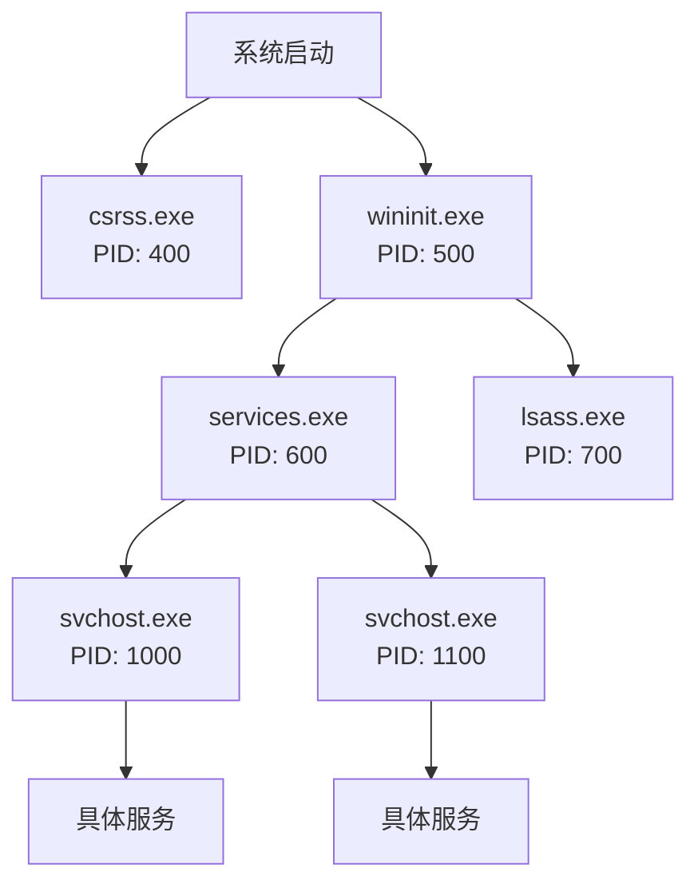
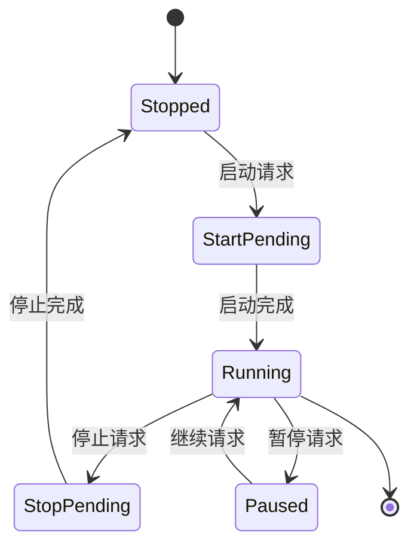
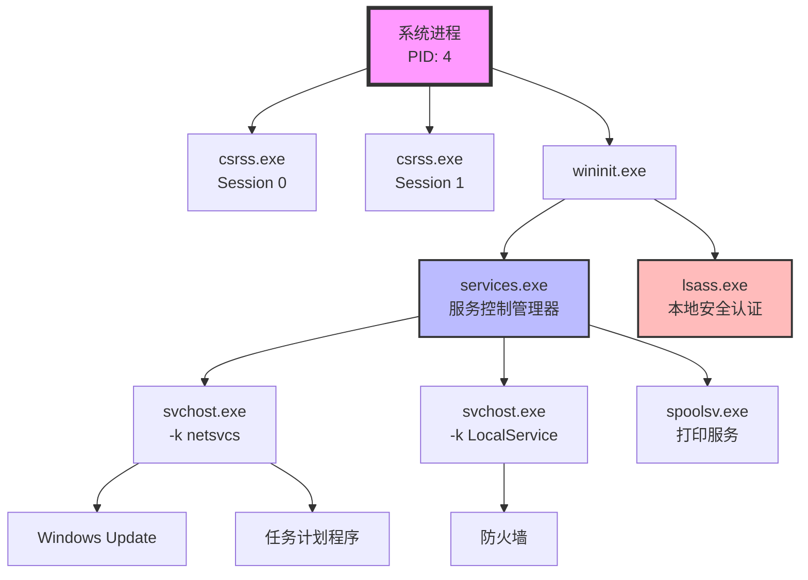

# 第11章 进程与服务管理 — 系统的守护者

## 你将学到什么

通过本章学习，你将能够：

- 使用 `tasklist` 查看、筛选和分析运行中的进程
- 使用 `taskkill` 安全地终止进程（按PID或名称）
- 使用 `start` 启动新进程并控制运行方式
- 使用 `sc` 命令查询和管理 Windows 服务
- 使用 `systeminfo` 和 `wmic` 获取系统详细信息
- 编写进程监控脚本
- 理解进程树、服务状态机等核心概念

**预计学习时间**：90-120 分钟

**前置要求**：

- 完成第1-10章内容
- 理解基本的批处理语法
- 管理员权限（部分操作需要）

---

## 11.1 进程管理基础

### 11.1.1 什么是进程？

进程是正在运行的程序实例。每个进程都有：

- **PID（进程ID）**：唯一标识符
- **内存空间**：独立的地址空间
- **优先级**：决定CPU调度顺序
- **父子关系**：进程可以创建子进程



### 11.1.2 tasklist — 查看进程列表

`tasklist` 是查看系统进程的基本工具。

**基本语法**：

```batch
tasklist [/s computer] [/u domain\user] [/p password] [/fo format] [/fi filter] [/m module]
```

**常用参数**：

| 参数 | 说明 | 示例 |
|------|------|------|
| `/fo TABLE` | 表格格式输出（默认） | `tasklist /fo TABLE` |
| `/fo CSV` | CSV格式输出 | `tasklist /fo CSV` |
| `/fo LIST` | 列表格式输出 | `tasklist /fo LIST` |
| `/fi` | 筛选条件 | `tasklist /fi "imagename eq cmd.exe"` |
| `/v` | 详细信息 | `tasklist /v` |
| `/m` | 查看加载的模块 | `tasklist /m /fi "imagename eq notepad.exe"` |

**筛选条件运算符**：

| 运算符 | 说明 | 示例 |
|--------|------|------|
| `eq` | 等于 | `"PID eq 1234"` |
| `ne` | 不等于 | `"status ne running"` |
| `gt` | 大于 | `"memusage gt 100000"` |
| `lt` | 小于 | `"memusage lt 100000"` |
| `ge` | 大于等于 | `"PID ge 1000"` |
| `le` | 小于等于 | `"PID le 2000"` |

**常用筛选字段**：

- `imagename`：进程名
- `PID`：进程ID
- `session`：会话ID
- `status`：状态（running/suspended/not responding）
- `username`：用户名
- `memusage`：内存使用（KB）
- `cputime`：CPU时间

!!! tip "实践技巧"
    使用 `/fo CSV` 格式便于后续脚本解析，可以配合 `for /f` 命令提取数据。

---

## 11.2 进程控制

### 11.2.1 taskkill — 终止进程

`taskkill` 用于终止正在运行的进程。

**基本语法**：

```batch
taskkill [/s computer] [/u domain\user] [/p password] [/fi filter] [/pid processid] [/im imagename] [/f] [/t]
```

**常用参数**：

| 参数 | 说明 |
|------|------|
| `/pid` | 按PID终止 |
| `/im` | 按进程名终止 |
| `/f` | 强制终止 |
| `/t` | 终止进程及其子进程树 |

**安全终止进程示例**：

```batch
@echo off
REM 安全终止记事本进程
tasklist /fi "imagename eq notepad.exe" | find "notepad.exe" >nul
if %errorlevel% equ 0 (
    echo 正在终止记事本...
    taskkill /im notepad.exe
) else (
    echo 记事本未运行
)
```

!!! warning "警告"
    1. 不要强制终止系统关键进程（如 csrss.exe, winlogon.exe）
    2. 使用 `/t` 参数会终止整个进程树，谨慎使用
    3. 终止前最好先确认进程存在

### 11.2.2 start — 启动新进程

`start` 命令用于启动新程序或窗口。

**基本语法**：

```batch
start ["title"] [/d path] [/i] [/min | /max] [/separate | /shared] [/low | /normal | /high | /realtime | /abovenormal | /belownormal] [/affinity hex] [/wait] [/b] [command/program]
```

**常用参数**：

| 参数 | 说明 |
|------|------|
| `/min` | 最小化窗口 |
| `/max` | 最大化窗口 |
| `/b` | 不创建新窗口（后台运行） |
| `/wait` | 等待程序结束 |
| `/d path` | 设置工作目录 |
| `/low` | 低优先级 |
| `/high` | 高优先级 |

**示例**：

```batch
REM 最小化启动记事本
start /min notepad.exe

REM 后台启动程序
start /b ping -t localhost

REM 等待程序结束后继续
start /wait notepad.exe
echo 记事本已关闭
```

---

## 11.3 服务管理

### 11.3.1 什么是 Windows 服务？

Windows 服务是在后台运行的程序，具有以下特点：

- 不需要用户登录即可运行
- 可以配置为自动启动
- 由服务控制管理器（SCM）管理

**服务状态**：



### 11.3.2 sc query — 查询服务状态

`sc` 命令是服务管理的核心工具。

**查询所有服务**：

```batch
sc query state= all
```

**查询特定服务**：

```batch
sc query wuauserv
```

**输出字段说明**：

| 字段 | 说明 |
|------|------|
| SERVICE_NAME | 服务名称 |
| DISPLAY_NAME | 显示名称 |
| TYPE | 服务类型 |
| STATE | 当前状态 |
| WIN32_EXIT_CODE | 退出代码 |
| SERVICE_EXIT_CODE | 服务退出代码 |
| CHECKPOINT | 检查点 |
| WAIT_HINT | 等待提示 |

**筛选服务状态**：

```batch
REM 查询所有运行中的服务
sc query state= active type= service

REM 查询所有停止的服务
sc query state= inactive type= service
```

!!! info "注意"
    `state=` 后面的等号后面必须有一个空格，这是 `sc` 命令的特殊语法要求。

### 11.3.3 sc start/stop — 启动/停止服务

**启动服务**：

```batch
sc start servicename
```

**停止服务**：

```batch
sc stop servicename
```

**暂停/继续服务**：

```batch
sc pause servicename
sc continue servicename
```

!!! danger "重要安全提示"
    本教程中的示例仅演示查询操作。实际启停服务需要：
    
    1. 管理员权限
    2. 充分了解服务依赖关系
    3. 在生产环境谨慎操作
    4. 操作前备份相关配置

### 11.3.4 sc config — 配置服务

**修改启动类型**：

```batch
REM 设置为自动启动
sc config servicename start= auto

REM 设置为手动启动
sc config servicename start= demand

REM 设置为禁用
sc config servicename start= disabled
```

**修改服务描述**：

```batch
sc description servicename "新的服务描述"
```

### 11.3.5 net start/stop — 简化版服务控制

`net` 命令提供更简单的服务控制接口：

```batch
REM 查看所有运行的服务
net start

REM 启动服务（需管理员权限）
net start servicename

REM 停止服务（需管理员权限）
net stop servicename
```

**比较 sc 和 net**：

| 特性 | sc 命令 | net 命令 |
|------|---------|----------|
| 功能完整性 | 完整 | 基本 |
| 查询能力 | 强大 | 有限 |
| 配置能力 | 支持 | 不支持 |
| 输出格式 | 结构化 | 简单文本 |
| 适用场景 | 复杂管理 | 快速操作 |

---

## 11.4 系统信息查询

### 11.4.1 systeminfo — 系统详细信息

`systeminfo` 显示系统配置的详细信息。

**基本使用**：

```batch
systeminfo
```

**输出信息包括**：

- 主机名、OS名称、版本
- 系统制造商、型号、处理器
- BIOS版本
- 物理内存总量、可用内存
- 网络适配器配置
- 已安装的热修补程序

**格式化输出**：

```batch
REM CSV格式
systeminfo /fo CSV

REM 列表格式
systeminfo /fo LIST

REM 远程计算机
systeminfo /s remotepc /u admin /p password
```

### 11.4.2 wmic — WMI 查询

WMI（Windows Management Instrumentation）提供强大的系统管理能力。

**查询进程信息**：

```batch
REM 获取进程列表
wmic process get name,processid,parentprocessid

REM 获取特定进程详细信息
wmic process where name="notepad.exe" get name,processid,executablepath,workingsetsize

REM 获取进程命令行
wmic process where processid=1234 get commandline
```

**查询系统信息**：

```batch
REM CPU信息
wmic cpu get name,numberofcores,maxclockspeed

REM 内存信息
wmic memorychip get capacity,speed,manufacturer

REM 磁盘信息
wmic diskdrive get model,size,status

REM BIOS信息
wmic bios get manufacturer,version,releasedate
```

### 11.4.3 driverquery — 驱动信息

```batch
REM 查看所有驱动
driverquery

REM 详细信息
driverquery /v

REM 签名状态
driverquery /si
```

---

## 11.5 进程监控

### 11.5.1 监控特定进程

**检查进程是否存在**：

```batch
@echo off
:check_loop
tasklist /fi "imagename eq notepad.exe" | find "notepad.exe" >nul
if %errorlevel% equ 0 (
    echo [%time%] 记事本正在运行
) else (
    echo [%time%] 记事本未运行
)
timeout /t 5 >nul
goto check_loop
```

**监控进程内存使用**：

```batch
@echo off
echo 进程内存使用监控
echo ==================

tasklist /fi "imagename eq chrome.exe" /fo list | findstr "Mem Usage"
```

### 11.5.2 进程资源使用

**使用 wmic 获取CPU使用率**：

```batch
REM 获取进程CPU时间
wmic process where name="notepad.exe" get kernelmodetime,usermodetime
```

**内存使用监控**：

```batch
REM 获取进程内存使用（字节）
wmic process where name="notepad.exe" get workingsetsize

REM 格式化为MB
for /f "skip=1" %%a in ('wmic process where name="notepad.exe" get workingsetsize') do (
    set /a mem=%%a/1024/1024
    echo 内存使用: !mem! MB
)
```

### 11.5.3 进程间通信基础

虽然批处理本身不直接支持进程间通信（IPC），但可以通过以下方式实现：

**使用临时文件通信**：

```batch
REM 进程A写入数据
echo data > temp_comm.txt

REM 进程B读取数据
for /f %%a in (temp_comm.txt) do set data=%%a
```

**使用环境变量**：

```batch
REM 设置全局环境变量（通过setx）
setx /m SHARED_DATA "some_value"
```

---

## 11.6 核心概念与数据结构

### 11.6.1 进程树（Process Tree）

Windows进程以树形结构组织，理解进程树对于：

- 定位问题进程的来源
- 理解服务依赖关系
- 安全地终止进程及其子进程



### 11.6.2 服务状态机

Windows服务的状态转换遵循严格的状态机模型：

| 状态 | 说明 | 可执行操作 |
|------|------|-----------|
| STOPPED | 服务已停止 | Start |
| START_PENDING | 正在启动 | （等待） |
| RUNNING | 正在运行 | Stop, Pause |
| PAUSE_PENDING | 正在暂停 | （等待） |
| PAUSED | 已暂停 | Continue, Stop |
| CONTINUE_PENDING | 正在继续 | （等待） |
| STOP_PENDING | 正在停止 | （等待） |

### 11.6.3 PID管理

**PID分配规则**：

- PID 0：系统空闲进程
- PID 4：系统进程
- 其他进程随机分配（通常为4的倍数）
- PID会循环使用（在一定范围内）

**PID的有效范围**：

```batch
REM 查看当前系统PID范围
wmic os get MaxProcessId
```

---

## 11.7 与其他语言的对比

### 11.7.1 Python (psutil库)

Python的 `psutil` 库提供了跨平台的进程管理能力：

```python
# comparison.py
import psutil

# 获取所有进程
for proc in psutil.process_iter(['pid', 'name', 'memory_percent']):
    print(f"PID: {proc.info['pid']}, 名称: {proc.info['name']}, 内存: {proc.info['memory_percent']:.2f}%")

# 获取特定进程
for proc in psutil.process_iter(['name']):
    if proc.info['name'] == 'notepad.exe':
        print(f"找到记事本进程，PID: {proc.pid}")
```

### 11.7.2 Node.js (child_process)

```javascript
// comparison.js
const { exec, spawn } = require('child_process');

// 执行tasklist命令
exec('tasklist', (error, stdout, stderr) => {
    if (error) {
        console.error(`执行错误: ${error}`);
        return;
    }
    console.log(`进程列表:\n${stdout}`);
});

// 启动子进程
const child = spawn('ping', ['-t', 'localhost']);
child.stdout.on('data', (data) => {
    console.log(`输出: ${data}`);
});
```

### 11.7.3 C语言 (system/popen)

```c
// comparison.c
#include <stdio.h>
#include <stdlib.h>

int main() {
    FILE *fp;
    char buffer[256];
    
    // 使用popen执行命令
    fp = popen("tasklist", "r");
    if (fp == NULL) {
        printf("执行失败\n");
        return 1;
    }
    
    // 读取输出
    while (fgets(buffer, sizeof(buffer), fp) != NULL) {
        printf("%s", buffer);
    }
    
    pclose(fp);
    return 0;
}
```

### 11.7.4 Lua (os.execute)

```lua
-- comparison.lua
-- 执行系统命令
os.execute("tasklist > process_list.txt")

-- 读取输出
local file = io.open("process_list.txt", "r")
if file then
    local content = file:read("*all")
    print(content)
    file:close()
end

-- 使用io.popen获取输出
local handle = io.popen("tasklist")
local result = handle:read("*a")
handle:close()
print(result)
```

**语言对比总结**：

| 特性 | CMD批处理 | Python | Node.js | C | Lua |
|------|-----------|--------|---------|---|-----|
| 学习曲线 | 低 | 中 | 中 | 高 | 低 |
| 跨平台 | 否 | 是 | 是 | 是 | 是 |
| 进程管理 | 基础 | 强大 | 强大 | 强大 | 基础 |
| 异步支持 | 无 | 有 | 有 | 有 | 有限 |
| 适用场景 | Windows自动化 | 系统管理 | Web服务 | 系统编程 | 脚本扩展 |

---

## 11.8 最佳实践

### 11.8.1 权限管理

!!! warning "权限注意事项"
    1. **查询操作**：普通用户权限即可
    2. **终止进程**：可能需要管理员权限（终止其他用户的进程）
    3. **服务管理**：通常需要管理员权限
    4. **远程操作**：需要相应凭据

**检查管理员权限**：

```batch
@echo off
net session >nul 2>&1
if %errorlevel% neq 0 (
    echo 需要管理员权限，请以管理员身份运行！
    pause
    exit /b 1
)
echo 已获得管理员权限
```

### 11.8.2 避免进程残留

**等待进程结束**：

```batch
start /wait notepad.exe
echo 记事本已关闭
```

**循环检查直到进程结束**：

```batch
:wait_loop
tasklist /fi "imagename eq notepad.exe" | find "notepad.exe" >nul
if %errorlevel% equ 0 (
    timeout /t 1 >nul
    goto wait_loop
)
echo 进程已结束
```

### 11.8.3 安全终止进程

**先检查再终止**：

```batch
@echo off
set "target=notepad.exe"

REM 检查进程是否存在
tasklist /fi "imagename eq %target%" | find "%target%" >nul
if %errorlevel% neq 0 (
    echo 进程 %target% 不存在
    exit /b 1
)

REM 尝试正常终止
echo 尝试终止 %target%...
taskkill /im %target% >nul 2>&1

REM 等待2秒
timeout /t 2 >nul

REM 检查是否还在运行
tasklist /fi "imagename eq %target%" | find "%target%" >nul
if %errorlevel% equ 0 (
    echo 进程未响应，强制终止...
    taskkill /im %target% /f
) else (
    echo 进程已正常终止
)
```

### 11.8.4 常见陷阱

| 陷阱 | 说明 | 解决方案 |
|------|------|----------|
| 忘记管理员权限 | 服务操作失败 | 检查并提示用户 |
| 进程名拼写错误 | 找不到进程 | 先查询确认存在 |
| 杀错进程 | 影响系统运行 | 使用PID而非进程名 |
| 未等待进程结束 | 后续操作失败 | 使用 `start /wait` |
| 路径含空格 | 命令执行错误 | 使用引号包裹路径 |

---

## 11.9 实战练习

### 练习1：基础进程查询

编写脚本 `exercise1.bat`，实现：

1. 显示所有正在运行的进程
2. 只显示内存使用超过50MB的进程
3. 按内存使用排序显示前5个进程

??? tip "参考答案"
    ```batch
    @echo off
    echo 内存使用超过50MB的进程
    echo =======================
    
    REM 方法：使用wmic获取内存信息
    for /f "skip=1" %%a in ('wmic process get name^,workingsetsize /format:csv') do (
        for /f "tokens=2,3 delims=," %%b in ("%%a") do (
            set /a mem=%%c/1024/1024 2>nul
            if !mem! gtr 50 echo %%b: !mem! MB
        )
    )
    ```

### 练习2：服务状态检查

编写脚本 `exercise2.bat`，实现：

1. 检查以下服务状态：wuauserv（Windows Update）、Spooler（打印服务）、Dhcp（DHCP客户端）
2. 输出服务名称、显示名称、当前状态
3. 如果服务停止，提示用户是否需要启动

??? tip "参考答案"
    ```batch
    @echo off
    setlocal enabledelayedexpansion
    
    set services=wuauserv Spooler Dhcp
    
    for %%s in (%services%) do (
        echo 检查服务: %%s
        for /f "tokens=2 delims=:" %%a in ('sc query %%s ^| findstr "STATE"') do (
            echo 状态: %%a
        )
        echo.
    )
    ```

### 练习3：进程监控器

编写脚本 `exercise3.bat`，实现：

1. 持续监控指定进程
2. 如果进程消失，记录日志并尝试重启
3. 日志文件包含时间戳

??? tip "参考答案"
    ```batch
    @echo off
    setlocal enabledelayedexpansion
    
    set "target=notepad.exe"
    set "log=monitor.log"
    set "restart_cmd=notepad.exe"
    
    :loop
    set "timestamp=%date% %time%"
    
    tasklist /fi "imagename eq %target%" | find "%target%" >nul
    if %errorlevel% neq 0 (
        echo [!timestamp!] %target% 未运行，正在重启... >> %log%
        start %restart_cmd%
        echo [!timestamp!] 已重启 %target% >> %log%
    ) else (
        echo [!timestamp!] %target% 正在运行 >> %log%
    )
    
    timeout /t 10 >nul
    goto loop
    ```

### 练习4：系统健康检查

编写脚本 `exercise4.bat`，实现：

1. 收集系统信息（CPU、内存、磁盘）
2. 检查关键服务状态
3. 生成报告文件
4. 如果发现问题，高亮显示

??? tip "参考答案"
    ```batch
    @echo off
    setlocal enabledelayedexpansion
    
    set "report=health_report.txt"
    
    echo 系统健康检查报告 > %report%
    echo 检查时间: %date% %time% >> %report%
    echo ================================ >> %report%
    
    REM 检查内存
    echo. >> %report%
    echo 内存信息: >> %report%
    for /f "skip=1" %%a in ('wmic os get freephysicalmemory^,totalvisiblememorysize') do (
        for /f "tokens=1,2" %%b in ("%%a") do (
            set /a free=%%b/1024
            set /a total=%%c/1024
            set /a used=total-free
            set /a percent=used*100/total
            echo 可用内存: !free! MB >> %report%
            echo 总内存: !total! MB >> %report%
            echo 使用率: !percent!%% >> %report%
            
            if !percent! gtr 90 (
                echo [警告] 内存使用率超过90%！>> %report%
            )
        )
    )
    
    echo 报告已生成: %report%
    ```

---

## 11.10 总结

### 关键要点

1. **进程管理三剑客**：
   - `tasklist`：查看进程
   - `taskkill`：终止进程
   - `start`：启动进程

2. **服务管理核心**：
   - `sc query`：查询服务状态
   - `sc start/stop`：控制服务
   - `net start/stop`：简化操作

3. **系统信息工具**：
   - `systeminfo`：系统概览
   - `wmic`：WMI查询
   - `driverquery`：驱动信息

4. **安全第一**：
   - 操作前检查进程/服务是否存在
   - 优先使用正常终止
   - 避免终止系统关键进程
   - 需要时请求管理员权限

### 下一步

- 第12章将学习**任务计划程序**，实现定时自动执行
- 结合本章知识，可以编写进程自动重启脚本
- 探索 PowerShell 获取更强大的进程管理能力

---

## 11.11 参考资源

### 官方文档

- [tasklist 命令参考](https://learn.microsoft.com/zh-cn/windows-server/administration/windows-commands/tasklist)
- [taskkill 命令参考](https://learn.microsoft.com/zh-cn/windows-server/administration/windows-commands/taskkill)
- [sc 命令参考](https://learn.microsoft.com/zh-cn/windows-server/administration/windows-commands-sc-query)
- [wmic 命令参考](https://learn.microsoft.com/zh-cn/windows-server/administration/windows-commands/wmic)

### 相关工具

- **Process Explorer**：微软官方高级进程管理工具
- **Process Monitor**：实时监控文件、注册表、进程活动
- **Services**：Windows服务管理控制台（services.msc）

---

*本章完成时间：预计90-120分钟*
