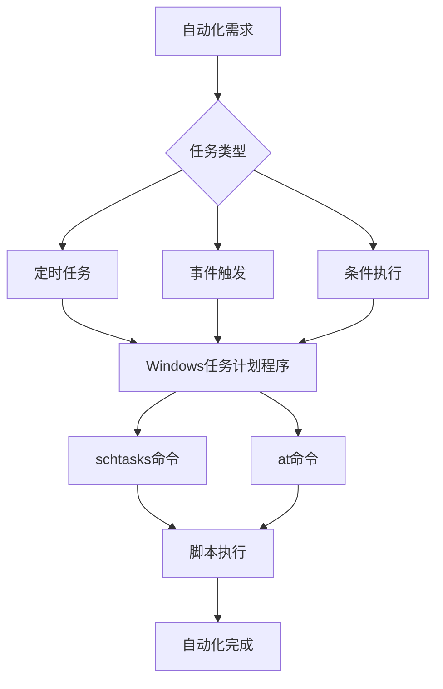
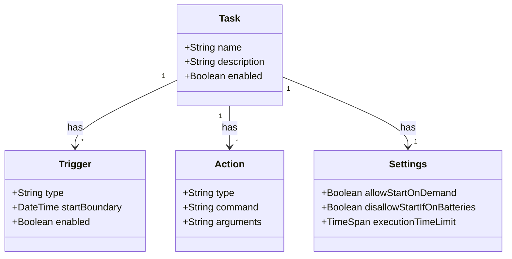

# 第12章 任务计划与调度 — 自动化的基石

## 章节概述

欢迎来到第12章！在前面的章节中，我们学习了命令行脚本的各种技能，从基础命令到高级编程结构。现在，我们将探索一个将脚本提升到真正自动化水平的关键领域：**任务计划与调度**。

任务调度是自动化运维的基石。通过将脚本与计划任务结合，你可以：

- **定时执行重复性任务** - 备份、清理、报告生成
- **无人值守运行** - 脚本在后台静默执行，无需人工干预
- **事件驱动响应** - 系统启动、用户登录时自动触发
- **资源优化** - 在系统空闲时段执行资源密集型操作



## 核心概念详解

### 12.1 schtasks命令详解

`schtasks`是Windows中功能最强大的任务调度工具，它提供了完整的命令行接口来管理计划任务。

!!! note "安全提示"
    本章中的所有示例都使用`echo`命令模拟schtasks操作，**不会实际创建系统级计划任务**。在实际生产环境中使用schtasks需要管理员权限。

#### 12.1.1 创建计划任务 (schtasks /create)

创建计划任务的基本语法如下：

```batch
schtasks /create /tn "任务名称" /tr "要执行的命令" /sc 计划类型 [/其他参数]
```

**参数说明：**
- `/tn` - 任务名称（Task Name）
- `/tr` - 任务运行的命令（Task to Run）
- `/sc` - 计划类型（Schedule），如：once, daily, weekly, monthly, onstart, onlogon

**示例1：创建每日任务**

```batch
@echo off
echo 创建每日备份任务...
echo schtasks /create /tn "DailyBackup" /tr "C:\scripts\backup.bat" /sc daily /st 02:00
```

**示例2：创建每周任务**

```batch
@echo off
echo 创建每周报告任务...
echo schtasks /create /tn "WeeklyReport" /tr "C:\scripts\report.bat" /sc weekly /d MON /st 09:00
```

**示例3：创建启动时任务**

```batch
@echo off
echo 创建系统启动时任务...
echo schtasks /create /tn "StartupCheck" /tr "C:\scripts\check.bat" /sc onstart
```

#### 12.1.2 查询计划任务 (schtasks /query)

查询系统中现有的计划任务：

```batch
schtasks /query [/tn "任务名称"] [/fo 格式] [/v] [/nh]
```

**常用参数：**
- `/tn` - 查询特定任务
- `/fo` - 输出格式：TABLE, LIST, CSV
- `/v` - 显示详细信息（Verbose）
- `/nh` - 无表头（No Header）

**示例：查询所有任务**

```batch
@echo off
echo 查询所有计划任务...
echo schtasks /query /fo TABLE
```

#### 12.1.3 立即运行任务 (schtasks /run)

手动触发一个已存在的计划任务：

```batch
schtasks /run /tn "任务名称"
```

**示例：立即运行备份任务**

```batch
@echo off
echo 立即运行备份任务...
echo schtasks /run /tn "DailyBackup"
```

#### 12.1.4 修改任务 (schtasks /change)

修改现有计划任务的属性：

```batch
schtasks /change /tn "任务名称" [/tr 新命令] [/st 新时间] [/其他参数]
```

**示例：修改任务执行时间**

```batch
@echo off
echo 修改备份任务时间...
echo schtasks /change /tn "DailyBackup" /st 03:00
```

#### 12.1.5 删除任务 (schtasks /delete)

删除计划任务：

```batch
schtasks /delete /tn "任务名称" [/f]
```

**示例：删除任务**

```batch
@echo off
echo 删除备份任务...
echo schtasks /delete /tn "DailyBackup" /f
```

!!! warning "警告"
    `/f`参数表示强制删除，不显示确认提示。请谨慎使用！

#### 12.1.6 触发器类型详解

Windows任务计划支持多种触发器类型：

| 触发器类型 | 命令参数 | 说明 | 示例 |
|-----------|---------|------|------|
| 一次 | `/sc once` | 指定时间执行一次 | `schtasks /create ... /sc once /st 14:00` |
| 每日 | `/sc daily` | 每天执行 | `schtasks /create ... /sc daily /st 02:00` |
| 每周 | `/sc weekly` | 每周特定天执行 | `schtasks /create ... /sc weekly /d MON,FRI /st 09:00` |
| 每月 | `/sc monthly` | 每月特定日期执行 | `schtasks /create ... /sc monthly /d 1,15 /st 10:00` |
| 启动时 | `/sc onstart` | 系统启动时执行 | `schtasks /create ... /sc onstart` |
| 登录时 | `/sc onlogon` | 用户登录时执行 | `schtasks /create ... /sc onlogon` |
| 空闲时 | `/sc onidle` | 系统空闲时执行 | `schtasks /create ... /sc onidle /i 10` |

### 12.2 at命令（已弃用但仍可用）

`at`命令是Windows早期版本中的任务调度工具，虽然在Windows 10及以后版本中已被弃用，但为了向后兼容，某些Windows版本仍然支持它。

#### 12.2.1 基本用法

```batch
at \\computername time [/interactive] [/every:date[,...] | /next:date[,...]] "command"
```

**示例：创建一个一次性任务**

```batch
@echo off
echo 使用at命令创建任务...
echo at 14:00 "C:\scripts\cleanup.bat"
```

#### 12.2.2 与schtasks的区别

| 特性 | at命令 | schtasks命令 |
|------|--------|-------------|
| 状态 | 已弃用 | 当前推荐 |
| 功能范围 | 基础调度 | 高级调度、条件、设置 |
| 任务管理 | 有限 | 完整 |
| 兼容性 | Windows XP/7/10/11 | Windows XP及以后 |
| 远程管理 | 支持 | 更强大 |

!!! tip "迁移建议"
    如果你的脚本仍在使用`at`命令，建议尽快迁移到`schtasks`。`at`命令在未来的Windows版本中可能完全移除。

### 12.3 后台执行技术

在批处理脚本中，有时需要让程序在后台运行，以便继续执行其他命令。

#### 12.3.1 start /b 后台启动

`start /b`命令在后台启动程序，不打开新窗口：

```batch
start /b notepad.exe
echo 继续执行其他命令...
```

**注意事项：**
- 后台进程的输出可能与当前窗口混合
- 适合不需要交互的程序
- 使用`tasklist`或`taskkill`管理后台进程

#### 12.3.2 start /min 最小化启动

`start /min`命令以最小化窗口启动程序：

```batch
start /min notepad.exe
echo 程序已最小化启动
```

#### 12.3.3 后台进程管理

**查看后台进程：**

```batch
tasklist /fi "imagename eq notepad.exe"
```

**终止后台进程：**

```batch
taskkill /f /im notepad.exe
```

### 12.4 超时控制

控制脚本执行节奏是任务调度中的重要技能。

#### 12.4.1 timeout 命令

`timeout`命令让脚本暂停指定秒数：

```batch
timeout /t 10
```

**常用选项：**
- `/t 10` - 暂停10秒
- `/t 10 /nobreak` - 不允许按键跳过
- `/t 10 /break` - 允许按键跳过（默认）

**示例：带倒计时的暂停**

```batch
@echo off
echo 开始处理...
echo.
timeout /t 5 /nobreak
echo 处理完成！
```

#### 12.4.2 ping 模拟延时

在`timeout`不可用时，可以使用`ping`模拟延时：

```batch
ping 127.0.0.1 -n 6 >nul
```

**原理：** `-n 6`表示发送6个ping包，每个间隔约1秒，总共约5秒延时。

#### 12.4.3 waitfor 等待信号

`waitfor`命令等待特定信号或超时：

```batch
waitfor MySignal /t 30
```

**其他进程发送信号：**

```batch
waitfor MySignal /si
```

**应用场景：**
- 进程间同步
- 等待外部事件
- 超时控制

### 12.5 实际应用场景

#### 12.5.1 定时备份

**场景：每天凌晨2点自动备份数据库**

```batch
@echo off
:: 备份脚本示例
set BACKUP_DIR=C:\Backups
set DB_NAME=mydb
set DATE_STAMP=%date:~0,4%%date:~5,2%%date:~8,2%
set BACKUP_FILE=%BACKUP_DIR%\%DB_NAME%_%DATE_STAMP%.bak

echo 创建备份目录...
if not exist "%BACKUP_DIR%" mkdir "%BACKUP_DIR%"

echo 执行数据库备份...
:: 这里使用echo模拟实际备份命令
echo mysqldump -u root -p %DB_NAME% > "%BACKUP_FILE%"

echo 备份完成: %BACKUP_FILE%
```

**创建计划任务：**

```batch
@echo off
echo 创建数据库备份计划任务...
echo schtasks /create /tn "DB_Backup" /tr "C:\scripts\backup_db.bat" /sc daily /st 02:00
```

#### 12.5.2 日志轮转

**场景：每周日清理旧日志文件**

```batch
@echo off
:: 日志轮转脚本
set LOG_DIR=C:\Logs
set DAYS_TO_KEEP=30

echo 清理超过%DAYS_TO_KEEP%天的日志文件...
forfiles /p "%LOG_DIR%" /s /m *.log /d -%DAYS_TO_KEEP% /c "cmd /c del @path"

echo 日志轮转完成。
```

#### 12.5.3 系统清理

**场景：每月清理临时文件**

```batch
@echo off
:: 系统清理脚本
echo 清理临时文件...
del /q /f /s "%TEMP%\*.*" 2>nul
rd /s /q "%TEMP%" 2>nul
mkdir "%TEMP%"

echo 清理Windows更新缓存...
echo net stop wuauserv
echo rd /s /q C:\Windows\SoftwareDistribution\Download
echo net start wuauserv

echo 系统清理完成。
```

#### 12.5.4 监控告警

**场景：每5分钟检查服务状态**

```batch
@echo off
:: 服务监控脚本
set SERVICE_NAME=MySQL
set ALERT_EMAIL=admin@example.com

echo 检查%SERVICE_NAME%服务状态...
sc query %SERVICE_NAME% | find "RUNNING" >nul
if errorlevel 1 (
    echo 服务已停止！发送告警邮件...
    :: 这里使用echo模拟发送邮件
    echo mail -s "服务停止告警" %ALERT_EMAIL% < alert.txt
) else (
    echo 服务运行正常。
)
```

## 数据结构概念

### 12.6 任务调度器的内部结构

Windows任务计划程序在内部使用XML格式存储任务定义。了解这个结构有助于：

- 理解任务是如何被解析和执行的
- 手动编辑任务配置
- 进行故障排查

**任务XML结构示例：**

```xml
<?xml version="1.0" encoding="UTF-16"?>
<Task version="1.2" xmlns="http://schemas.microsoft.com/windows/2004/02/mit/task">
  <RegistrationInfo>
    <Description>示例任务</Description>
  </RegistrationInfo>
  <Triggers>
    <CalendarTrigger>
      <StartBoundary>2024-01-01T02:00:00</StartBoundary>
      <Enabled>true</Enabled>
      <ScheduleByDay>
        <DaysInterval>1</DaysInterval>
      </ScheduleByDay>
    </CalendarTrigger>
  </Triggers>
  <Actions Context="Author">
    <Exec>
      <Command>C:\scripts\backup.bat</Command>
    </Exec>
  </Actions>
</Task>
```

### 12.7 触发器-动作模型

任务调度遵循经典的**触发器-动作**模型：



**模型组件说明：**

1. **触发器（Trigger）**：决定任务何时执行
   - 时间触发器：每日、每周、每月等
   - 事件触发器：系统启动、用户登录等
   - 条件触发器：空闲时、网络连接时等

2. **动作（Action）**：决定任务执行什么
   - 启动程序（Exec）
   - 发送邮件（SendEmail）
   - 显示消息（ShowMessage）

3. **设置（Settings）**：任务的其他配置
   - 错过执行时的处理方式
   - 空闲条件
   - 电源管理

## 与其他语言的对比

### 12.8 Python实现对比

Python中有多个任务调度库，其中最流行的是`schedule`和`APScheduler`。

**schedule库示例：**

```python
import schedule
import time

def job():
    print("执行定时任务...")

# 每天执行
schedule.every().day.at("02:00").do(job)

# 每小时执行
schedule.every().hour.do(job)

while True:
    schedule.run_pending()
    time.sleep(1)
```

**APScheduler示例：**

```python
from apscheduler.schedulers.background import BackgroundScheduler

def job():
    print("执行任务...")

scheduler = BackgroundScheduler()
scheduler.add_job(job, 'cron', hour=2, minute=0)
scheduler.start()
```

**CMD vs Python对比：**

| 特性 | CMD schtasks | Python schedule | Python APScheduler |
|------|-------------|----------------|-------------------|
| 持久化 | 是（系统级） | 否（内存） | 是（数据库） |
| 精确度 | 系统级 | 秒级 | 毫秒级 |
| 复杂调度 | 支持 | 有限 | 强大 |
| 依赖 | 无 | 需要Python | 需要Python |
| 集成 | Windows原生 | 任何Python环境 | 任何Python环境 |

### 12.9 JavaScript实现对比

Node.js中的`node-cron`库提供了类似Linux crontab的调度功能。

**node-cron示例：**

```javascript
const cron = require('node-cron');

// 每天凌晨2点执行
cron.schedule('0 2 * * *', () => {
    console.log('执行每日任务...');
});

// 每5分钟执行
cron.schedule('*/5 * * * *', () => {
    console.log('每5分钟执行...');
});

// 工作日执行
cron.schedule('0 9 * * 1-5', () => {
    console.log('工作日任务...');
});
```

**CMD vs JavaScript对比：**

| 特性 | CMD schtasks | Node.js node-cron |
|------|-------------|-------------------|
| 环境 | Windows | 跨平台 |
| 语法 | 命令行参数 | Cron表达式 |
| 异步支持 | 无 | 是 |
| 生态系统 | Windows原生 | npm丰富 |
| 学习曲线 | 中等 | 低 |

### 12.10 C语言实现对比

C语言通常使用系统API或库来实现定时功能。

**Windows API定时器：**

```c
#include <windows.h>
#include <stdio.h>

VOID CALLBACK TimerProc(HWND hwnd, UINT uMsg, UINT_PTR idEvent, DWORD dwTime) {
    printf("定时器触发！\n");
}

int main() {
    // 设置1秒的定时器
    SetTimer(NULL, 1, 1000, TimerProc);
    
    MSG msg;
    while (GetMessage(&msg, NULL, 0, 0)) {
        TranslateMessage(&msg);
        DispatchMessage(&msg);
    }
    return 0;
}
```

**使用标准库time.h：**

```c
#include <stdio.h>
#include <time.h>
#include <windows.h>

int main() {
    time_t last_run = time(NULL);
    
    while (1) {
        time_t current = time(NULL);
        
        // 每10秒执行一次
        if (current - last_run >= 10) {
            printf("执行定时任务...\n");
            last_run = current;
        }
        
        Sleep(1000);
    }
    return 0;
}
```

### 12.11 Lua实现对比

Lua本身没有内置的定时器功能，但可以通过第三方库或系统调用实现。

**使用LuaSocket的定时器：**

```lua
local socket = require("socket")

-- 简单的定时器
local function delay(seconds)
    socket.sleep(seconds)
end

local function schedule(func, interval)
    while true do
        func()
        delay(interval)
    end
end

-- 每5秒执行一次
schedule(function()
    print("定时任务执行...", os.date("%Y-%m-%d %H:%M:%S"))
end, 5)
```

**使用LuaJIT的FFI调用Windows API：**

```lua
local ffi = require("ffi")

ffi.cdef[[
    typedef unsigned long DWORD;
    typedef int BOOL;
    typedef void* HANDLE;
    
    DWORD Sleep(DWORD dwMilliseconds);
    BOOL QueryPerformanceCounter(int64_t *lpPerformanceCount);
]]

-- 使用Windows Sleep函数
ffi.C.Sleep(5000)  -- 暂停5秒
```

## 最佳实践与常见陷阱

### 12.12 权限管理

**常见权限问题：**

1. **管理员权限要求**
   - 创建系统级任务需要管理员权限
   - 某些任务需要SYSTEM账户运行

2. **解决方法**
   - 使用提升的命令提示符
   - 在脚本中请求提升权限

```batch
@echo off
:: 检查是否以管理员权限运行
net session >nul 2>&1
if errorlevel 1 (
    echo 需要管理员权限！
    echo 请右键点击"以管理员身份运行"
    pause
    exit /b 1
)

echo 以管理员权限运行...
```

### 12.13 任务冲突处理

**潜在冲突场景：**

1. **同一任务多次运行**
2. **资源竞争**
3. **时间重叠**

**解决方案：**

```batch
@echo off
:: 使用锁文件防止重复运行
set LOCK_FILE=%TEMP%\task_running.lock

if exist "%LOCK_FILE%" (
    echo 任务正在运行，退出...
    exit /b 1
)

echo 创建锁文件...
echo %date% %time% > "%LOCK_FILE%"

:: 执行任务
echo 执行任务...

:: 清理锁文件
del "%LOCK_FILE%"
echo 任务完成。
```

### 12.14 日志记录最佳实践

**创建详细的日志记录：**

```batch
@echo off
set LOG_FILE=C:\Logs\task.log

call :log "任务开始"
call :log "执行备份操作..."
:: 备份代码...
call :log "备份完成"

call :log "任务结束"
goto :eof

:log
echo [%date% %time%] %~1 >> "%LOG_FILE%"
echo [%date% %time%] %~1
goto :eof
```

**日志轮转策略：**

```batch
@echo off
:: 每天创建新的日志文件
set LOG_DIR=C:\Logs
set LOG_FILE=%LOG_DIR%\task_%date:~0,4%%date:~5,2%%date:~8,2%.log

if not exist "%LOG_DIR%" mkdir "%LOG_DIR%"
```

### 12.15 常见错误与解决方案

| 错误 | 原因 | 解决方案 |
|------|------|---------|
| 任务未执行 | 权限不足 | 以管理员身份运行 |
| 任务执行但无效果 | 路径错误 | 使用绝对路径 |
| 任务多次执行 | 锁机制缺失 | 添加锁文件机制 |
| 任务超时 | 执行时间过长 | 增加超时设置或优化脚本 |
| 网络资源不可用 | 网络驱动器未映射 | 使用UNC路径或映射驱动器 |

## 练习题

### 12.16 基础练习

**练习1：创建简单的每日任务**

编写一个批处理脚本，使用`echo`模拟创建一个每日任务：
- 任务名称：DailyCleanup
- 执行时间：每天凌晨1点
- 执行命令：C:\scripts\cleanup.bat

```batch
@echo off
:: 在此编写你的代码
```

**练习2：查询特定任务**

编写脚本查询名为"DB_Backup"的任务详细信息。

```batch
@echo off
:: 在此编写你的代码
```

### 12.17 进阶练习

**练习3：创建任务调度库**

扩展`scheduler_lib.bat`，添加以下功能：
1. 任务状态检查函数
2. 任务执行历史记录
3. 任务执行统计

**练习4：实现监控脚本**

创建一个监控脚本，实现：
1. 每5分钟检查关键服务状态
2. 记录服务状态变化
3. 当服务停止时发送告警（使用echo模拟）

**练习5：对比实验**

1. 使用Python的`schedule`库实现相同的定时任务
2. 比较CMD和Python实现的优缺点
3. 讨论在什么场景下选择哪种方案

## 总结

在本章中，我们学习了：

1. **schtasks命令**：Windows任务调度的核心工具
2. **后台执行技术**：`start /b`和`start /min`
3. **超时控制**：`timeout`、`ping`、`waitfor`命令
4. **实际应用场景**：备份、清理、监控
5. **数据结构**：触发器-动作模型
6. **跨语言对比**：Python、JavaScript、C、Lua实现
7. **最佳实践**：权限、冲突、日志

任务调度是将脚本从"手动运行"提升到"自动化运行"的关键一步。掌握这些技术后，你可以构建真正无人值守的自动化系统。

## 下一步学习

在下一章中，我们将探讨：
- 多语言脚本集成
- 跨平台自动化
- 现代化运维工具

## 参考资源

- [Windows任务计划程序文档](https://docs.microsoft.com/en-us/windows/win32/taskschd/task-scheduler-start-page)
- [schtasks命令参考](https://docs.microsoft.com/en-us/windows-server/administration/windows-commands/schtasks)
- [Python schedule库](https://schedule.readthedocs.io/)
- [Node.js node-cron](https://www.npmjs.com/package/node-cron)