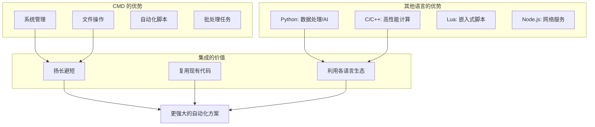
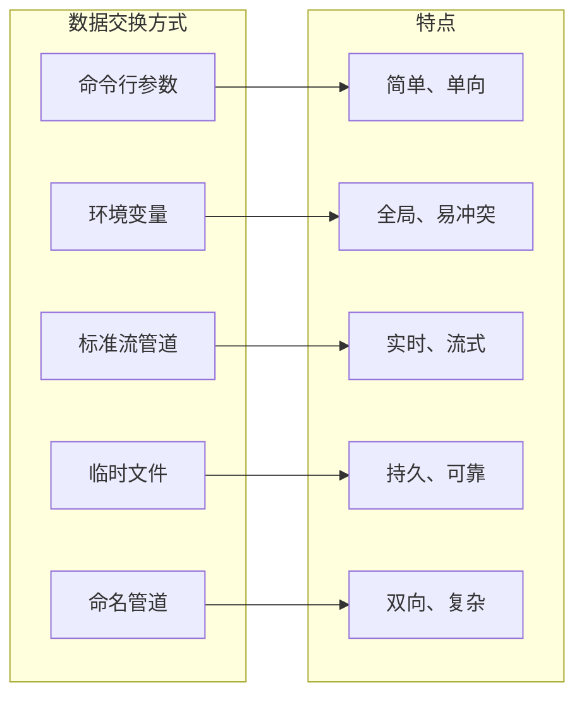
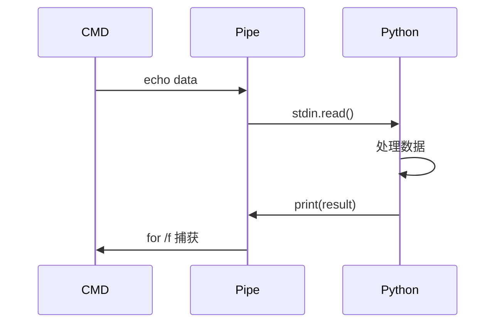
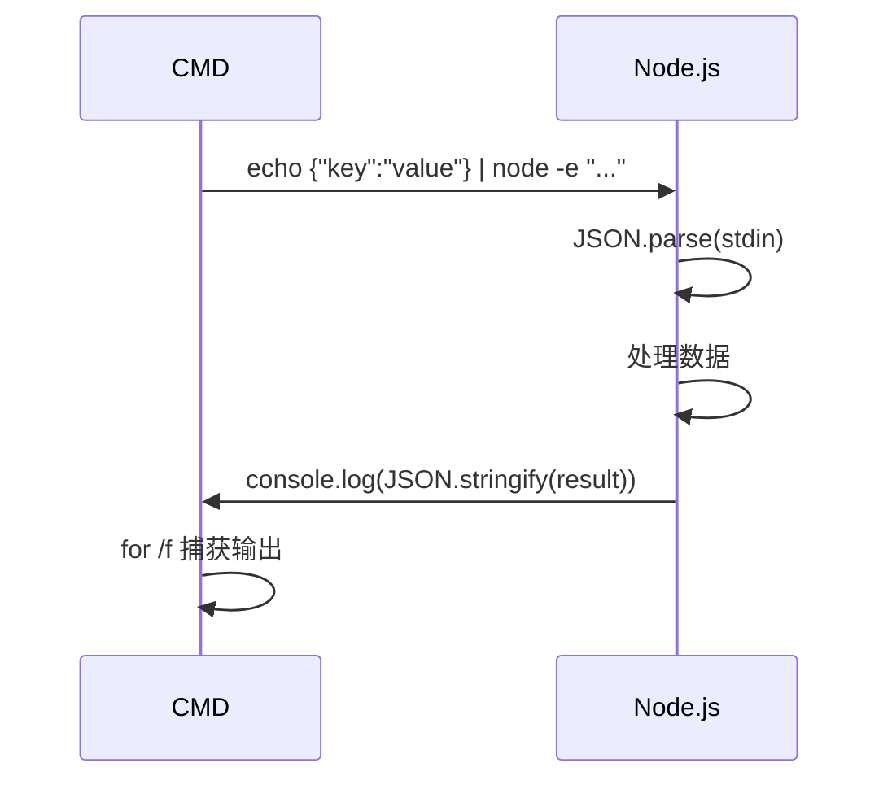
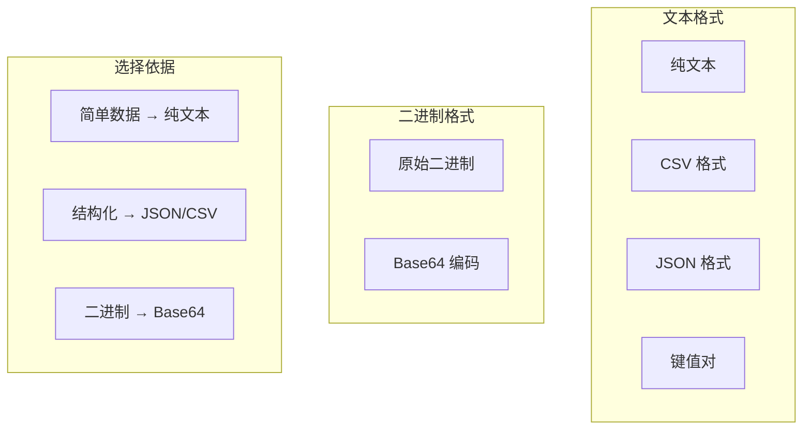
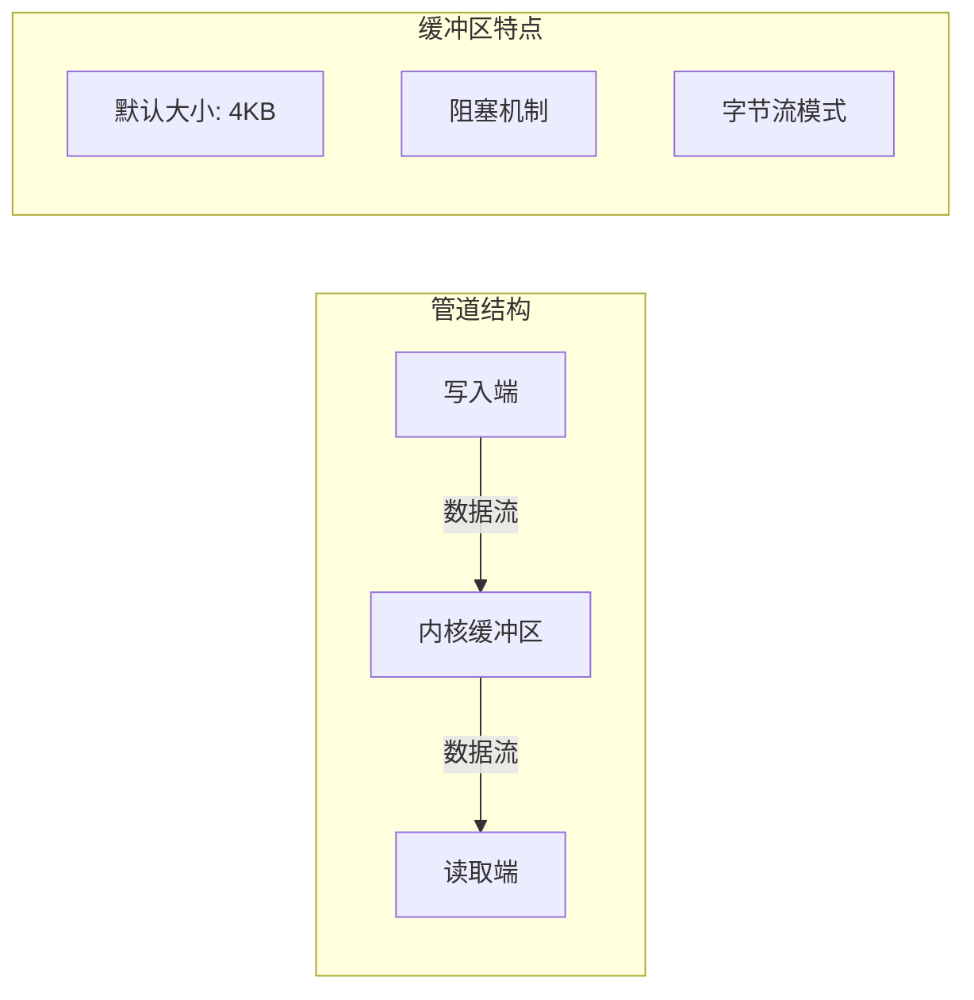
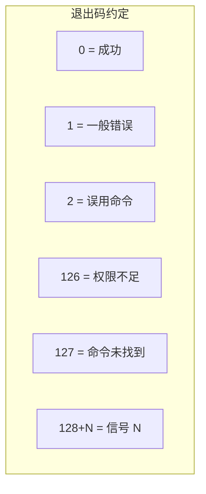
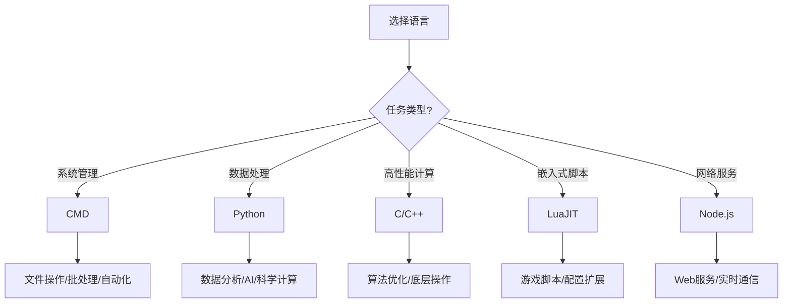
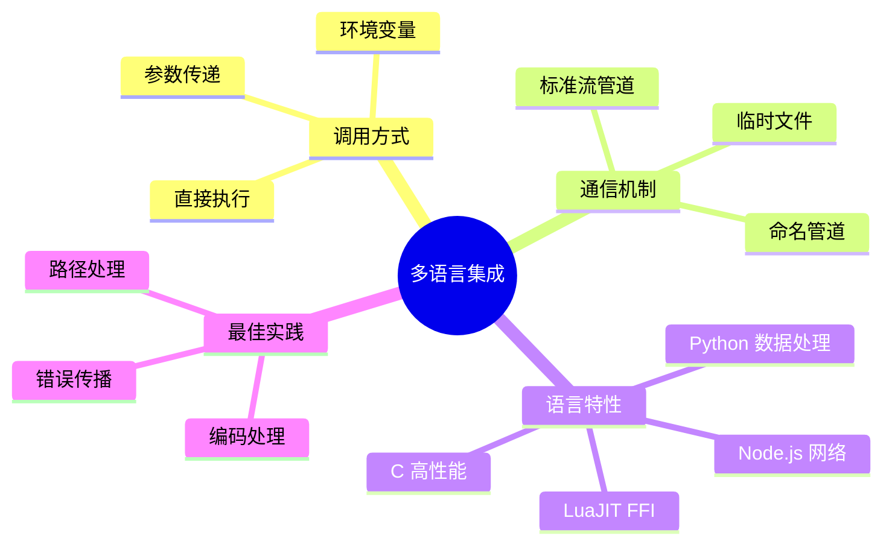

# 第13章 多语言集成 — 万物互联

## 13.1 概述

在现代软件开发中，没有一种语言能够完美解决所有问题。CMD 作为 Windows 系统的原生脚本语言，擅长系统管理和自动化任务，但在数据处理、网络编程、复杂算法等方面存在局限。本章将教你如何让 CMD 与其他编程语言协同工作，实现功能扩展和优势互补。

!!! abstract "学习目标"
    通过本章学习，你将能够：
    
    - 调用 Python、C、Lua、Node.js 等语言编写的程序
    - 掌握多种进程间通信（IPC）方式
    - 理解管道、临时文件、环境变量等数据交换机制
    - 根据场景选择最合适的多语言集成方案

### 13.1.1 为什么要多语言集成？



### 13.1.2 进程间通信概览



### 13.1.3 前置要求

| 技能 | 要求 |
|------|------|
| CMD 基础 | 第1-6章内容 |
| 变量与环境变量 | 第9章内容 |
| 进程与服务 | 第11章基础 |
| 其他语言 | 无需精通，了解基本语法即可 |

---

## 13.2 调用 Python 脚本

Python 是与 CMD 配合最紧密的语言之一，尤其擅长数据处理、Web 请求和复杂逻辑。

### 13.2.1 基本调用方式

最简单的方式是直接调用 Python 解释器执行脚本：

```batch
REM 直接调用 Python 脚本
python script.py

REM 指定完整路径
python "C:\Users\username\project\script.py"

REM 使用 Python 模块
python -m json.tool input.json
```

!!! tip "检查 Python 是否可用"
    在调用 Python 前，建议先检查环境：
    ```batch
    where python >nul 2>nul
    if errorlevel 1 (
        echo Python 未安装或不在 PATH 中
        exit /b 1
    )
    ```

### 13.2.2 命令行参数传递

CMD 通过命令行参数向 Python 传递数据：

```batch
@echo off
REM call_python.bat - 传递命令行参数给 Python

set SCRIPT_DIR=%~dp0scripts
set NAME=World
set COUNT=3

echo [CMD] 调用 Python 脚本，参数: %NAME% %COUNT%
python "%SCRIPT_DIR%\hello.py" %NAME% %COUNT%

echo [CMD] Python 执行完成，退出码: %errorlevel%
```

对应的 Python 脚本接收参数：

```python
# hello.py - 接收命令行参数
import sys

def main():
    # sys.argv[0] 是脚本名，参数从 [1] 开始
    name = sys.argv[1] if len(sys.argv) > 1 else "World"
    count = int(sys.argv[2]) if len(sys.argv) > 2 else 1
    
    for i in range(count):
        print(f"Hello, {name}! (第 {i+1} 次)")
    
    # 通过退出码返回状态
    sys.exit(0)

if __name__ == "__main__":
    main()
```

!!! info "退出码约定"
    - `exit 0` 或 `sys.exit(0)` 表示成功
    - 非零值表示错误，CMD 通过 `%errorlevel%` 获取

### 13.2.3 环境变量交换数据

环境变量是进程间共享数据的简单方式：

```batch
@echo off
REM env_exchange.bat - 通过环境变量交换数据

REM 设置要传递给 Python 的数据
set INPUT_DATA=Hello from CMD
set MAX_VALUE=100

echo [CMD] 设置环境变量: INPUT_DATA=%INPUT_DATA%
echo [CMD] 设置环境变量: MAX_VALUE=%MAX_VALUE%

REM 调用 Python 脚本（Python 会读取这些环境变量）
python scripts\data_exchange.py

REM 读取 Python 设置的环境变量（需要使用延迟扩展或临时文件）
REM 注意：子进程无法直接修改父进程的环境变量
echo [CMD] 任务完成
```

Python 端读取和设置环境变量：

```python
# data_exchange.py - 环境变量数据交换
import os

# 读取 CMD 设置的环境变量
input_data = os.environ.get('INPUT_DATA', '默认值')
max_value = int(os.environ.get('MAX_VALUE', '50'))

print(f"[Python] 读取到 INPUT_DATA: {input_data}")
print(f"[Python] 读取到 MAX_VALUE: {max_value}")

# 计算结果
result = f"处理结果: {input_data} * {max_value} = 处理完成"

# 输出结果到标准输出（CMD 可以捕获）
print(f"RESULT={result}")
```

!!! warning "环境变量的局限"
    子进程（Python）无法直接修改父进程（CMD）的环境变量。需要通过标准输出或其他机制将数据传回。

### 13.2.4 管道通信

管道是实时数据交换的利器：

```batch
@echo off
REM pipe_to_python.bat - 管道通信示例

echo [CMD] 通过管道发送数据给 Python

REM 方式1：简单文本管道
echo Hello from CMD | python -c "import sys; print('[Python] 收到:', sys.stdin.read().strip())"

REM 方式2：多行数据管道
(
echo 张三,25,工程师
echo 李四,30,设计师
echo 王五,28,产品经理
) | python -c "
import sys
for line in sys.stdin:
    parts = line.strip().split(',')
    if len(parts) == 3:
        print(f'[Python] 姓名: {parts[0]}, 年龄: {parts[1]}, 职位: {parts[2]}')
"

REM 方式3：捕获 Python 输出
for /f "delims=" %%i in ('python scripts\hello.py World 1') do (
    echo [CMD] 收到 Python 输出: %%i
)
```



### 13.2.5 Python 内嵌调用 CMD

反过来，Python 也可以调用 CMD 命令：

```python
# python_call_cmd.py - Python 调用 CMD 命令
import os
import subprocess

# 方式1: os.system() - 简单执行
os.system('echo [Python via os.system] Hello from CMD')

# 方式2: subprocess.run() - 更多控制
result = subprocess.run(
    ['dir', '/b', '*.bat'],
    capture_output=True,
    text=True,
    shell=True
)
print(f"[Python via subprocess] 输出:\n{result.stdout}")

# 方式3: subprocess.check_output() - 获取输出
output = subprocess.check_output('echo Hello', shell=True, text=True)
print(f"[Python] CMD 输出: {output.strip()}")
```

### 13.2.6 完整示例：CMD 与 Python 双向通信

```batch
@echo off
REM call_python_full.bat - 完整的 CMD-Python 通信示例

set SCRIPT_DIR=%~dp0scripts

echo ========================================
echo CMD 与 Python 双向通信演示
echo ========================================

echo.
echo [1] 命令行参数传递
echo ----------------------------------------
python "%SCRIPT_DIR%\hello.py" "CMD用户" 2

echo.
echo [2] 管道数据传递
echo ----------------------------------------
echo 姓名,年龄,城市 | python -c "
import sys
data = sys.stdin.read().strip().split(',')
print(f'收到数据: 姓名={data[0]}, 年龄={data[1]}, 城市={data[2]}')
print('处理完成')
"

echo.
echo [3] 捕获 Python 输出
echo ----------------------------------------
for /f "tokens=1,2 delims==" %%a in ('python -c "print('KEY=VALUE')"') do (
    echo 键: %%a, 值: %%b
)

echo.
echo ========================================
echo 演示完成
echo ========================================
```

---

## 13.3 调用 C 程序

C 语言编写的程序具有极高的执行效率，适合性能敏感的计算任务。

### 13.3.1 编译与调用

首先将 C 源码编译为可执行文件，然后在 CMD 中调用：

```batch
@echo off
REM call_c.bat - 调用 C 程序

set SCRIPT_DIR=%~dp0scripts

REM 检查是否已编译
if not exist "%SCRIPT_DIR%\hello.exe" (
    echo [CMD] 正在编译 C 程序...
    gcc "%SCRIPT_DIR%\hello.c" -o "%SCRIPT_DIR%\hello.exe"
    if errorlevel 1 (
        echo 编译失败！请确保已安装 GCC
        exit /b 1
    )
    echo [CMD] 编译成功
)

echo [CMD] 调用 C 程序
"%SCRIPT_DIR%\hello.exe" arg1 arg2 arg3

echo [CMD] C 程序退出码: %errorlevel%
```

!!! tip "检查 GCC"
    如果使用 MinGW-w64 或 MSYS2，可以通过以下方式检查：
    ```batch
    where gcc >nul 2>nul
    if errorlevel 1 (
        echo GCC 未安装，尝试使用 MSVC...
        cl hello.c
    )
    ```

### 13.3.2 C 程序接收参数

```c
// hello.c - 接收命令行参数
#include <stdio.h>
#include <stdlib.h>

int main(int argc, char *argv[]) {
    printf("[C] 程序启动，共 %d 个参数\n", argc);
    
    for (int i = 0; i < argc; i++) {
        printf("[C] 参数 %d: %s\n", i, argv[i]);
    }
    
    // 通过退出码返回状态
    return 0;
}
```

### 13.3.3 通过文件交换数据

对于复杂数据，文件是更可靠的交换方式：

```batch
@echo off
REM c_file_exchange.bat - 通过文件与 C 程序交换数据

set SCRIPT_DIR=%~dp0scripts
set DATA_FILE=%TEMP%\cmd_c_data.txt
set RESULT_FILE=%TEMP%\cmd_c_result.txt

REM 准备输入数据
echo 100 > "%DATA_FILE%"
echo 200 >> "%DATA_FILE%"
echo 300 >> "%DATA_FILE%"

echo [CMD] 输入数据已写入: %DATA_FILE%

REM 调用 C 程序处理
"%SCRIPT_DIR%\calculator.exe" "%DATA_FILE%" "%RESULT_FILE%"

REM 读取结果
if exist "%RESULT_FILE%" (
    echo [CMD] C 程序返回的结果:
    type "%RESULT_FILE%"
)

REM 清理临时文件
del "%DATA_FILE%" "%RESULT_FILE%" 2>nul
```

### 13.3.4 管道通信（popen）

C 程序可以通过 `popen` 与 CMD 进行管道通信：

```c
// pipe_demo.c - C 程序中的管道操作
#include <stdio.h>
#include <stdlib.h>

int main() {
    // 从 stdin 读取数据
    char buffer[256];
    printf("[C] 等待输入...\n");
    
    while (fgets(buffer, sizeof(buffer), stdin)) {
        // 处理并输出
        printf("[C] 处理: %s", buffer);
    }
    
    printf("[C] 管道结束\n");
    return 0;
}
```

调用方式：

```batch
echo 数据1 & echo 数据2 | pipe_demo.exe
```

---

## 13.4 调用 LuaJIT

LuaJIT 是一个轻量级、高性能的 Lua 运行时，特别适合嵌入式脚本和 FFI 调用。

### 13.4.1 基本调用

```batch
@echo off
REM call_lua.bat - 调用 LuaJIT 脚本

set SCRIPT_DIR=%~dp0scripts

REM 检查 LuaJIT
where luajit >nul 2>nul
if errorlevel 1 (
    echo LuaJIT 未安装，请从 https://luajit.org 下载
    exit /b 1
)

echo [CMD] 调用 LuaJIT 脚本
luajit "%SCRIPT_DIR%\hello.lua" "CMD参数1" "CMD参数2"

echo [CMD] LuaJIT 退出码: %errorlevel%
```

### 13.4.2 Lua 脚本接收参数

```lua
-- hello.lua - LuaJIT 示例脚本
-- 安全提示：仅在项目目录内操作

print("[Lua] 脚本启动")

-- arg 是全局参数表
print("[Lua] 参数数量: " .. #arg)
for i, v in ipairs(arg) do
    print(string.format("[Lua] 参数 %d: %s", i, v))
end

-- 通过 os.exit 返回退出码
os.exit(0)
```

### 13.4.3 LuaJIT FFI 调用 Windows API

LuaJIT 的 FFI（Foreign Function Interface）可以直接调用 Windows DLL：

```lua
-- ffi_demo.lua - LuaJIT FFI 调用 Windows API
-- 安全提示：仅用于学习 FFI 机制

local ffi = require("ffi")

-- 声明 Windows API 函数
ffi.cdef[[
    int MessageBoxA(void *hwnd, const char *text, const char *caption, unsigned int type);
    uint32_t GetTickCount(void);
    int GetSystemDirectoryA(char *buffer, int size);
]]

-- 调用 GetTickCount 获取系统运行时间
local tick = ffi.C.GetTickCount()
print(string.format("[Lua FFI] 系统运行时间: %d 毫秒 (%.1f 秒)", tick, tick / 1000))

-- 获取系统目录
local buffer = ffi.new("char[260]")
local len = ffi.C.GetSystemDirectoryA(buffer, 260)
local sysdir = ffi.string(buffer, len)
print("[Lua FFI] 系统目录: " .. sysdir)

-- 注意：MessageBoxA 会弹出窗口，这里注释掉
-- ffi.C.MessageBoxA(nil, "Hello from LuaJIT FFI!", "FFI Demo", 0)
```

!!! warning "FFI 安全提示"
    FFI 直接调用系统 API，使用时需谨慎。避免调用不熟悉的函数，防止系统不稳定。

### 13.4.4 Lua 与 CMD 数据交换

```batch
@echo off
REM lua_data_exchange.bat - Lua 与 CMD 数据交换

set SCRIPT_DIR=%~dp0scripts

REM 方式1：通过环境变量
set LUA_INPUT=Hello from CMD
luajit -e "
local data = os.getenv('LUA_INPUT') or 'default'
print('[Lua] 读取到: ' .. data)
print('RESULT=' .. data .. ' -> 处理完成')
"

REM 方式2：通过管道
echo 管道数据 | luajit -e "
local data = io.read('*l')
print('[Lua] 管道数据: ' .. data)
"

REM 方式3：捕获输出
for /f "tokens=1,* delims==" %%a in ('luajit -e "print('KEY=Lua计算结果')"') do (
    echo [CMD] 键=%%a, 值=%%b
)
```

---

## 13.5 调用 JavaScript（Node.js）

Node.js 是服务端 JavaScript 运行时，擅长网络编程和异步操作。

### 13.5.1 基本调用

```batch
@echo off
REM call_node.bat - 调用 Node.js 脚本

set SCRIPT_DIR=%~dp0scripts

REM 检查 Node.js
where node >nul 2>nul
if errorlevel 1 (
    echo Node.js 未安装，请从 https://nodejs.org 下载
    exit /b 1
)

echo [CMD] Node.js 版本:
node --version

echo.
echo [CMD] 调用 Node.js 脚本
node "%SCRIPT_DIR%\hello.js" "参数1" "参数2" "参数3"

echo [CMD] Node.js 退出码: %errorlevel%
```

### 13.5.2 Node.js 脚本示例

```javascript
// hello.js - Node.js 示例脚本
// 安全提示：仅在项目目录内操作

console.log('[Node.js] 脚本启动');

// process.argv 包含参数
// [0] = node, [1] = 脚本路径, [2+] = 用户参数
const args = process.argv.slice(2);

console.log(`[Node.js] 收到 ${args.length} 个参数:`);
args.forEach((arg, index) => {
    console.log(`  参数 ${index + 1}: ${arg}`);
});

// 通过 process.exit 设置退出码
process.exit(0);
```

### 13.5.3 Node.js 子进程执行 CMD 命令

```javascript
// node_call_cmd.js - Node.js 调用 CMD 命令
const { execSync, exec } = require('child_process');

// 方式1: execSync - 同步执行
console.log('[Node.js] 同步执行 CMD 命令:');
const output = execSync('dir /b *.bat', { encoding: 'utf8', shell: 'cmd.exe' });
console.log(output);

// 方式2: exec - 异步执行
exec('echo Hello from CMD', { shell: 'cmd.exe' }, (error, stdout, stderr) => {
    if (error) {
        console.error(`[Node.js] 错误: ${error.message}`);
        return;
    }
    console.log(`[Node.js] CMD 输出: ${stdout.trim()}`);
});

// 方式3: 执行批处理文件
exec('call test.bat', { shell: 'cmd.exe' }, (error, stdout) => {
    console.log(`[Node.js] 批处理输出: ${stdout}`);
});
```

### 13.5.4 JSON 数据交换

JSON 是 Node.js 最自然的数据格式：

```batch
@echo off
REM json_exchange.bat - JSON 数据交换

set SCRIPT_DIR=%~dp0scripts

REM 方式1：通过管道传递 JSON
echo {"name":"张三","age":25,"city":"北京"} | node -e "
const data = JSON.parse(require('fs').readFileSync('/dev/stdin', 'utf8'));
console.log('[Node.js] 收到 JSON:');
console.log('  姓名:', data.name);
console.log('  年龄:', data.age);
console.log('  城市:', data.city);

// 返回处理结果
const result = { status: 'success', message: `处理完成: ${data.name}` };
console.log('RESULT=' + JSON.stringify(result));
"

REM 方式2：捕获 JSON 输出
for /f "delims=" %%i in ('node -e "console.log(JSON.stringify({count:42,status:'ok'}))"') do (
    echo [CMD] 收到 JSON: %%i
)
```



---

## 13.6 管道通信详解

管道是进程间通信的核心机制，理解其工作原理对于构建复杂的多语言集成至关重要。

### 13.6.1 匿名管道

匿名管道是最常用的管道类型，通过 `|` 操作符创建：

```batch
@echo off
REM pipe_demo.bat - 管道通信演示

echo ========================================
echo 匿名管道通信演示
echo ========================================

echo.
echo [示例1] 基本管道
echo ----------------------------------------
echo Hello World | findstr "World"

echo.
echo [示例2] 多命令管道
echo ----------------------------------------
echo apple & echo banana & echo cherry | sort

echo.
echo [示例3] 管道中的错误处理
echo ----------------------------------------
REM 注意：管道中只有最后一个命令的 errorlevel 被保留
dir /b *.txt | findstr "test"
echo findstr 退出码: %errorlevel%

echo.
echo [示例4] 跨语言管道
echo ----------------------------------------
REM CMD -> Python 管道
echo 100 200 300 | python -c "
import sys
data = sys.stdin.read().split()
total = sum(int(x) for x in data)
print(f'总和: {total}')
"

echo.
echo [示例5] 复杂数据管道
echo ----------------------------------------
REM 生成 CSV 数据并通过 Python 处理
(
echo 姓名,分数
echo 张三,85
echo 李四,92
echo 王五,78
echo 赵六,95
) | python -c "
import sys, csv
from io import StringIO

data = sys.stdin.read()
reader = csv.DictReader(StringIO(data))
scores = []
for row in reader:
    scores.append((row['姓名'], int(row['分数'])))
    print(f\"  {row['姓名']}: {row['分数']}分\")

avg = sum(s for _, s in scores) / len(scores)
print(f\"平均分: {avg:.1f}\")
"
```

### 13.6.2 管道中的数据格式



```batch
@echo off
REM pipe_formats.bat - 不同数据格式的管道传输

echo [1] 纯文本格式
echo Hello World | python -c "print('[Python]', input())"

echo.
echo [2] 键值对格式
echo NAME=张三 & echo AGE=25 | python -c "
import sys
for line in sys.stdin:
    key, _, value = line.strip().partition('=')
    print(f'  {key} = {value}')
"

echo.
echo [3] JSON 格式
echo {\"scores\":[85,92,78,95]} | python -c "
import sys, json
data = json.loads(sys.stdin.read())
avg = sum(data['scores']) / len(data['scores'])
print(f'平均分: {avg}')
"
```

### 13.6.3 管道错误处理

```batch
@echo off
REM pipe_error_handling.bat - 管道中的错误处理

echo 管道错误处理演示
echo ========================================

REM 问题：管道中前面命令的错误会被忽略
echo.
echo [测试1] 忽略前面命令的错误
nonexistent_command | echo 这行仍然会执行
echo 前面命令的退出码丢失，当前: %errorlevel%

REM 解决方案：使用临时文件
echo.
echo [测试2] 使用临时文件保存中间结果
set TEMP_FILE=%TEMP%\pipe_result.txt

some_command > "%TEMP_FILE%" 2>nul
set CMD_RESULT=%errorlevel%

if %CMD_RESULT% neq 0 (
    echo 命令失败，退出码: %CMD_RESULT%
) else (
    type "%TEMP_FILE%" | findstr "pattern"
)

del "%TEMP_FILE%" 2>nul

REM 解决方案：使用 && 和 || 操作符
echo.
echo [测试3] 使用条件操作符
dir /b *.txt && echo 找到文件 || echo 没有找到文件
```

!!! warning "管道错误处理的陷阱"
    管道中，`%errorlevel%` 只反映最后一个命令的结果。如果需要捕获中间命令的错误，请使用临时文件或 `&&`/`||` 操作符。

---

## 13.7 临时文件通信

当数据量大或需要持久化时，临时文件是更可靠的选择。

### 13.7.1 基本临时文件通信

```batch
@echo off
REM temp_file_comm.bat - 临时文件通信

set TEMP_DIR=%TEMP%\cmd_multilang
set DATA_FILE=%TEMP_DIR%\data.txt
set RESULT_FILE=%TEMP_DIR%\result.txt

REM 创建临时目录
if not exist "%TEMP_DIR%" mkdir "%TEMP_DIR%"

echo [CMD] 准备数据...
(
echo 这是第一行数据
echo 这是第二行数据
echo 这是第三行数据
) > "%DATA_FILE%"

echo [CMD] 调用 Python 处理数据...
python -c "
import sys

# 读取输入文件
with open(r'%DATA_FILE%', 'r', encoding='utf-8') as f:
    lines = f.readlines()

# 处理数据
result = []
for i, line in enumerate(lines, 1):
    result.append(f'行 {i}: {line.strip()} (长度: {len(line.strip())})')

# 写入结果文件
with open(r'%RESULT_FILE%', 'w', encoding='utf-8') as f:
    f.write('\n'.join(result))

print('[Python] 处理完成')
"

echo.
echo [CMD] 读取处理结果:
type "%RESULT_FILE%"

REM 清理
rd /s /q "%TEMP_DIR%" 2>nul
```

### 13.7.2 文件锁和同步

在多进程环境下，需要考虑文件同步问题：

```batch
@echo off
REM file_sync.bat - 文件同步示例

set LOCK_FILE=%TEMP%\cmd_lock.tmp
set DATA_FILE=%TEMP%\cmd_data.txt

REM 简单的文件锁实现
call :acquire_lock
if errorlevel 1 (
    echo 无法获取锁，另一个进程正在运行
    exit /b 1
)

REM 临界区：安全地读写文件
echo 当前时间: %time% >> "%DATA_FILE%"

call :release_lock
echo 操作完成
exit /b 0

:acquire_lock
REM 尝试创建锁文件
if exist "%LOCK_FILE%" (
    REM 检查锁文件是否过期（超过30秒）
    for %%f in ("%LOCK_FILE%") do (
        set lock_time=%%~tf
    )
    REM 简化处理：直接尝试重命名
    ren "%LOCK_FILE%" "%LOCK_FILE%.%random%" 2>nul
    if errorlevel 1 exit /b 1
)
echo %PID% > "%LOCK_FILE%"
exit /b 0

:release_lock
del "%LOCK_FILE%" 2>nul
exit /b 0
```

!!! tip "生产环境建议"
    简单的文件锁在生产环境中可能不够可靠。对于复杂场景，建议使用：
    - Windows 互斥对象（Mutex）
    - 数据库事务
    - 专用的 IPC 机制

---

## 13.8 FFI（外部函数接口）

FFI 允许脚本语言直接调用本地代码（DLL），是性能优化和系统编程的重要手段。

### 13.8.1 LuaJIT FFI 调用 DLL

LuaJIT 的 FFI 是最强大的 FFI 实现之一：

```lua
-- ffi_dll_demo.lua - LuaJIT FFI 调用自定义 DLL
-- 安全提示：仅用于学习 FFI 机制

local ffi = require("ffi")

-- 假设我们有一个 math_utils.dll
-- 导出函数: int add(int a, int b)

ffi.cdef[[
    // Windows API 示例
    typedef void* HANDLE;
    typedef unsigned long DWORD;
    typedef int BOOL;
    
    HANDLE GetCurrentProcess(void);
    BOOL TerminateProcess(HANDLE hProcess, DWORD uExitCode);
    
    // 用户自定义 DLL（需要先编译）
    // int add_numbers(int a, int b);
]]

-- 调用 Windows API
local process = ffi.C.GetCurrentProcess()
print("[LuaJIT FFI] 当前进程句柄: " .. tostring(process))

-- 使用 metatype 封装 C 结构体
ffi.cdef[[
    typedef struct {
        double x;
        double y;
    } Point;
]]

local Point = ffi.metatype("Point", {
    __tostring = function(self)
        return string.format("(%g, %g)", self.x, self.y)
    end,
    __add = function(a, b)
        return Point(a.x + b.x, a.y + b.y)
    end
})

local p1 = Point(1.5, 2.5)
local p2 = Point(3.0, 4.0)
local p3 = p1 + p2
print("[LuaJIT FFI] p1 = " .. tostring(p1))
print("[LuaJIT FFI] p2 = " .. tostring(p2))
print("[LuaJIT FFI] p1 + p2 = " .. tostring(p3))
```

### 13.8.2 Python ctypes 调用 DLL

Python 的 ctypes 模块提供类似功能：

```python
# ctypes_demo.py - Python ctypes 调用 DLL
import ctypes
from ctypes import wintypes

# 加载 Windows API
kernel32 = ctypes.WinDLL('kernel32', use_last_error=True)

# 获取系统目录
buffer = ctypes.create_unicode_buffer(260)
length = kernel32.GetSystemDirectoryW(buffer, 260)
print(f"[Python ctypes] 系统目录: {buffer.value}")

# 获取系统信息
kernel32.GetTickCount.restype = wintypes.DWORD
tick_count = kernel32.GetTickCount()
print(f"[Python ctypes] 系统运行时间: {tick_count} 毫秒")

# 调用自定义 DLL（需要先编译）
# mydll = ctypes.CDLL('./my_math.dll')
# result = mydll.add_numbers(10, 20)
# print(f"[Python ctypes] 10 + 20 = {result}")
```

### 13.8.3 调用自定义 DLL 示例

创建一个简单的 C DLL 并从脚本调用：

```c
// my_math.c - 简单的数学 DLL 源码
// 编译: gcc -shared -o my_math.dll my_math.c

#ifdef _WIN32
#define EXPORT __declspec(dllexport)
#else
#define EXPORT
#endif

EXPORT int add(int a, int b) {
    return a + b;
}

EXPORT int multiply(int a, int b) {
    return a * b;
}

EXPORT double calculate(double x, double y) {
    return x * x + y * y;
}
```

CMD 中编译和测试：

```batch
@echo off
REM build_and_test_dll.bat

REM 编译 DLL
gcc -shared -o my_math.dll my_math.c
if errorlevel 1 (
    echo DLL 编译失败
    exit /b 1
)

REM 使用 LuaJIT FFI 测试
luajit -e "
local ffi = require('ffi')
ffi.cdef[[
    int add(int a, int b);
    int multiply(int a, int b);
    double calculate(double x, double y);
]]
local lib = ffi.load('my_math')
print('10 + 20 = ' .. lib.add(10, 20))
print('6 * 7 = ' .. lib.multiply(6, 7))
print('calculate(3, 4) = ' .. lib.calculate(3, 4))
"

REM 使用 Python ctypes 测试
python -c "
import ctypes
lib = ctypes.CDLL('./my_math.dll')
print('10 + 20 =', lib.add(10, 20))
print('6 * 7 =', lib.multiply(6, 7))
lib.calculate.restype = ctypes.c_double
print('calculate(3, 4) =', lib.calculate(3.0, 4.0))
"

REM 清理
del my_math.dll 2>nul
```

---

## 13.9 数据结构概念

理解进程间通信的底层机制有助于编写更健壮的集成代码。

### 13.9.1 管道缓冲区



```batch
@echo off
REM pipe_buffer_test.bat - 管道缓冲区测试

REM 测试大数据量管道传输
python -c "
import sys
# 生成大量数据
for i in range(10000):
    print(f'Line {i}: ' + 'x' * 100)
" | findstr /c:"Line 5000"

echo 管道测试完成
```

### 13.9.2 数据序列化

不同语言间的数据交换需要序列化格式：

| 格式 | 优点 | 缺点 | 适用场景 |
|------|------|------|----------|
| 纯文本 | 简单、通用 | 无结构 | 简单数据 |
| CSV | 表格数据友好 | 不支持嵌套 | 表格数据 |
| JSON | 结构化、可读 | 解析开销 | 复杂结构 |
| XML | 严格格式 | 冗长 | 配置文件 |
| 二进制 | 高效 | 不可读 | 大量数据 |

### 13.9.3 进程退出码

退出码是进程间通信的最简单形式：



```batch
@echo off
REM exit_code_demo.bat - 退出码处理演示

REM 获取 Python 脚本的退出码
python -c "import sys; sys.exit(42)"
echo Python 退出码: %errorlevel%

REM 根据退出码执行不同操作
python scripts\hello.py
if %errorlevel% equ 0 (
    echo 成功
) else if %errorlevel% equ 1 (
    echo 一般错误
) else (
    echo 未知错误: %errorlevel%
)
```

---

## 13.10 各语言特性对比

选择合适的语言取决于任务特性和性能需求。

### 13.10.1 功能对比

| 特性 | CMD | Python | C | LuaJIT | Node.js |
|------|-----|--------|---|--------|---------|
| 启动速度 | ★★★★★ | ★★★ | ★★★★★ | ★★★★★ | ★★ |
| 执行速度 | ★★ | ★★★ | ★★★★★ | ★★★★ | ★★★ |
| 语法简洁 | ★★ | ★★★★★ | ★★ | ★★★★ | ★★★★ |
| 数据处理 | ★ | ★★★★★ | ★★★ | ★★★ | ★★★★ |
| 系统操作 | ★★★★★ | ★★★ | ★★★★★ | ★★★★ | ★★ |
| 网络编程 | ★ | ★★★★ | ★★★ | ★★ | ★★★★★ |
| FFI 能力 | ★ | ★★★ | N/A | ★★★★★ | ★★★ |
| 学习曲线 | ★★★★ | ★★★★★ | ★★ | ★★★ | ★★★★ |

### 13.10.2 场景推荐



### 13.10.3 混合使用示例

```batch
@echo off
REM hybrid_solution.bat - 混合语言解决方案

REM 1. CMD: 系统检查和环境准备
echo [阶段1] 系统检查 (CMD)
where python >nul 2>nul || (echo Python 未安装 & exit /b 1)

REM 2. Python: 数据获取和处理
echo [阶段2] 数据处理 (Python)
python -c "
import json
import urllib.request

# 模拟数据处理
data = {'users': ['张三', '李四', '王五'], 'total': 3}
print(json.dumps(data, ensure_ascii=False))
" > data.json

REM 3. Python: 分析数据
echo [阶段3] 数据分析 (Python)
python -c "
import json
with open('data.json', 'r', encoding='utf-8') as f:
    data = json.load(f)
print(f'用户数量: {data[\"total\"]}')
for user in data['users']:
    print(f'  - {user}')
"

REM 4. CMD: 清理和报告
echo [阶段4] 清理 (CMD)
del data.json 2>nul
echo 任务完成
```

---

## 13.11 最佳实践和常见陷阱

### 13.11.1 编码问题

!!! danger "编码陷阱"
    Windows CMD 默认使用 GBK 编码，而 Python 3 默认使用 UTF-8。这会导致中文乱码。

```batch
@echo off
REM encoding_fix.bat - 编码问题解决方案

REM 方案1: 设置代码页为 UTF-8
chcp 65001 >nul

REM 方案2: Python 使用正确的编码
python -c "
import sys
import io
sys.stdout = io.TextIOWrapper(sys.stdout.buffer, encoding='utf-8')
print('中文测试成功')
"

REM 方案3: 使用二进制模式避免编码问题
python -c "
import sys
sys.stdout.buffer.write('中文测试\n'.encode('utf-8'))
"
```

### 13.11.2 路径处理

```batch
@echo off
REM path_handling.bat - 路径处理最佳实践

REM 使用引号包裹路径（处理空格）
set "SCRIPT_PATH=%~dp0scripts\hello.py"

REM 使用短路径避免特殊字符
for %%f in ("%SCRIPT_PATH%") do set "SHORT_PATH=%%~sf"

REM 在 Python 中使用原始字符串
python -c "
import os
# 使用 os.path 处理路径
path = os.path.join(os.getcwd(), 'scripts', 'hello.py')
print(f'路径: {path}')
print(f'存在: {os.path.exists(path)}')
"
```

### 13.11.3 错误传播

```batch
@echo off
REM error_propagation.bat - 错误传播最佳实践

REM 检查命令是否成功
python scripts\hello.py
if %errorlevel% neq 0 (
    echo Python 脚本执行失败，退出码: %errorlevel%
    exit /b %errorlevel%
)

REM 使用 && 操作符链式执行
python script1.py && python script2.py && echo 全部成功

REM 使用 || 操作符处理失败
python script.py || (
    echo 脚本失败，执行备用方案
    python fallback.py
)
```

### 13.11.4 常见错误和解决方案

| 错误 | 原因 | 解决方案 |
|------|------|----------|
| `'python' is not recognized` | Python 未安装或不在 PATH | 安装 Python 并添加到 PATH |
| `UnicodeDecodeError` | 编码不匹配 | 设置正确的代码页或编码 |
| `File not found` | 路径错误或工作目录不对 | 使用绝对路径或 `%~dp0` |
| `Access denied` | 权限不足 | 以管理员身份运行 |
| `The process cannot access the file` | 文件被占用 | 使用文件锁或等待 |

---

## 13.12 练习题

### 练习1：基础调用

编写一个批处理脚本，实现以下功能：
1. 调用 Python 脚本计算斐波那契数列的第 N 项
2. 将结果返回给 CMD 并显示

!!! tip "提示"
    使用命令行参数传递 N，通过标准输出返回结果。

### 练习2：管道数据处理

编写一个批处理脚本：
1. 生成 100 个随机数（使用 CMD 的 `%random%`）
2. 通过管道传递给 Python
3. Python 计算平均值和标准差
4. 将结果显示在 CMD 中

!!! tip "提示"
    使用 `for /l` 循环生成数据，通过管道传输。

### 练习3：FFI 实践

使用 LuaJIT FFI 完成：
1. 获取当前用户名（使用 Windows API `GetUserNameA`）
2. 获取计算机名（使用 `GetComputerNameA`）
3. 显示信息

!!! tip "提示"
    参考 13.8.1 节的 FFI 语法，查阅 MSDN 文档获取函数签名。

### 练习4：综合项目

设计一个"系统信息收集器"：
1. 使用 CMD 收集系统基本信息（OS 版本、IP 地址等）
2. 使用 Python 收集硬件信息（CPU、内存等）
3. 使用 JSON 格式整合所有信息
4. 生成 HTML 报告

!!! tip "提示"
    分步骤实现，每步验证后再继续。

---

## 13.13 本章小结

!!! success "学习成果"
    通过本章学习，你已经掌握了：
    
    - ✅ 调用 Python、C、LuaJIT、Node.js 等语言的方法
    - ✅ 命令行参数、环境变量、管道、临时文件等通信机制
    - ✅ FFI 的基本概念和使用方法
    - ✅ 多语言集成的最佳实践和常见陷阱
    - ✅ 根据场景选择合适的语言和通信方式

### 核心要点回顾



---

## 13.14 下一步学习

- **第14章 项目实战**：将多语言集成应用到实际项目中
- **第15章 安全与防护**：了解脚本安全和权限管理
- **附录**：各语言详细参考手册

---

## 附录：示例文件清单

| 文件 | 说明 |
|------|------|
| `call_python.bat` | 调用 Python 脚本示例 |
| `call_python_inline.bat` | 内联 Python 代码 |
| `call_c.bat` | 调用 C 程序示例 |
| `call_lua.bat` | 调用 LuaJIT 脚本 |
| `call_node.bat` | 调用 Node.js 脚本 |
| `pipe_comm.bat` | 管道通信演示 |
| `temp_file_comm.bat` | 临时文件通信 |
| `scripts/hello.py` | Python 示例脚本 |
| `scripts/hello.c` | C 示例源码 |
| `scripts/hello.lua` | Lua 示例脚本 |
| `scripts/hello.js` | Node.js 示例脚本 |
| `scripts/data_exchange.py` | Python 数据交换 |
| `scripts/ffi_demo.lua` | LuaJIT FFI 演示 |
