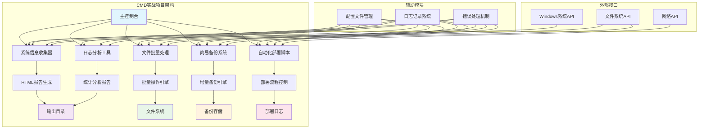
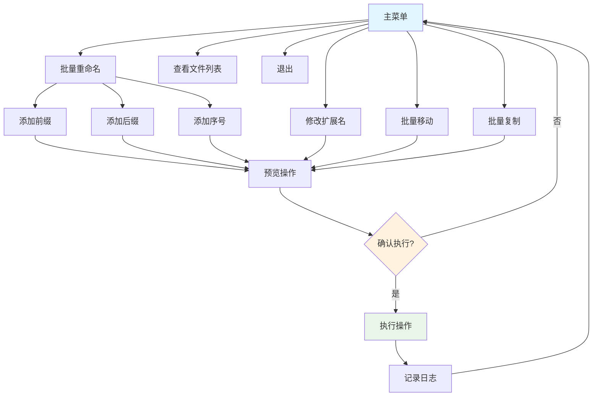

# 第14章：实战项目 — 学以致用

## 学习目标

通过本章学习，你将能够：

1. 综合运用前面章节学到的CMD/BAT脚本知识
2. 掌握实际项目开发的需求分析和设计思路
3. 实现5个完整的实战项目
4. 学习项目架构设计和最佳实践
5. 理解CMD脚本与其他编程语言的对比

!!! note "学习时间"
    预计学习时间：90-120分钟

## 概述

本章将通过5个完整的实战项目，将前面学到的CMD/BAT脚本知识进行综合运用。每个项目都包含：

- **需求分析**：明确项目目标和功能需求
- **设计思路**：规划实现方案和技术选型
- **代码实现**：完整的代码实现和详细注释
- **运行效果**：展示项目运行结果
- **扩展思考**：讨论可能的改进和扩展

!!! tip "学习建议"
    - 按顺序完成每个项目，逐步提升难度
    - 动手实践每个示例代码
    - 尝试修改和扩展示例功能
    - 记录遇到的问题和解决方案

## 项目架构设计

在开始具体项目之前，我们先了解整体架构设计：



## 最佳实践

在开始项目之前，让我们先了解一些CMD脚本开发的最佳实践：

### 1. 模块化设计

```bat
:: 模块化设计示例
@echo off
setlocal

:: 主模块
call :initialize
call :main_process
call :cleanup
goto :eof

:initialize
:: 初始化代码
goto :eof

:main_process
:: 主要处理逻辑
goto :eof

:cleanup
:: 清理代码
goto :eof
```

### 2. 错误处理

```bat
:: 错误处理示例
@echo off
setlocal

:: 执行命令并检查错误
some_command
if %ERRORLEVEL% neq 0 (
    echo [ERROR] 命令执行失败
    call :error_handler
    exit /b 1
)

:error_handler
:: 错误处理逻辑
echo 正在执行错误处理...
goto :eof
```

### 3. 日志记录

```bat
:: 日志记录示例
@echo off
setlocal

set "LOG_FILE=%~dp0app.log"

:: 记录日志函数
call :log "INFO" "程序启动"
call :log "ERROR" "发生错误"
call :log "INFO" "程序结束"

goto :eof

:log
set "LEVEL=%~1"
set "MESSAGE=%~2"
echo [%DATE% %TIME%] [%LEVEL%] %MESSAGE% >> "%LOG_FILE%"
echo [%LEVEL%] %MESSAGE%
goto :eof
```

### 4. 配置文件管理

```bat
:: 配置文件读取示例
@echo off
setlocal

set "CONFIG_FILE=%~dp0config.ini"

:: 读取配置文件
for /f "tokens=1,2 delims==" %%a in ('type "%CONFIG_FILE%" 2^>nul') do (
    set "%%a=%%b"
)

echo 应用名称: %app_name%
echo 版本: %app_version%

endlocal
```

## 项目1：系统信息收集器

### 需求分析

**目标**：创建一个能够收集系统信息并生成HTML报告的工具

**功能需求**：
1. 收集操作系统信息（版本、架构、安装日期）
2. 收集CPU信息（型号、核心数、频率）
3. 收集内存信息（总容量、速度）
4. 收集磁盘信息（型号、容量）
5. 收集网络信息（IP地址、MAC地址）
6. 生成美观的HTML报告

**技术要点**：
- 使用`wmic`命令获取系统信息
- 使用`for /f`解析命令输出
- 使用HTML模板生成报告
- 处理命令输出中的特殊字符

### 设计思路


### 代码实现详解

#### 1. 初始化部分

```bat
@echo off
:: 初始化变量
set "SCRIPT_DIR=%~dp0"
set "OUTPUT_DIR=%~1"
if "%OUTPUT_DIR%"=="" set "OUTPUT_DIR=%SCRIPT_DIR%output"
set "REPORT_FILE=%OUTPUT_DIR%\sysinfo_report.html"
```

**关键点**：
- `%~dp0`获取脚本所在目录
- 支持命令行参数指定输出目录
- 设置默认输出目录

#### 2. 系统信息收集

```bat
:: 收集操作系统信息
for /f "tokens=2 delims==" %%a in ('wmic os get Caption /value 2^>nul') do set "OS_NAME=%%a"
for /f "tokens=2 delims==" %%a in ('wmic os get Version /value 2^>nul') do set "OS_VERSION=%%a"
```

**关键点**：
- 使用`wmic`命令获取系统信息
- 使用`for /f`解析命令输出
- 使用`2^>nul`隐藏错误输出

#### 3. HTML报告生成

```bat
:: 生成HTML报告
(
echo ^<!DOCTYPE html^>
echo ^<html^>
echo ^<head^>
echo     ^<title^>系统信息报告^</title^>
echo ^</head^>
echo ^<body^>
echo     ^<h1^>系统信息报告^</h1^>
echo ^</body^>
echo ^</html^
) > "%REPORT_FILE%"
```

**关键点**：
- 使用括号创建代码块
- 使用`^`转义HTML特殊字符
- 使用重定向`>`写入文件

### 运行效果展示

运行`sysinfo_collector.bat`后，会生成一个HTML报告文件，包含：

1. **操作系统信息**：
   - 操作系统名称和版本
   - 系统架构（32位/64位）
   - 安装日期和上次启动时间

2. **CPU信息**：
   - 处理器型号
   - 核心数和线程数
   - 最大频率

3. **内存信息**：
   - 总内存容量
   - 内存速度
   - 制造商信息

4. **网络信息**：
   - IP地址
   - MAC地址
   - DHCP状态

5. **系统运行时间**：
   - 计算系统运行时长

!!! tip "使用方法"
    1. 双击运行`sysinfo_collector.bat`
    2. 等待信息收集完成
    3. 自动生成HTML报告并打开浏览器显示

## 项目2：日志分析工具

### 需求分析

**目标**：创建一个能够分析日志文件并生成统计报告的工具

**功能需求**：
1. 读取日志文件
2. 统计不同日志级别的数量
3. 提取错误和警告详情
4. 计算错误率
5. 生成分析报告

**技术要点**：
- 使用`for /f`读取文件内容
- 使用`findstr`进行文本匹配
- 使用变量计数和统计
- 生成格式化的报告

### 设计思路


### 代码实现详解

#### 1. 文件读取和解析

```bat
:: 读取日志文件
for /f "usebackq delims=" %%a in ("%LOG_FILE%") do (
    set "line=%%a"
    set /a "TOTAL_LINES+=1"
    
    :: 检查日志级别
    echo "!line!" | findstr /i /c:"[ERROR]" > nul && (
        set /a "ERROR_COUNT+=1"
    )
)
```

**关键点**：
- 使用`for /f`逐行读取文件
- 使用`findstr`进行模式匹配
- 使用延迟扩展处理循环中的变量

#### 2. 统计分析

```bat
:: 计算错误率
set /a "ERROR_RATE=0"
if %TOTAL_LINES% gtr 0 (
    set /a "ERROR_RATE=(ERROR_COUNT + FATAL_COUNT) * 100 / TOTAL_LINES"
)
```

**关键点**：
- 使用`set /a`进行算术运算
- 处理除零错误
- 计算百分比

#### 3. 报告生成

```bat
:: 生成报告
(
echo 【基本信息】
echo 总行数: %TOTAL_LINES%
echo.
echo 【日志级别统计】
echo ┌─────────────┬──────────┐
echo │ 日志级别    │ 数量     │
echo ├─────────────┼──────────┤
echo │ ERROR       │ %ERROR_COUNT%        │
echo └─────────────┴──────────┘
) > "%REPORT_FILE%"
```

**关键点**：
- 使用ASCII字符绘制表格
- 格式化输出
- 写入报告文件

### 运行效果展示

运行`log_analyzer.bat`后，会生成一个文本报告文件，包含：

1. **基本信息**：
   - 总行数
   - 分析时间范围

2. **日志级别统计**：
   - FATAL、ERROR、WARNING、INFO、DEBUG数量
   - 使用表格格式显示

3. **错误率分析**：
   - 计算错误率百分比
   - 给出状态评估（正常/注意/警告）

4. **错误详情**：
   - 列出所有ERROR和FATAL日志
   - 帮助定位问题根源

5. **建议操作**：
   - 根据错误率给出处理建议

!!! tip "使用方法"
    1. 准备日志文件（可使用`logs/sample.log`示例）
    2. 运行`log_analyzer.bat`
    3. 查看生成的分析报告

## 项目3：文件批量处理工具

### 需求分析

**目标**：创建一个能够批量处理文件的工具，支持重命名、修改扩展名、移动和复制

**功能需求**：
1. 批量重命名文件（添加前缀、后缀、序号）
2. 批量修改文件扩展名
3. 批量移动文件
4. 批量复制文件
5. 操作预览和确认

**技术要点**：
- 使用`for`循环遍历文件
- 使用`ren`、`move`、`copy`命令操作文件
- 使用菜单系统提供交互界面
- 添加操作确认机制

### 设计思路



### 代码实现详解

#### 1. 菜单系统

```bat
:MAIN_MENU
echo ============================================================
echo                        主菜单
echo ============================================================
echo 1. 批量重命名文件
echo 2. 批量修改扩展名
echo 3. 批量移动文件
echo 4. 批量复制文件
echo 5. 查看目录文件列表
echo 6. 退出
echo ============================================================
set /p "CHOICE=请选择操作 (1-6): "
```

**关键点**：
- 使用标签创建菜单循环
- 使用`set /p`获取用户输入
- 使用`if`语句处理选择

#### 2. 文件重命名

```bat
:: 添加前缀
set /p "PREFIX=请输入前缀: "
for %%f in ("%TARGET_DIR%\*.*") do (
    set "FILENAME=%%~nxf"
    ren "%%f" "%PREFIX%!FILENAME!"
)
```

**关键点**：
- 使用`for`循环遍历文件
- 使用`%%~nxf`获取文件名
- 使用`ren`命令重命名

#### 3. 操作确认

```bat
:: 预览和确认
echo 预览重命名结果：
for %%f in ("%TARGET_DIR%\*.*") do (
    echo %%~nxf -^> %PREFIX%%%~nxf
)
set /p "CONFIRM=确认执行重命名？(Y/N): "
if /i "%CONFIRM%" neq "Y" goto MAIN_MENU
```

**关键点**：
- 先预览再执行
- 使用`/i`忽略大小写比较
- 提供取消机制

### 运行效果展示

运行`file_batch.bat`后，会显示交互式菜单：

1. **主菜单**：
   - 显示可用操作选项
   - 接收用户选择

2. **批量重命名**：
   - 选择重命名方式（前缀/后缀/序号）
   - 输入参数
   - 预览重命名结果
   - 确认执行

3. **批量修改扩展名**：
   - 输入原扩展名和新扩展名
   - 预览修改结果
   - 确认执行

4. **批量移动/复制**：
   - 输入文件匹配模式
   - 输入目标目录
   - 预览操作结果
   - 确认执行

!!! tip "使用方法"
    1. 准备测试文件（可使用`test_files/`目录）
    2. 运行`file_batch.bat`
    3. 选择操作类型
    4. 输入参数并确认执行

## 项目4：简易备份系统

### 需求分析

**目标**：创建一个支持增量备份和恢复的备份系统

**功能需求**：
1. 增量备份（基于时间戳）
2. 全量备份
3. 备份日志记录
4. 备份恢复功能
5. 备份配置管理

**技术要点**：
- 使用时间戳创建备份目录
- 使用`copy`命令复制文件
- 记录备份日志
- 实现恢复功能

### 设计思路


### 代码实现详解

#### 1. 增量备份

```bat
:: 获取上次备份时间
set "LAST_BACKUP_TIME="
if exist "%CONFIG_FILE%" (
    for /f "tokens=2 delims==" %%a in ('findstr /i "last_backup_time" "%CONFIG_FILE%" 2^>nul') do (
        set "LAST_BACKUP_TIME=%%a"
    )
)

:: 创建备份目录
set "BACKUP_PATH=%BACKUP_DIR%\backup_%TIMESTAMP%"
mkdir "%BACKUP_PATH%"

:: 执行备份
for %%f in ("%SOURCE_DIR%\*.*") do (
    copy "%%f" "%BACKUP_PATH%" > nul
)
```

**关键点**：
- 读取上次备份时间
- 使用时间戳创建唯一备份目录
- 复制文件到备份目录

#### 2. 备份恢复

```bat
:: 列出可用备份
set "BACKUP_INDEX=0"
for /d %%d in ("%BACKUP_DIR%\backup_*" "%BACKUP_DIR%\full_backup_*") do (
    set /a "BACKUP_INDEX+=1"
    set "BACKUP_!BACKUP_INDEX!=%%~nxd"
    echo !BACKUP_INDEX!. %%~nxd (%%~td)
)

:: 执行恢复
for %%f in ("!RESTORE_PATH!\*.*") do (
    copy "%%f" "%SOURCE_DIR%" > nul
)
```

**关键点**：
- 列出所有备份目录
- 让用户选择恢复目标
- 复制文件到源目录

#### 3. 配置文件管理

```bat
:: 更新配置文件
(
echo [backup_config]
echo last_backup_time=%DATE% %TIME%
echo last_backup_path=%BACKUP_PATH%
echo backup_type=!BACKUP_TYPE!
echo backup_count=!BACKUP_COUNT!
) > "%CONFIG_FILE%"
```

**关键点**：
- 使用括号创建配置内容
- 写入配置文件
- 记录备份元数据

### 运行效果展示

运行`backup_system.bat`后，会显示交互式菜单：

1. **主菜单**：
   - 显示源目录和备份目录
   - 提供备份和恢复选项

2. **增量备份**：
   - 检查上次备份时间
   - 只备份修改过的文件
   - 显示备份统计信息

3. **全量备份**：
   - 备份所有文件
   - 显示备份大小和文件数

4. **备份恢复**：
   - 列出所有可用备份
   - 选择恢复到原目录或新目录
   - 执行恢复操作

5. **备份配置**：
   - 显示当前配置
   - 支持修改配置

!!! tip "使用方法"
    1. 准备源文件目录（可使用`test_files/`）
    2. 运行`backup_system.bat`
    3. 选择备份或恢复操作
    4. 查看备份日志

## 项目5：自动化部署脚本

### 需求分析

**目标**：创建一个自动化部署脚本，支持配置文件、错误处理和回滚

**功能需求**：
1. 读取部署配置文件
2. 执行部署步骤（备份、停止、部署、启动、验证）
3. 错误处理和自动回滚
4. 健康检查
5. 部署日志记录

**技术要点**：
- 读取INI配置文件
- 实现步骤化部署流程
- 错误检测和回滚机制
- 健康检查模拟

### 设计思路


### 代码实现详解

#### 1. 配置文件读取

```bat
:: 读取配置文件
for /f "tokens=1,2 delims==" %%a in ('type "%CONFIG_FILE%" 2^>nul') do (
    set "KEY=%%a"
    set "VALUE=%%b"
    
    if "!KEY!"=="app_name" set "APP_NAME=!VALUE!"
    if "!KEY!"=="app_version" set "APP_VERSION=!VALUE!"
    if "!KEY!"=="deploy_steps" set "DEPLOY_STEPS=!VALUE!"
)
```

**关键点**：
- 使用`for /f`解析配置文件
- 使用`delims==`按等号分割
- 存储配置值到变量

#### 2. 部署步骤执行

```bat
:: 执行部署步骤
for %%s in (%DEPLOY_STEPS%) do (
    call :EXECUTE_STEP %%s
    if !ERRORLEVEL! neq 0 (
        echo [ERROR] 步骤 %%s 执行失败！
        set "DEPLOY_STATUS=FAILED"
        set "FAILED_STEP=%%s"
        
        :: 检查是否需要回滚
        if "%ROLLBACK_ENABLED%"=="true" (
            goto AUTO_ROLLBACK
        )
    )
)
```

**关键点**：
- 使用`for`循环执行步骤
- 检查每个步骤的返回值
- 失败时触发回滚机制

#### 3. 错误处理和回滚

```bat
:AUTO_ROLLBACK
echo [INFO] 开始自动回滚...

:: 停止当前应用
echo [模拟] 停止当前应用
timeout /t 1 > nul

:: 恢复备份文件
echo [模拟] 恢复备份文件
timeout /t 2 > nul

:: 重启应用
echo [模拟] 重启应用
timeout /t 1 > nul

echo [完成] 回滚完成！
```

**关键点**：
- 实现自动回滚流程
- 模拟停止、恢复、重启操作
- 记录回滚日志

### 运行效果展示

运行`deploy.bat`后，会显示交互式菜单：

1. **主菜单**：
   - 显示部署环境和配置
   - 提供部署和回滚选项

2. **完整部署**：
   - 读取配置文件
   - 按步骤执行部署
   - 显示每个步骤的状态
   - 失败时自动回滚

3. **单个步骤执行**：
   - 选择要执行的步骤
   - 单独执行并显示结果

4. **健康检查**：
   - 检查应用状态
   - 显示健康检查结果

5. **回滚部署**：
   - 列出可用备份
   - 选择回滚目标
   - 执行回滚操作

6. **部署日志**：
   - 查看部署历史记录
   - 分析部署状态

!!! tip "使用方法"
    1. 准备配置文件（可使用`config/settings.ini`）
    2. 运行`deploy.bat`
    3. 选择部署环境
    4. 执行部署或回滚操作
    5. 查看部署日志

## 与Python/Node.js的对比

### Python实现对比

Python实现相同功能时，具有以下优势：

1. **代码简洁性**：
   ```python
   # Python - 获取系统信息
   import platform
   import os
   
   os_info = {
       'system': platform.system(),
       'version': platform.version(),
       'machine': platform.machine()
   }
   ```

2. **错误处理**：
   ```python
   # Python - 异常处理
   try:
       result = some_operation()
   except Exception as e:
       logger.error(f"操作失败: {e}")
   ```

3. **数据处理**：
   ```python
   # Python - 日志分析
   with open('log.txt', 'r') as f:
       for line in f:
           if 'ERROR' in line:
               error_count += 1
   ```

### Node.js实现对比

Node.js实现相同功能时，具有以下特点：

1. **异步处理**：
   ```javascript
   // Node.js - 文件操作
   const fs = require('fs');
   fs.readFile('file.txt', 'utf8', (err, data) => {
       if (err) throw err;
       console.log(data);
   });
   ```

2. **模块化**：
   ```javascript
   // Node.js - 模块导出
   class SystemInfoCollector {
       collect() { /* ... */ }
   }
   module.exports = SystemInfoCollector;
   ```

3. **跨平台**：
   ```javascript
   // Node.js - 跨平台API
   const os = require('os');
   console.log(os.platform());
   ```

### 对比总结

| 特性 | CMD/BAT | Python | Node.js |
|------|---------|--------|---------|
| 学习曲线 | 低 | 中 | 中 |
| 代码简洁性 | 低 | 高 | 中 |
| 错误处理 | 基础 | 强大 | 强大 |
| 跨平台 | Windows | 跨平台 | 跨平台 |
| 执行速度 | 快 | 中 | 快 |
| 生态系统 | 小 | 大 | 大 |
| 适用场景 | Windows系统管理 | 数据处理、自动化 | Web开发、工具开发 |

!!! note "选择建议"
    - **CMD/BAT**：适合Windows系统管理、简单自动化任务
    - **Python**：适合数据处理、复杂自动化、跨平台需求
    - **Node.js**：适合Web开发、工具开发、异步处理

## 总结

通过本章的5个实战项目，你已经掌握了：

1. **系统信息收集**：使用`wmic`命令获取系统信息
2. **日志分析**：使用`for`循环和`findstr`进行文本处理
3. **文件批量处理**：使用`for`循环和文件操作命令
4. **备份系统**：实现增量备份和恢复功能
5. **自动化部署**：实现步骤化部署和错误处理

这些项目综合运用了前面章节学到的所有知识，包括：
- 变量和数据类型
- 条件判断和循环
- 函数和模块化
- 文件操作
- 错误处理
- 配置文件管理

!!! tip "下一步学习"
    - 尝试扩展这些项目的功能
    - 将项目应用到实际工作中
    - 学习PowerShell或Python提升自动化能力
    - 探索更多Windows系统管理命令

## 练习题

### 练习1：扩展系统信息收集器

扩展`sysinfo_collector.bat`，添加以下功能：
1. 收集已安装软件列表
2. 收集系统服务状态
3. 收集系统事件日志
4. 生成JSON格式报告

### 练习2：增强日志分析工具

增强`log_analyzer.bat`，添加以下功能：
1. 支持正则表达式匹配
2. 按时间范围过滤日志
3. 生成图表（使用HTML/CSS）
4. 支持多种日志格式

### 练习3：改进文件批量处理

改进`file_batch.bat`，添加以下功能：
1. 支持正则表达式匹配文件名
2. 添加撤销功能
3. 支持递归处理子目录
4. 添加文件内容预览

### 练习4：完善备份系统

完善`backup_system.bat`，添加以下功能：
1. 支持增量备份（基于文件修改时间）
2. 添加备份压缩功能
3. 支持远程备份（网络路径）
4. 添加备份验证功能

### 练习5：优化部署脚本

优化`deploy.bat`，添加以下功能：
1. 支持多环境部署（开发、测试、生产）
2. 添加部署前检查
3. 支持蓝绿部署
4. 添加部署回滚验证

## 附录：常用命令速查表

| 命令 | 描述 | 示例 |
|------|------|------|
| `wmic` | Windows管理工具 | `wmic os get Caption` |
| `findstr` | 文本搜索 | `findstr /i "error" log.txt` |
| `for /f` | 文件解析 | `for /f "delims=" %%a in (file) do` |
| `ren` | 重命名文件 | `ren old.txt new.txt` |
| `move` | 移动文件 | `move file.txt C:\backup\` |
| `copy` | 复制文件 | `copy file1.txt file2.txt` |
| `mkdir` | 创建目录 | `mkdir new_folder` |
| `rmdir` | 删除目录 | `rmdir empty_folder` |
| `type` | 显示文件内容 | `type file.txt` |
| `find` | 查找文本 | `find "error" log.txt` |

---

**章节总结：**
本章通过5个完整的实战项目，将前面学到的CMD/BAT脚本知识进行了综合运用。每个项目都包含了需求分析、设计思路、代码实现和运行效果，帮助你理解如何将理论知识应用到实际项目中。通过对比Python和Node.js的实现，你也了解了CMD脚本的优势和局限性。掌握这些实战技能后，你将能够独立开发实用的Windows系统管理工具。