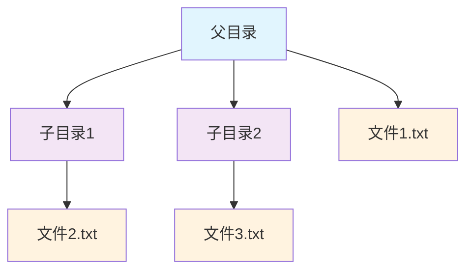
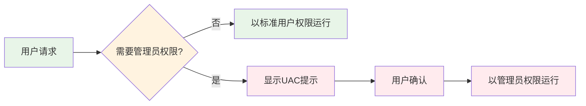
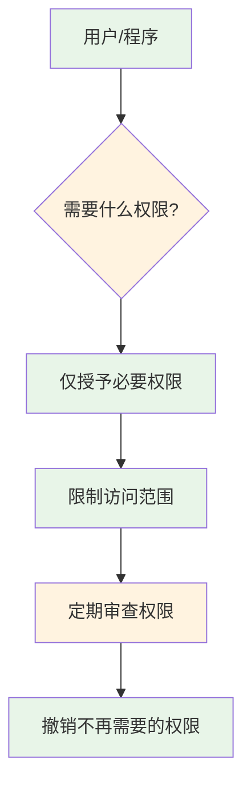
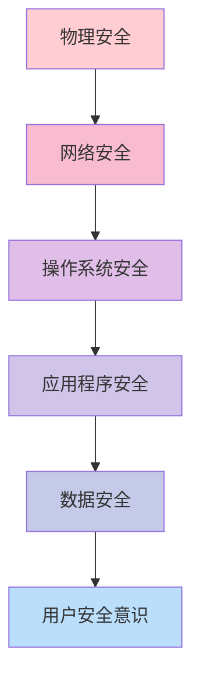

# 第15章 安全与权限 — 守护系统

## 15.1 概述

安全编程是专业开发者的必备素质。在CMD/BAT脚本开发中，安全问题同样不可忽视。本章将系统介绍Windows命令行环境下的安全机制，包括文件权限管理、用户账户控制、脚本安全实践等关键主题。

!!! warning "安全提示"
    本章涉及系统安全相关的操作。请在**测试环境**中进行练习，避免在生产系统中直接执行权限修改命令。所有示例代码均采用安全模拟方式，不会实际修改系统权限。

## 15.2 核心安全概念

### 15.2.1 文件权限管理

Windows文件系统采用访问控制列表（ACL）来管理权限。`icacls`是Windows内置的权限管理工具。

#### 15.2.1.1 `icacls` 命令详解

`icacls`命令用于显示、修改、备份和恢复文件及目录的ACL。

```bash
# 查看文件权限
icacls filename.txt

# 查看目录权限
icacls "C:\Users\FaustSherpad\usrtmp\cmd_learn"

# 查看详细权限（包括继承信息）
icacls filename.txt /T
```

#### 15.2.1.2 权限类型

Windows定义了多种权限类型：

| 权限类型 | 缩写 | 说明 |
|---------|------|------|
| 完全控制 | F | 完全控制文件或目录 |
| 修改 | M | 读取、写入、删除文件 |
| 读取和执行 | RX | 读取文件内容，执行程序 |
| 读取 | R | 读取文件内容 |
| 写入 | W | 写入文件内容 |
| 列出文件夹内容 | AD | 列出目录中的文件（仅目录） |

#### 15.2.1.3 权限继承和传播

Windows权限支持继承机制，子对象可以继承父对象的权限：



**继承规则**：
- 默认情况下，子对象继承父对象的权限
- 可以禁用继承（`icacls /inheritance:d`）
- 可以复制继承的权限后移除继承（`icacls /inheritance:r`）

#### 15.2.1.4 `takeown` 获取文件所有权

当文件所有权丢失时，可以使用`takeown`命令获取：

```bash
# 获取文件所有权
takeown /F filename.txt

# 递归获取目录所有权
takeown /F "C:\MyFolder" /R /A
```

!!! danger "安全警告"
    `takeown`命令会修改文件所有权，请谨慎使用。仅在必要时（如文件被锁定）使用此命令。

### 15.2.2 用户账户管理

#### 15.2.2.1 用户账户管理

`net user`命令用于管理用户账户：

```bash
# 查看所有用户
net user

# 查看特定用户信息
net user username

# 创建用户（需要管理员权限）
net user username password /add

# 删除用户
net user username /delete

# 修改用户密码
net user username newpassword
```

#### 15.2.2.2 用户组管理

`net localgroup`命令用于管理用户组：

```bash
# 查看所有用户组
net localgroup

# 查看特定用户组成员
net localgroup "Administrators"

# 添加用户到用户组
net localgroup "Administrators" username /add

# 从用户组移除用户
net localgroup "Administrators" username /delete
```

#### 15.2.2.3 当前用户信息

`whoami`命令显示当前用户信息：

```bash
# 显示当前用户名
whoami

# 显示当前用户的SID
whoami /user

# 显示当前用户所属的用户组
whoami /groups

# 显示当前用户的权限
whoami /priv
```

### 15.2.3 执行策略与权限控制

#### 15.2.3.1 CMD执行权限

Windows通过UAC（用户账户控制）管理程序执行权限：



#### 15.2.3.2 UAC（用户账户控制）

UAC是Windows的安全机制，用于防止恶意软件获取管理员权限。

**UAC保护级别**：
- **始终通知**：最安全，任何系统更改都通知
- **默认设置**：平衡安全性和便利性
- **从不通知**：不推荐，安全风险高

#### 15.2.3.3 以管理员身份运行脚本

有多种方式以管理员身份运行脚本：

```bash
# 方法1：右键选择"以管理员身份运行"
# 方法2：使用runas命令
runas /user:Administrator script.bat

# 方法3：在脚本中检查并请求管理员权限
```

**检查管理员权限的脚本**：

```batch
@echo off
:: 检查是否以管理员身份运行
net session >nul 2>&1
if %errorLevel% == 0 (
    echo [SUCCESS] 以管理员身份运行
) else (
    echo [ERROR] 需要管理员权限
    echo 请右键选择"以管理员身份运行"
    pause
    exit /b 1
)
```

### 15.2.4 脚本安全实践

#### 15.2.4.1 输入验证和消毒

永远不要信任用户输入，必须进行验证和消毒：

```batch
@echo off
setlocal enabledelayedexpansion

:: 获取用户输入
set /p "user_input=请输入文件名: "

:: 验证输入
echo %user_input% | findstr /r "[\\/:*?\"<>|]" >nul
if %errorLevel% == 0 (
    echo [ERROR] 文件名包含非法字符
    exit /b 1
)

:: 检查文件名长度
if "%user_input%"=="" (
    echo [ERROR] 文件名不能为空
    exit /b 1
)

:: 消毒处理 - 移除首尾空格
set "user_input=!user_input: =!"
```

#### 15.2.4.2 防止命令注入

命令注入是常见的安全漏洞：

```batch
@echo off
:: 危险示例 - 命令注入漏洞
set "user_input=%1"
:: 如果用户输入: file.txt & del /f /q C:\*.*
:: 将会执行危险命令
echo %user_input%

:: 安全做法 - 使用引号和验证
set "safe_input=%~1"
if not defined safe_input (
    echo [ERROR] 缺少参数
    exit /b 1
)

:: 验证输入不包含危险字符
echo %safe_input% | findstr /r "[&|<>^]" >nul
if %errorLevel% == 0 (
    echo [ERROR] 输入包含危险字符
    exit /b 1
)
```

#### 15.2.4.3 路径遍历攻击防护

路径遍历攻击可以访问系统敏感文件：

```batch
@echo off
:: 危险示例 - 路径遍历漏洞
set "file_path=%1"
:: 如果用户输入: ..\..\..\Windows\System32\config\SAM
:: 可能访问敏感文件
type %file_path%

:: 安全做法 - 限制路径范围
set "base_dir=C:\Users\FaustSherpad\usrtmp\cmd_learn\docs"
set "requested_file=%~1"

:: 构建完整路径
set "full_path=%base_dir%\%requested_file%"

:: 验证路径是否在允许范围内
echo %full_path% | findstr /i "%base_dir%" >nul
if %errorLevel% neq 0 (
    echo [ERROR] 路径超出允许范围
    exit /b 1
)
```

#### 15.2.4.4 敏感信息保护

永远不要在脚本中硬编码敏感信息：

```batch
@echo off
:: 错误做法 - 硬编码密码
set "password=MySecret123"

:: 正确做法 - 使用环境变量或安全存储
:: 方法1：从环境变量读取
set "password=%MY_APP_PASSWORD%"

:: 方法2：从加密文件读取
:: 方法3：提示用户输入（不显示）
set /p "password=请输入密码: " <nul
:: 使用PowerShell安全读取
for /f "tokens=*" %%p in ('powershell -Command "$p = Read-Host 'Password' -AsSecureString; [Runtime.InteropServices.Marshal]::PtrToStringAuto([Runtime.InteropServices.Marshal]::SecureStringToBSTR($p))"') do set "password=%%p"
```

### 15.2.5 日志和审计

#### 15.2.5.1 操作日志记录

良好的日志记录是安全审计的基础：

```batch
@echo off
setlocal enabledelayedexpansion

:: 设置日志文件
set "log_file=%~dp0audit.log"
set "timestamp=%date% %time%"
set "username=%USERNAME%"
set "computer=%COMPUTERNAME%"

:: 记录操作日志
echo [%timestamp%] User: %username% Computer: %computer% Action: Script started >> "%log_file%"
echo [%timestamp%] Working directory: %CD% >> "%log_file%"

:: 记录命令执行
echo [%timestamp%] Executing: dir /b >> "%log_file%"
dir /b >> "%log_file%" 2>&1

echo [%timestamp%] Script completed >> "%log_file%"
```

#### 15.2.5.2 安全事件审计

审计安全相关事件：

```batch
@echo off
:: 记录登录尝试
echo [%date% %time%] Login attempt by %USERNAME% from %CLIENTNAME% >> security.log

:: 记录权限变更
echo [%date% %time%] Permission change: %USERNAME% modified %FILE% >> security.log

:: 记录失败操作
if %errorLevel% neq 0 (
    echo [%date% %time%] FAILED: %ERROR_COMMAND% - Error: %errorLevel% >> security.log
)
```

#### 15.2.5.3 日志文件保护

保护日志文件不被篡改：

```batch
@echo off
:: 设置日志文件权限（仅管理员可写）
icacls audit.log /grant:r "Administrators:(R,W)" /inheritance:r
icacls audit.log /grant:r "SYSTEM:(R,W)" /inheritance:r

:: 定期备份日志
set "backup_date=%date:~0,4%%date:~5,2%%date:~8,2%"
copy audit.log "backup_%backup_date%.log"

:: 清理旧日志（保留30天）
forfiles /p "C:\Logs" /m "*.log" /d -30 /c "cmd /c del @path"
```

### 15.2.6 加密基础

#### 15.2.6.1 `certutil` 编码/解码

`certutil`是Windows内置的加密工具：

```bash
# Base64编码文件
certutil -encode input.txt encoded.txt

# Base64解码文件
certutil -decode encoded.txt decoded.txt

# 计算文件哈希
certutil -hashfile filename.txt MD5
certutil -hashfile filename.txt SHA256
```

#### 15.2.6.2 文件哈希计算

文件哈希用于验证文件完整性：

```batch
@echo off
:: 计算文件MD5哈希
set "file_to_hash=%~1"
if not defined file_to_hash (
    echo [ERROR] 请指定文件路径
    exit /b 1
)

echo 计算文件哈希: %file_to_hash%
certutil -hashfile "%file_to_hash%" MD5
certutil -hashfile "%file_to_hash%" SHA256
```

#### 15.2.6.3 签名验证

验证文件的数字签名：

```batch
@echo off
:: 验证文件签名
set "file_to_verify=%~1"
if not defined file_to_verify (
    echo [ERROR] 请指定文件路径
    exit /b 1
)

echo 验证文件签名: %file_to_verify%
signtool verify /pa "%file_to_verify%"
if %errorLevel% == 0 (
    echo [SUCCESS] 签名验证通过
) else (
    echo [WARNING] 签名验证失败或文件未签名
)
```

## 15.3 安全模型

### 15.3.1 最小权限原则

最小权限原则（Principle of Least Privilege, POLP）要求：



**实施要点**：
1. 为每个任务创建专用账户
2. 限制用户组权限
3. 使用标准用户账户进行日常操作
4. 仅在必要时提升权限

### 15.3.2 纵深防御

纵深防御（Defense in Depth）采用多层安全措施：



**在脚本中的应用**：
- 输入验证（第一层）
- 参数消毒（第二层）
- 权限检查（第三层）
- 操作审计（第四层）
- 错误处理（第五层）

## 15.4 与其他语言的安全实践对比

### 15.4.1 Python安全实践

Python提供了丰富的安全相关库和最佳实践。

#### 输入验证

```python
import re
import os

def validate_input(user_input: str) -> bool:
    """验证用户输入是否安全"""
    # 检查危险字符
    dangerous_chars = r'[\\/:*?"<>|&;`$]'
    if re.search(dangerous_chars, user_input):
        return False
    
    # 检查路径遍历
    if '..' in user_input:
        return False
    
    # 检查空输入
    if not user_input.strip():
        return False
    
    return True
```

#### 安全文件操作

```python
import os
from pathlib import Path

def safe_file_operation(base_dir: str, filename: str) -> str:
    """安全的文件操作"""
    # 构建完整路径
    base_path = Path(base_dir).resolve()
    file_path = (base_path / filename).resolve()
    
    # 验证路径是否在允许范围内
    if not str(file_path).startswith(str(base_path)):
        raise ValueError("路径超出允许范围")
    
    # 验证文件存在
    if not file_path.exists():
        raise FileNotFoundError(f"文件不存在: {filename}")
    
    return str(file_path)
```

#### 敏感信息处理

```python
import getpass
import hashlib
import secrets

def secure_password_input():
    """安全密码输入"""
    password = getpass.getpass("请输入密码: ")
    return password

def hash_password(password: str, salt: bytes = None) -> tuple:
    """安全密码哈希"""
    if salt is None:
        salt = secrets.token_bytes(32)
    
    # 使用PBKDF2进行密码哈希
    key = hashlib.pbkdf2_hmac(
        'sha256',
        password.encode('utf-8'),
        salt,
        100000  # 迭代次数
    )
    
    return salt, key
```

### 15.4.2 Node.js安全实践

Node.js的安全实践与Python类似，但有其独特之处。

#### 输入验证

```javascript
const path = require('path');
const fs = require('fs');

/**
 * 验证用户输入
 * @param {string} userInput - 用户输入
 * @returns {boolean} 是否安全
 */
function validateInput(userInput) {
    // 检查危险字符
    const dangerousChars = /[\\/:*?"<>|&;`$]/;
    if (dangerousChars.test(userInput)) {
        return false;
    }
    
    // 检查路径遍历
    if (userInput.includes('..')) {
        return false;
    }
    
    // 检查空输入
    if (!userInput.trim()) {
        return false;
    }
    
    return true;
}
```

#### 安全路径处理

```javascript
/**
 * 安全的路径处理
 * @param {string} basePath - 基础路径
 * @param {string} userPath - 用户输入路径
 * @returns {string} 安全路径
 */
function safePathJoin(basePath, userPath) {
    // 解析路径
    const resolvedBase = path.resolve(basePath);
    const resolvedPath = path.resolve(basePath, userPath);
    
    // 验证路径是否在允许范围内
    if (!resolvedPath.startsWith(resolvedBase)) {
        throw new Error('路径超出允许范围');
    }
    
    return resolvedPath;
}
```

#### 敏感信息处理

```javascript
const crypto = require('crypto');

/**
 * 安全密码哈希
 * @param {string} password - 密码
 * @returns {object} 包含盐和哈希值
 */
function hashPassword(password) {
    // 生成随机盐
    const salt = crypto.randomBytes(32);
    
    // 使用PBKDF2进行密码哈希
    const hash = crypto.pbkdf2Sync(
        password,
        salt,
        100000, // 迭代次数
        64,     // 输出长度
        'sha512'
    );
    
    return {
        salt: salt.toString('hex'),
        hash: hash.toString('hex')
    };
}
```

### 15.4.3 C语言安全实践

C语言需要特别注意内存安全和缓冲区溢出。

#### 输入验证

```c
#include <stdio.h>
#include <string.h>
#include <ctype.h>
#include <stdbool.h>

/**
 * 验证用户输入
 * @param input 用户输入
 * @param max_length 最大长度
 * @return 是否安全
 */
bool validate_input(const char *input, size_t max_length) {
    // 检查空指针
    if (input == NULL) {
        return false;
    }
    
    // 检查长度
    if (strlen(input) > max_length) {
        return false;
    }
    
    // 检查危险字符
    const char *dangerous_chars = "\\:*?\"<>|&;`$";
    for (size_t i = 0; i < strlen(input); i++) {
        if (strchr(dangerous_chars, input[i]) != NULL) {
            return false;
        }
    }
    
    // 检查路径遍历
    if (strstr(input, "..") != NULL) {
        return false;
    }
    
    return true;
}
```

#### 安全字符串处理

```c
#include <stdio.h>
#include <string.h>

/**
 * 安全字符串复制
 * @param dest 目标缓冲区
 * @param src 源字符串
 * @param dest_size 目标缓冲区大小
 * @return 成功与否
 */
bool safe_strcpy(char *dest, const char *src, size_t dest_size) {
    if (dest == NULL || src == NULL || dest_size == 0) {
        return false;
    }
    
    size_t src_len = strlen(src);
    if (src_len >= dest_size) {
        // 截断字符串
        strncpy(dest, src, dest_size - 1);
        dest[dest_size - 1] = '\0';
        return false;
    }
    
    strcpy(dest, src);
    return true;
}
```

#### 缓冲区溢出防护

```c
#include <stdio.h>
#include <string.h>
#include <stdlib.h>

/**
 * 安全的格式化字符串
 * @param buffer 输出缓冲区
 * @param size 缓冲区大小
 * @param format 格式化字符串
 * @param ... 可变参数
 * @return 写入的字符数
 */
int safe_snprintf(char *buffer, size_t size, const char *format, ...) {
    va_list args;
    va_start(args, format);
    
    int result = vsnprintf(buffer, size, format, args);
    
    va_end(args);
    
    // 检查是否截断
    if (result >= (int)size) {
        buffer[size - 1] = '\0';
        return -1;
    }
    
    return result;
}
```

### 15.4.4 Lua安全实践

Lua语言简洁但需要注意安全实践。

#### 输入验证

```lua
-- 验证用户输入
function validate_input(user_input)
    -- 检查空输入
    if user_input == nil or user_input == "" then
        return false
    end
    
    -- 检查危险字符
    local dangerous_chars = "[\\/:*?\"<>|&;`$]"
    if string.find(user_input, dangerous_chars) then
        return false
    end
    
    -- 检查路径遍历
    if string.find(user_input, "%.%.") then
        return false
    end
    
    return true
end
```

#### 安全路径处理

```lua
-- 安全路径处理
function safe_path_join(base_path, user_path)
    -- 解析路径
    local full_path = base_path .. "/" .. user_path
    
    -- 规范化路径
    full_path = string.gsub(full_path, "\\", "/")
    full_path = string.gsub(full_path, "/+", "/")
    
    -- 检查路径遍历
    if string.find(full_path, "%.%.") then
        error("路径超出允许范围")
    end
    
    return full_path
end
```

#### 敏感信息处理

```lua
-- 安全密码哈希（简化示例）
function hash_password(password, salt)
    if salt == nil then
        -- 生成随机盐
        math.randomseed(os.time())
        salt = ""
        for i = 1, 32 do
            salt = salt .. string.char(math.random(65, 122))
        end
    end
    
    -- 简单哈希（实际应用应使用更强的哈希函数）
    local hash = 0
    local combined = password .. salt
    for i = 1, #combined do
        hash = (hash * 31 + string.byte(combined, i)) % 1000000007
    end
    
    return {
        salt = salt,
        hash = tostring(hash)
    }
end
```

### 15.4.5 对比表格

| 安全实践 | CMD/BAT | Python | Node.js | C | Lua |
|---------|---------|--------|---------|---|-----|
| 输入验证 | 手动验证 | `re`模块 | 正则表达式 | 手动验证 | 模式匹配 |
| 路径安全 | `findstr` | `pathlib` | `path`模块 | 手动检查 | 字符串处理 |
| 密码处理 | 环境变量 | `getpass` | `crypto` | `openssl` | 外部库 |
| 哈希计算 | `certutil` | `hashlib` | `crypto` | `openssl` | 外部库 |
| 内存安全 | N/A | 自动垃圾回收 | 自动垃圾回收 | 手动管理 | 自动垃圾回收 |
| 注入防护 | 引号和验证 | 参数化查询 | 参数化查询 | 输入消毒 | 输入消毒 |

## 15.5 最佳实践和常见陷阱

### 15.5.1 最佳实践

!!! tip "安全最佳实践"
    1. **永远不要信任用户输入** - 始终验证和消毒
    2. **使用最小权限原则** - 仅授予必要的权限
    3. **记录所有操作** - 完善的日志记录
    4. **定期审查权限** - 及时撤销不再需要的权限
    5. **使用安全的默认值** - 默认拒绝，显式允许
    6. **保护敏感信息** - 不要硬编码密码、密钥
    7. **验证文件路径** - 防止路径遍历攻击
    8. **使用数字签名** - 验证脚本完整性
    9. **定期更新系统** - 修补安全漏洞
    10. **安全编码培训** - 提高安全意识

### 15.5.2 常见陷阱

!!! danger "常见安全陷阱"
    1. **命令注入** - 未验证的用户输入直接执行
    2. **路径遍历** - 未限制文件访问范围
    3. **硬编码凭据** - 在脚本中存储密码
    4. **权限过高** - 使用管理员权限运行所有脚本
    5. **日志缺失** - 未记录安全相关事件
    6. **缓冲区溢出** - C语言中的常见问题
    7. **SQL注入** - 数据库操作中的常见问题
    8. **跨站脚本** - Web应用中的常见问题
    9. **会话劫持** - 未保护的会话标识符
    10. **不安全的反序列化** - 处理不可信数据

### 15.5.3 安全检查清单

在部署脚本前，请检查以下项目：

- [ ] 输入验证是否完整？
- [ ] 是否使用最小权限原则？
- [ ] 是否记录了所有操作？
- [ ] 是否保护了敏感信息？
- [ ] 是否验证了文件路径？
- [ ] 是否处理了错误情况？
- [ ] 是否进行了安全测试？
- [ ] 是否更新了安全补丁？
- [ ] 是否有安全审计日志？
- [ ] 是否有应急响应计划？

## 15.6 练习题

### 练习1：输入验证

创建一个安全的文件重命名脚本，要求：
1. 验证原文件名是否合法
2. 验证新文件名是否合法
3. 检查文件是否存在
4. 记录操作日志

```batch
@echo off
:: 练习1：安全的文件重命名脚本
:: 在此处编写您的代码

:: 要求：
:: 1. 验证原文件名是否合法（不包含非法字符）
:: 2. 验证新文件名是否合法
:: 3. 检查原文件是否存在
:: 4. 检查新文件名是否已存在
:: 5. 记录操作日志到 rename_log.txt
```

### 练习2：权限管理

创建一个脚本，为指定目录设置安全的权限：
1. 移除所有继承的权限
2. 仅授予当前用户读取权限
3. 仅授予管理员完全控制权限
4. 记录权限变更日志

```batch
@echo off
:: 练习2：安全的权限管理脚本
:: 在此处编写您的代码

:: 要求：
:: 1. 接受目录路径作为参数
:: 2. 移除所有继承的权限
:: 3. 仅授予当前用户读取权限
:: 4. 仅授予管理员完全控制权限
:: 5. 记录权限变更日志
```

### 练习3：安全日志

创建一个安全的审计日志系统：
1. 记录用户登录/登出
2. 记录文件访问
3. 记录权限变更
4. 日志文件防篡改
5. 定期清理旧日志

```batch
@echo off
:: 练习3：安全的审计日志系统
:: 在此处编写您的代码

:: 要求：
:: 1. 创建安全的审计日志系统
:: 2. 记录用户登录/登出事件
:: 3. 记录文件访问事件
:: 4. 记录权限变更事件
:: 5. 日志文件设置为只读
:: 6. 实现日志轮转（按日期）
:: 7. 清理超过30天的旧日志
```

### 练习4：文件完整性检查

创建一个文件完整性检查工具：
1. 计算文件哈希值
2. 保存哈希值到数据库
3. 定期检查文件完整性
4. 报告文件变更

```batch
@echo off
:: 练习4：文件完整性检查工具
:: 在此处编写您的代码

:: 要求：
:: 1. 计算指定目录中所有文件的哈希值
:: 2. 保存哈希值到 integrity_db.txt
:: 3. 定期检查文件完整性
:: 4. 报告新增、删除、修改的文件
:: 5. 生成完整性报告
```

### 练习5：安全脚本模板

创建一个安全的脚本模板，包含：
1. 输入验证
2. 错误处理
3. 日志记录
4. 权限检查
5. 清理机制

```batch
@echo off
:: 练习5：安全脚本模板
:: 在此处编写您的代码

:: 要求：
:: 1. 创建安全的脚本模板
:: 2. 包含完整的输入验证
:: 3. 包含完善的错误处理
:: 4. 包含详细的操作日志
:: 5. 包含权限检查机制
:: 6. 包含资源清理逻辑
:: 7. 支持命令行参数
```

## 15.7 总结

本章介绍了Windows命令行环境下的安全编程实践，包括：

1. **文件权限管理** - 使用`icacls`管理文件权限
2. **用户账户管理** - 使用`net user`和`net localgroup`
3. **执行策略** - 理解UAC和权限提升
4. **脚本安全** - 输入验证、命令注入防护、路径遍历防护
5. **日志和审计** - 操作日志记录和安全事件审计
6. **加密基础** - 文件哈希和数字签名

### 关键要点

!!! success "关键要点"
    1. 安全是开发过程中的重要组成部分
    2. 最小权限原则是安全的基础
    3. 输入验证是防止攻击的第一道防线
    4. 日志记录是安全审计的基础
    5. 安全编码需要持续学习和实践

## 15.8 下一步

完成本章学习后，建议：

1. **实践练习** - 完成本章的所有练习题
2. **代码审查** - 检查现有脚本的安全问题
3. **安全测试** - 对脚本进行安全测试
4. **持续学习** - 关注最新的安全威胁和防护措施
5. **安全文化** - 在团队中推广安全编码实践

## 15.9 附加资源

### 官方文档

- [Windows安全文档](https://docs.microsoft.com/en-us/windows/security/)
- [icacls命令参考](https://docs.microsoft.com/en-us/windows-server/administration/windows-commands/icacls)
- [Windows权限管理](https://docs.microsoft.com/en-us/windows/win32/secauthz/access-control-lists)

### 安全工具

- [Windows Defender](https://www.microsoft.com/en-us/windows/comprehensive-security)
- [Sysinternals工具集](https://docs.microsoft.com/en-us/sysinternals/)
- [Windows事件日志](https://docs.microsoft.com/en-us/windows/win32/eventlog/event-logging)

### 学习资源

- [OWASP安全编码实践](https://owasp.org/www-project-secure-coding-practices-quick-reference-guide/)
- [CWE/SANS Top 25](https://cwe.mitre.org/top25/)
- [Microsoft安全开发生命周期](https://www.microsoft.com/en-us/securityengineering/sdl)

!!! info "学习建议"
    安全是一个持续的过程，不是一次性任务。定期审查和更新安全实践，关注最新的安全威胁和防护措施，是每个开发者的责任。