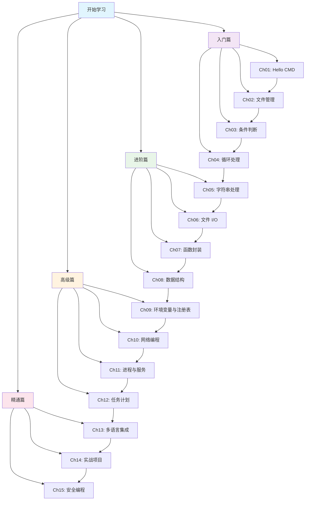

# CMD/BAT 从入门到精通

!!! info "欢迎来到 Windows 命令行世界"
    本教程将带你从零开始掌握 Windows CMD/BAT 脚本编程，从基础命令到高级自动化，从简单批处理到复杂系统管理脚本。

## 🎯 教程简介

**CMD/BAT 从入门到精通** 是一套完整的 Windows 命令行脚本编程学习教程。无论你是系统管理员、运维工程师，还是对命令行感兴趣的开发者，都能在这里找到适合你的学习路径。

本教程涵盖 15 个章节，从最基础的 "Hello World" 开始，逐步深入到文件管理、条件判断、循环处理、字符串操作、文件 I/O、函数封装、数据结构、环境变量、网络操作、进程管理、任务调度、多语言集成、实战项目和安全编程等主题。

## ✨ 教程特色

=== "📚 系统化学习"

    - **15 章渐进式学习**：从入门到精通，循序渐进
    - **每章配套示例代码**：理论与实践相结合
    - **实战项目驱动**：学以致用，解决实际问题

=== "🔄 多语言对比"

    - **Python 对比**：理解脚本语言的异同
    - **JavaScript 对比**：掌握现代脚本编程思想
    - **C 语言对比**：深入理解底层实现
    - **Lua 对比**：学习轻量级脚本设计

=== "🛠️ 实用技能"

    - **系统管理自动化**：批量处理、定时任务
    - **文件批处理**：重命名、整理、备份
    - **网络工具开发**：Ping、端口扫描、数据抓取
    - **安全脚本编写**：输入验证、权限控制

## 👥 适合人群

!!! tip "你是否属于以下人群？"

    **🪟 Windows 系统管理员**
    
    日常需要管理大量 Windows 服务器和工作站，希望通过脚本自动化重复性工作，提高运维效率。
    
    **🔧 自动化运维工程师**
    
    需要编写批处理脚本来部署应用、监控系统、处理日志，实现运维工作的自动化。
    
    **💻 对命令行感兴趣的开发者**
    
    想要深入了解 Windows 命令行的强大功能，掌握系统级编程技能，提升开发效率。
    
    **🎓 编程初学者**
    
    希望从简单的脚本语言开始学习编程，CMD/BAT 语法简单，是入门编程的绝佳选择。

## 🗺️ 学习路线图



## 🚀 快速导航

### 入门篇

| 章节 | 主题 | 关键内容 |
|------|------|----------|
| [第1章](ch01-hello-cmd/index.md) | Hello CMD | CMD基础、命令提示符、第一个BAT文件 |
| [第2章](ch02-file-management/index.md) | 文件管理 | 文件操作、目录管理、路径处理 |
| [第3章](ch03-conditionals/index.md) | 条件判断 | if语句、比较运算、逻辑判断 |
| [第4章](ch04-loops/index.md) | 循环处理 | for循环、while循环、循环控制 |

### 进阶篇

| 章节 | 主题 | 关键内容 |
|------|------|----------|
| [第5章](ch05-string-processing/index.md) | 字符串处理 | 字符串操作、查找替换、格式化 |
| [第6章](ch06-file-io/index.md) | 文件 I/O | 文件读写、重定向、管道操作 |
| [第7章](ch07-functions/index.md) | 函数封装 | 函数定义、参数传递、返回值 |
| [第8章](ch08-data-structures/index.md) | 数据结构 | 数组、列表、字典模拟 |

### 高级篇

| 章节 | 主题 | 关键内容 |
|------|------|----------|
| [第9章](ch09-env-registry/index.md) | 环境变量与注册表 | 环境变量管理、注册表操作 |
| [第10章](ch10-network/index.md) | 网络编程 | 网络命令、HTTP请求、端口扫描 |
| [第11章](ch11-process-services/index.md) | 进程与服务 | 进程管理、服务控制、系统监控 |
| [第12章](ch12-task-scheduler/index.md) | 任务计划 | 定时任务、计划任务、自动化调度 |

### 精通篇

| 章节 | 主题 | 关键内容 |
|------|------|----------|
| [第13章](ch13-multilang/index.md) | 多语言集成 | Python/JS/C/Lua集成调用 |
| [第14章](ch14-projects/index.md) | 实战项目 | 完整项目案例、最佳实践 |
| [第15章](ch15-security/index.md) | 安全编程 | 输入验证、权限控制、安全编码 |

### 附录

| 资源 | 说明 |
|------|------|
| [附录](appendix/index.md) | 命令速查表、特殊字符、环境变量、错误代码 |

## 💻 环境要求

!!! warning "开始学习前请确认"

    **必需环境**
    
    - Windows 10 或 Windows 11
    - CMD.exe（系统自带）
    - 文本编辑器（记事本、VS Code、Notepad++ 等）
    
    **可选环境（用于多语言对比）**
    
    - Python 3.x（推荐 3.8+）
    - Node.js（推荐 16+）
    - GCC/MinGW（C 语言编译器）
    - LuaJIT（Lua 解释器）

!!! tip "快速检查环境"

    打开 CMD，输入以下命令检查环境：
    
    ```cmd
    :: 检查 CMD 版本
    ver
    
    :: 检查 Python（如果已安装）
    python --version
    
    :: 检查 Node.js（如果已安装）
    node --version
    
    :: 检查 GCC（如果已安装）
    gcc --version
    
    :: 检查 Lua（如果已安装）
    luajit -v
    ```

## 📖 如何使用本教程

1. **按顺序学习**：建议从第1章开始，逐步深入
2. **动手实践**：每个示例都要亲手运行
3. **多语言对比**：对比不同语言的实现，加深理解
4. **完成练习**：每章末尾的练习题是巩固知识的好机会
5. **参考附录**：遇到问题时查阅速查表

!!! quote "学习建议"

    > "纸上得来终觉浅，绝知此事要躬行。"
    
    编程是一门实践技能，只有不断动手编写代码，才能真正掌握。建议你打开 CMD 窗口，跟着教程一步步操作，遇到问题不要害怕，错误是最好的老师。

## 🎉 开始你的学习之旅

准备好了吗？让我们从 [快速开始](getting-started.md) 开始，迈出 CMD/BAT 编程的第一步！

---

!!! note "关于本教程"
    
    - **版本**：1.0
    - **更新日期**：2026年6月
    - **适用系统**：Windows 10/11
    - **许可证**：MIT License
